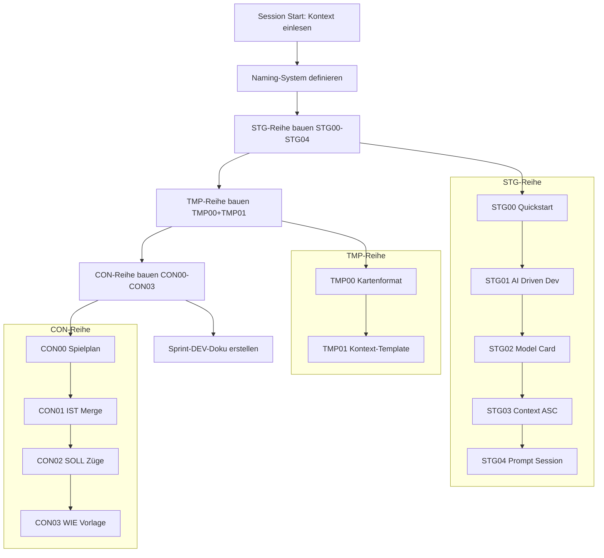

================================================================================
SPRINT-DEV-DOKU – CARD-Reihe-Umbau
================================================================================
Projekt             : R+MUNI Blueprint
Sprint-Bezeichnung  : Sprint-DEV-CARD-Reihe-Umbau
Tag                 : #dev #sprint #s102 #card #naming #struktur #asc
Datum               : 2026-04-04
Stage               : S1.02 — AKTIV
Status              : Abgeschlossen
Verantwortlich      : EUMAXL
Review              : —
Jira-Sync           : NEIN
Erstellt durch      : EUMAXL + Claude (Pair-Session)
Vorgänger           : [[Global_GOV_DEV_S101]] — Naming-Konventionen (Kap. 16) als normative Grundlage
                      [[KONZEPT_MGT-Layout_Zwei-Welten-Entscheid_S7]] — Zwei-Welten-Entscheid
Nachfolger          : CON-Reihe befüllen (offener Punkt) | noch kein konkreter Sprint definiert
================================================================================

================================================================================
LESEANLEITUNG — FÜR SPÄTERE REVIEW
================================================================================

Dieses Dokument beschreibt den strukturellen Umbau der MTG-Dateireihe
zur CARD-Reihe im Rahmen von Stage S1.02.

Der Sprint ist vollständig abgeschlossen. Alle Artefakte sind erstellt.

Kontext für den Leser in 6+ Monaten:
  - Das R+MUNI Blueprint-Projekt nutzt ein Kartensystem (angelehnt an Magic: The Gathering)
    als Denkmodell und Dokumentationsstruktur — nicht als Spielregel, sondern als Linse.
  - MTG = alter Dateiname-Prefix aus der frühen Entstehungsphase
  - CARD = sauberes, neutrales Naming das MTG ablöst
  - STG / TMP / CON = drei Dokumentrollen die nun das System strukturieren
  - DEV = Arbeitsmodus/Kontext (AI_DRIVEN_DEV + GOV) — bleibt unverändert
  - ASC = Associate = Betakunden-Variante — Zieldokument dieser Reihe

Wenn unklar was "Stage S1.02" bedeutet:
  Stages sind Entwicklungsperioden. S1.01 brachte die GOV-Erweiterung Naming/Kap.16.
  S1.02 ist die erste aktive Stage danach — dieses Dokument gehört dazu.

================================================================================

================================================================================
1. AUSGANGSLAGE UND KONTEXT
================================================================================

1.1 Ist-Zustand vor diesem Sprint
-----------------------------------

Das R+MUNI Blueprint-Projekt hatte zum Zeitpunkt des Sprint-Starts (Ende März / Anfang April 2026)
eine funktionierende DEV-Infrastruktur, aber eine noch unvollständige
Dokumentationsstruktur für die ASC-Zielgruppe (Betakunden).

Die bisherigen Inhaltsdokumente trugen das Präfix "MTG" — abgeleitet vom
Regelwerk Magic: The Gathering, an dem sich das Kartensystem orientiert.
Dieses Präfix war historisch entstanden (frühe Projektphase) und
hatte sich nicht zu einem bewussten, konsistenten Naming-System entwickelt.

Konkrete Situation:

Es existierten folgende MTG-Dateien aus der ASC-Onboarding-Arbeit in S7/S8:
  - MTG05-Main_S1_ASC_Initiales_Deck_.md    IST-Zustand Verein (Infrastruktur + Karten)
  - MTG07-Combat_Phase_S1.md                Bestandsaufnahme-Tabellen
  - MTG08-Declare_Attackers_S1.md           Erweiterte Karten-Analyse
  - MTG09-Declare_Blockers_S1.md            Züge, Empfehlungen, Handoptionen

Diese Files existierten parallel und überlappten sich inhaltlich.
Es gab keine klare Rollentrennung zwischen IST / SOLL / WIE.
Es gab kein Template das die Kartenstruktur normativ definiert hätte.
Es gab keine Quickstart-Logik für neue Projekte oder neue Sessions.

Relevante Artefakte vor dem Sprint:
  - MTG05-Main_S1_ASC_Initiales_Deck_.md    Status: vorhanden, inhaltlich valide, Naming veraltet
  - MTG07-Combat_Phase_S1.md                Status: vorhanden, Teilinhalte
  - MTG08-Declare_Attackers_S1.md           Status: vorhanden, Teilinhalte
  - MTG09-Declare_Blockers_S1.md            Status: vorhanden, Züge + Analyse gemischt
  - (kein STG-File)                         Status: fehlend — kein definierter Einstieg
  - (kein TMP-File)                         Status: fehlend — keine Kartenvorlage
  - (kein CON-File mit klarer Rollenlogik)  Status: fehlend

Bezug: [[Global_GOV_DEV_S101]] — Kap. 16 verankert Naming-Konventionen normativ

1.2 Konkrete Diskrepanz oder Problemstellung
---------------------------------------------

  IST:  MTG-Präfix ohne klare Rollenlogik, 4 überlappende Files,
        kein Template, kein Quickstart, keine Session-Logik für neue KI-Instanz

  SOLL: Sauberes dreiteiliges Rollen-Naming (STG / TMP / CON),
        klare Dateihierarchie, ein Template als Single Source of Truth
        für Kartenstruktur, Quickstart-Logik für neue Sessions,
        CON-Reihe mit klarer IST / SOLL / WIE Trennung

Ergänzende Beschreibung:

Das eigentliche Problem war nicht nur das Naming.
Das Naming war das sichtbare Symptom für ein tieferes strukturelles Problem:

Ohne klare Rollenlogik (was ist ein Template? was ist Startdokumentation?
was ist erarbeiteter Inhalt?) konnte eine neue KI-Instanz ohne mündliche
Erklärung nicht sicher einsteigen. Das widersprach dem Grundprinzip
der AI_DRIVEN_DEV_METHODE: "AI-fähig = Claude kann es ohne mündliche Erklärung verarbeiten."

Gleichzeitig war die MTG-Benamung für externe Betrakunden (ASC) zwar charmant
aber potenziell verwirrend — ein neutrales CARD-System ist klarer und
weniger erklärungsbedürftig.

1.3 Auslöser
-------------
Auslöser-Typ: Strukturbereinigung + Feature (neue Reihe)

Konkreter Auslöser:
Der Sprint wurde ausgelöst durch den expliziten Auftrag von EUMAXL,
die MTG-Reihe "sauber als CARD-Reihe aufzubauen" und ein
konsistentes Naming-System zu etablieren.

Zeitpunkt-Begründung:
Der Zeitpunkt war durch die Fertigstellung von GOV Kap. 16 (Naming-Konventionen,
Stage S1.01, 2026-03-31) vorgegeben. Mit dem normativen Fundament für Naming
war der nächste logische Schritt die operative Umsetzung in der CARD-Reihe.
Außerdem war die ASC-Onboarding-Arbeit inhaltlich weit genug fortgeschritten,
dass eine Strukturbereinigung ohne Inhaltsverlust möglich war.

================================================================================
2. ENTSCHEIDUNGEN UND GRUNDSÄTZE DIESES SPRINTS
================================================================================

2.1 Neues dreiteiliges Naming-System STG / TMP / CON
------------------------------------------------------
Entscheidung:
  Das neue Naming-System für die CARD-Reihe verwendet drei Präfixe
  mit klarer Rollentrennung:

    STG  (Start) — Dokumente die beim Session-Start geladen werden.
                   Reihenfolge des Ladens ist durch die Nummerierung definiert.
                   Erster logisch auszuführender/ladender Einstiegspunkt.

    TMP  (Template) — Vorlagen. Werden nicht "gespielt" sondern kopiert.
                      Definieren Struktur und Format — keine inhaltlichen Aussagen.

    CON  (Content) — Erarbeitete Inhalte. Das eigentliche Deck.
                     Wird durch Arbeit befüllt — nicht durch Vordefinition.

  Die Nummerierung (00, 01, 02, ...) gibt innerhalb jeder Reihe die
  logische Reihenfolge an — 00 ist immer das erste File das relevant ist.

Begründung:
  Drei Rollen, drei Prefixe — sofort ablesbar was ein File ist und wozu es dient.
  Keine implizite Semantik im Dateinamen. Konform mit GOV 9.4 (Namen dienen
  der Lesbarkeit, enthalten keine implizite Semantik) und GOV 16.4 (File-Naming).

Verworfene Alternativen:
  Alternative A: MTG-Prefix beibehalten, nur Unterordner-Struktur aufbauen
    Verworfen weil: Ordnerstruktur löst das Lesbarkeits- und Rollentrennungs-
                    problem nicht. Die Dateinamen bleiben unklar.
                    Außerdem: MTG ist ein externes Trademark — kein eigenes System.

  Alternative B: Nummerierung allein (01_, 02_, 03_) ohne Rollenprefix
    Verworfen weil: Keine Rollenerkennung ohne Präfix. Ein File namens
                    "01_Quickstart.md" lässt nicht erkennen ob es ein
                    Template, Startdokument oder Inhaltsdokument ist.

  Alternative C: Einzelner Prefix "CARD" für alle Files
    Verworfen weil: Keine interne Differenzierung. CARD ist der Systemname,
                    nicht die Dokumentrolle.

Auswirkung:
  Alle neuen Files der CARD-Reihe tragen das neue Naming.
  Alte MTG-Files bleiben inhaltlich als Quelle erhalten — werden aber
  nicht aktiv weiterentwickelt. Die CON-Files ersetzen sie funktional.
  Keine GOV-Regel wird geändert — das Naming ist GOV-konform per Kap. 16.

2.2 Trennung DEV-Kontext vs. CARD-Zieldokumente als explizite Arbeitsprämisse
-------------------------------------------------------------------------------
Entscheidung:
  Im Sprint wurde explizit und wiederholt die Trennung zwischen
  DEV (Arbeitsmodus) und CARD (Zieldokumente) als Session-Prämisse
  verankert. Diese Prämisse wurde im Session-Start-File STG04 dokumentiert.

  DEV  = AI_DRIVEN_DEV_METHODE + Global GOV — bleibt was es ist.
         Wird nicht durch CARD-Arbeit verändert.
  CARD = Die Zieldokumente für ASC. Werden in dieser Session gebaut.

Begründung:
  Ohne diese explizite Trennung entstand in früheren Sessions Drift:
  Claude begann GOV-Regeln auf die Karteninhalte anzuwenden oder
  vermischte Arbeitsmodus-Fragen mit inhaltlichen Fragen.
  Die Prämisse wurde daher als Session-Regel (GOV 10.12) verankert.

Verworfene Alternativen:
  Keine — direkte Lösung aufgrund früherer Drift-Erfahrungen.

Auswirkung:
  STG04 trägt diese Prämisse als Ready-Check.
  Jede neue Session mit der CARD-Reihe beginnt mit dem STG04-Kontext.

2.3 CON-Reihe mit IST / SOLL / WIE Trennung
---------------------------------------------
Entscheidung:
  Die vier überlappenden MTG-Files werden in drei CON-Files mit
  klarer inhaltlicher Rolle überführt:

    CON01 = IST  (Merge MTG05 + MTG07 + MTG08 — Battlefield-Zustand)
    CON02 = SOLL (Züge & Analyse aus MTG09 — was gespielt werden soll)
    CON03 = WIE  (Kartenstruktur — Template für einzelne Züge)

  CON00 = Spielplan & Prämisse (Rahmendokument — erklärt wie die CON-Reihe funktioniert)

Begründung:
  Die IST / SOLL / WIE Trennung ist intuitiv lesbar ohne Systemwissen.
  Jedes File hat eine klare Frage die es beantwortet.
  Inhaltliche Überlappungen aus den MTG-Files werden aufgelöst.

Verworfene Alternativen:
  Alternative A: Alle Inhalte in ein einziges CON-Dokument
    Verworfen weil: Zu unhandlich. Eine KI-Instanz mit zu viel Kontext
                    auf einmal verliert Präzision. Modulare Struktur
                    erlaubt gezieltes Laden.

  Alternative B: 1:1 Umbenennung MTG → CON ohne Zusammenführung
    Verworfen weil: Die inhaltliche Überlappung bleibt bestehen.
                    Das Hauptproblem (fehlende Rollenklarheit) wird nicht gelöst.

Auswirkung:
  CON00–CON03 ersetzen MTG05/07/08/09 funktional.
  CON03 ist bewusst als Vorlage (WIE) angelegt —
  die einzelnen Züge werden in folge-Sprints befüllt.

2.4 Kartenformat als verbindliche Ausgabestruktur
--------------------------------------------------
Entscheidung:
  Alle Ausgaben innerhalb der CARD-Reihe folgen dem Kartenformat
  aus TMP00-Template_card_S102.md.

  Das Kartenformat enthält:
    - Header mit Kosten / Farbe / Typ
    - Inhaltssektionen (je nach Kartentyp)
    - Damage / Life Fußzeile (Impact-Bewertung)
    - Dateiname + Stage + Kontext im Footer

Begründung:
  Konsistenz ist das höchste Gut in einem Dokumentationssystem das
  KI-lesbar sein soll. Wenn jede Karte anders aussieht, muss eine
  neue KI-Instanz bei jeder Karte neu interpretieren.
  Einheitliches Format = geringerer Kontextaufwand = weniger Drift.

Verworfene Alternativen:
  Alternative A: Freies Markdown ohne festes Format
    Verworfen weil: Drift bei jeder neuen Session. Kein wiedererkennbares
                    Muster für KI oder Mensch.

  Alternative B: Tabellen-zentrierte Struktur statt Kartenformat
    Verworfen weil: Bricht die Lesbarkeit für den Endanwender (ASC).
                    Kartenformat ist zugänglicher und visuell unterscheidbarer.

Auswirkung:
  TMP00 ist Single Source of Truth für das Kartenformat.
  Alle CON-Files orientieren sich daran.
  Abweichungen vom Format sind nur mit expliziter Begründung zulässig.

2.5 STG-Reihe als Session-Initialisierungs-Stack
-------------------------------------------------
Entscheidung:
  Die STG-Reihe (STG00–STG04) wird als geordneter Ladestack konzipiert.
  Die Nummerierung gibt die Ladereihenfolge vor.
  STG04 ist der letzte File — enthält den Ready-Check für die KI.

    STG00  Quickstart — minimale Orientierung, Einstieg ohne Vorwissen
    STG01  AI Driven Dev — Arbeitsmodus und Rolle der KI (noch nicht im Projektfolder)
    STG02  Model Card — Begriffe und Typen der Welt
    STG03  Context ASC — Projektkontext des konkreten Projekts (wächst mit)
    STG04  Prompt Session — letztes File, Ready-Check, Session-Start-Bestätigung

Begründung:
  Eine KI-Instanz braucht strukturierten Kontext-Aufbau.
  Erst Spielregeln (STG01), dann Begriffe (STG02), dann Projektkontext (STG03),
  dann Start (STG04). Diese Reihenfolge minimiert Interpretationsspielraum.

Verworfene Alternativen:
  Alternative A: Ein einziges Megadokument für alle STG-Inhalte
    Verworfen weil: Zu lang für schnelle Sessions. Nicht modular anpassbar.
                    STG03 (Context) muss projektspezifisch angepasst werden —
                    das ist in einem Megadokument schwieriger.

Auswirkung:
  Neue Projekte die das CARD-System nutzen kopieren STG00-STG04 und
  passen STG03 an. STG01/STG02/STG04 sind generisch und wiederverwendbar.

================================================================================
3. SPRINT-ZIELE
================================================================================

3.1 Ziel 1 — Sauberes dreiteiliges Naming-System etablieren
------------------------------------------------------------
Alle neuen Files der CARD-Reihe tragen konsistente Präfixe (STG/TMP/CON)
mit klarer Rollenzuordnung. Das alte MTG-Naming ist nicht mehr führend.

  IST                                    →  SOLL
  MTG-Prefix ohne Rollenlogik            →  STG / TMP / CON mit expliziter Rolle
  4 überlappende MTG-Files               →  3 CON-Files mit klarer Trennung
  Kein Template vorhanden                →  TMP00 als Single Source of Truth
  Kein Quickstart                        →  STG00 als Einstiegspunkt
  Kein Session-Start-File                →  STG04 mit Ready-Check

Vorgehen:
  Neue Files direkt im neuen Naming erstellen — kein Umbenennen der MTG-Files.
  MTG-Files bleiben als historische Quelle erhalten.

Begründung für dieses Vorgehen:
  Umbenennen alter Files würde Rückkopplungen erzeugen wenn andere
  Dokumente auf die alten Namen verweisen. Neue Files im neuen Naming
  sind sauber — keine Rückwirkung auf bestehende Struktur.

3.2 Ziel 2 — STG-Reihe vollständig erstellen (STG00–STG04)
------------------------------------------------------------
Fünf STG-Files definieren den Session-Initialisierungs-Stack.
Nach diesem Sprint kann eine neue KI-Instanz ohne mündliche Erklärung
einsteigen wenn sie STG00–STG04 + TMP00 geladen hat.

Vorgehen:
  Sequentiell von STG00 bis STG04 — jedes File in einem Schritt.
  STG03 wird mit realem ASC-Projektkontext befüllt (nicht leer gelassen).

3.3 Ziel 3 — TMP-Reihe erstellen (TMP00, TMP01)
-------------------------------------------------
Zwei Template-Files definieren die Dokumentstruktur:
  TMP00 = Kartenformat (für alle CON-Inhalte)
  TMP01 = Kontext-Template (für neue Projekte die STG03 anpassen)

Vorgehen:
  TMP00 aus der bisherigen impliziten Kartenstruktur formalisieren.
  TMP01 als leere Version von STG03 erstellen.

3.4 Ziel 4 — CON-Reihe erstellen (CON00–CON03)
-----------------------------------------------
Vier CON-Files überführen die MTG-Inhalte in die neue Struktur:
  CON00 = Spielplan & Prämisse
  CON01 = IST (Merge MTG05+MTG07+MTG08)
  CON02 = SOLL (Züge & Analyse aus MTG09)
  CON03 = WIE (Kartenvorlage für einzelne Züge — befüllt in Folge-Sprint)

Vorgehen:
  CON00 zuerst (definiert die Reihe), dann CON01 (größter Merge-Aufwand),
  dann CON02, dann CON03 als Vorlage.

================================================================================
4. ABGRENZUNG — WAS DIESER SPRINT NICHT TUT
================================================================================

Dieser Sprint tut explizit nicht:
  - Die MTG-Files werden nicht gelöscht oder verschoben
  - CON03 wird nicht mit echten Zug-Karten befüllt — nur Vorlage
  - Die AI_DRIVEN_DEV_METHODE wird nicht geändert
  - Die Global GOV wird nicht geändert
  - STG01 (AI Driven Dev Variante) wurde nicht final in den Projektfolder
    integriert — liegt im Chat-Output vor, braucht eigene Ablage-Entscheidung
  - Die MGT Layout / Public Welt wird nicht aufgebaut (→ Phase 2, S7-Entscheid)
  - Keine Arbeit an bestehenden Stage-3/4/5/6/7-Artefakten

Begründung der wichtigsten Ausschlüsse:
  MTG-Files bleiben: Rückkopplungsschutz — alte Verweise bleiben gültig.
  CON03 nur Vorlage: Befüllen der Züge ist ein eigener Sprint mit eigenem
                     fachlichen Aufwand. Scope-Disziplin.
  MGT Layout: Folgt erst wenn Phase-1-Deck fertig (→ KONZEPT_MGT S7).

================================================================================
5. BETROFFENE ARTEFAKTE
================================================================================

Neu erstellt:
  STG00-Quickstart_S102.md              Quickstart — minimaler Einstieg
  STG02-Model_card_S102.md              Begriffe und Kartentypen der CARD-Welt
  STG03-Context_asc_S102.md            ASC-Projektkontext — befüllt, wächst mit
  STG04-Prompt_session_S102.md          Session-Start-File, Ready-Check
  TMP00-Template_card_S102.md           Kartenformat — Single Source of Truth
  TMP01-Template_context_S102.md        Kontext-Template für neue Projekte
  CON00-Declare_Blockers_S102.md        Spielplan & Prämisse der CON-Reihe
  CON01-Initiales_Deck_S102.md          IST — Merge MTG05+07+08
  CON02-Karten_ziehen_S102.md           SOLL — Züge & Analyse
  CON03-Declare_Attackers_S102.md       WIE — Kartenvorlage (leer, befüllung offen)

Hinweis zur Namensgebung CON00/CON03:
  CON00 "Declare_Blockers" und CON03 "Declare_Attackers" orientieren sich
  an den MTG-Phasennamen aus der Ordnerstruktur (MGT-structure.txt).
  Dies ist eine bewusste thematische Anlehnung — keine technische Abhängigkeit.

Nicht erstellt (bewusst):
  STG01-Aidriven_dev_S102.md            Wurde im Chat-Output erstellt,
                                         braucht eigene Ablage-Entscheidung.
                                         Nicht im Projektfolder.

Unverändert (relevant zu erwähnen):
  MTG05-Main_S1_ASC_Initiales_Deck_.md  Quelle für CON01 — bleibt read-only
  MTG07-Combat_Phase_S1.md              Quelle für CON01 — bleibt read-only
  MTG08-Declare_Attackers_S1.md         Quelle für CON01 — bleibt read-only
  MTG09-Declare_Blockers_S1.md          Quelle für CON02 — bleibt read-only
  Global_GOV_DEV_S101.md               Normative Grundlage — unverändert
  AI_DRIVEN_DEV_METHODE_DEV_S102.md    Arbeitsmethode — unverändert
  Sprint-DEV-Doku_Template_S8.md        Basis für dieses Dokument — unverändert

================================================================================
6. UMSETZUNG — SCHRITT FÜR SCHRITT
================================================================================

Ablauf-Übersicht:

Schritt 1 — Kontext herstellen und Naming-System klären
  EUMAXL hat den Projektfolder mit GOV, AI_DRIVEN_DEV_METHODE und den
  MTG-Files geladen. Claude hat alle relevanten Dokumente eingelesen.
  Naming-System wurde im Dialog erarbeitet und explizit bestätigt.
  Wichtige Prämisse wurde gesetzt: DEV ≠ CARD (Arbeitsmodus ≠ Zieldokument).
  Ergebnis: Gemeinsames Verständnis, keine offenen Definitions-Fragen.

Schritt 2 — STG00 Quickstart
  Erstellt als minimaler Einstiegspunkt.
  Ziel: Jemand der das System nicht kennt versteht in unter 2 Minuten
        was CARD ist und wie man einsteigt.
  Inhalt: Was ist CARD, wie funktioniert es, welche Files brauche ich.
  Ergebnis: STG00-Quickstart_S102.md

Schritt 3 — STG01 AI Driven Dev (Variante)
  Erstellt als ASC-Variante der AI_DRIVEN_DEV_METHODE.
  Ziel: Eine KI-Instanz in einem ASC-Kontext ohne DEV-Ballast initialisieren.
  Enthält: Grundprinzip, Rolle der KI, Verhalten, Trigger-Logik.
  Status: Im Chat-Output vorhanden — noch nicht im Projektfolder. Siehe offene Punkte.
  Ergebnis: STG01 als Chat-Dokument.

Schritt 4 — STG02 Model Card
  Erstellt als Begriffsdefinitions-Dokument.
  Inhalt: Alle CARD-System-Begriffe (Deck, Karte, Mana, Land, Creature etc.)
          und Kartentypen (Land, Creature, Artifact, Instant, Enchantment).
          Saison-Prinzip (Stage = Entwicklungsperiode) erklärt.
          Prinzip der Minimalität dokumentiert.
  Ergebnis: STG02-Model_card_S102.md

Schritt 5 — STG03 Context ASC
  Erstellt als Kontext-Anker mit realem ASC-Projektinhalt.
  Befüllt mit: Projektbeschreibung, DNA, Ressourcen (Land-Tabelle),
               aktive Karten, Schlummer-Karten, Combos, Saison-Übersicht,
               Sprints & Entscheidungen, offene Punkte.
  Wichtig: Dieses File wächst mit. Bei jedem neuen Sprint wird es aktualisiert.
  Ergebnis: STG03-Context_asc_S102.md

Schritt 6 — STG04 Prompt Session
  Erstellt als letztes File im Ladestack.
  Inhalt: Welche Files geladen wurden, Rolle der KI, Trigger-Logik,
          Fallback wenn kein Projektfolder vorhanden, Ready-Check.
  Ergebnis: STG04-Prompt_session_S102.md

Schritt 7 — TMP00 Kartenformat
  Erstellt als Single Source of Truth für das Kartenformat.
  Enthält: Alle Felder einer Karte mit Platzhaltern und Erklärungen.
           Header (Name, Cost, Color, Type), Inhaltssektionen,
           Damage/Life-Fußzeile, Footer.
  Ergebnis: TMP00-Template_card_S102.md
  Bonus: Parallel dazu wurde auch TMP00-Template_card_S102.svg erstellt
         (visuelle Darstellung im Kartenformat) — war nicht geplant,
         entstand im Dialog. Ablageort und Nutzung noch zu klären.

Schritt 8 — TMP01 Kontext-Template
  Erstellt als leere Version von STG03.
  Ermöglicht neue Projekte schnell aufzusetzen: TMP01 kopieren → befüllen → als STG03 ablegen.
  Ergebnis: TMP01-Template_context_S102.md

Schritt 9 — CON00 Spielplan & Prämisse
  Erstellt als Rahmendokument der CON-Reihe.
  Erklärt: Was ist die CON-Reihe, wie funktioniert sie, was ist der Unterschied
           zu STG und TMP, wie ist IST / SOLL / WIE aufgeteilt.
  Wichtig: Dieses File verhindert Drift bei neuen Sessions — Kontext über
           die CON-Reihe selbst, nicht nur über das Projekt.
  Ergebnis: CON00-Declare_Blockers_S102.md

Schritt 10 — CON01 IST (Merge MTG05+MTG07+MTG08)
  Größter Schritt. Drei MTG-Files werden zu einem IST-Dokument zusammengeführt.

  Merge-Logik:
    MTG05 → Kern-Kartenliste (Creatures, Artifacts, Instants, Enchantments)
    MTG07 → Bestandsaufnahme-Tabellen (Land, aktiv/passiv, Status)
    MTG08 → Erweiterte Karten-Analyse, DNA-Beschreibung

  Dabei wurden alle originalen Inhalte erhalten — Zusammenführung ohne
  inhaltliche Veränderung. Doppelungen wurden zusammengeführt,
  Widersprüche wurden explizit markiert.

  Wichtige Designentscheidung:
    Originalnamen der Karten aus MTG05/07/08 wurden bewusst beibehalten.
    Keine Umbenennung von Karten — nur File-Naming ändert sich.

  Ergebnis: CON01-Initiales_Deck_S102.md

Schritt 11 — CON02 SOLL (Züge & Analyse aus MTG09)
  MTG09 enthielt sowohl IST-Analyse als auch SOLL-Züge gemischt.
  Für CON02 wurden extrahiert:
    - Konkrete Züge (Zug 1-4)
    - Empfohlene Kombinationen
    - Hand-Zustand-Tabelle
    - Bewertungen und Konsequenzen

  Die IST-Analyse aus MTG09 (die sich mit MTG05-08 überschnitt)
  wurde nicht in CON02 übernommen — sie ist in CON01 enthalten.

  Ergebnis: CON02-Karten_ziehen_S102.md

Schritt 12 — CON03 WIE (Kartenvorlage)
  Erstellt als leere Vorlage für einzelne Zug-Karten.
  Struktur: Situation → Action → Effect → Insight → Combo → Mana-Check → Entscheidung.
  Wird in Folge-Sprint mit konkreten Zügen befüllt.
  Ergebnis: CON03-Declare_Attackers_S102.md

Schritt 13 — Sprint-DEV-Doku
  Dieses Dokument.
  Erstellt am 2026-04-04 auf Basis aller obigen Erkenntnisse.
  Ergebnis: Sprint-DEV-CARD-Reihe-Umbau_S102.md

================================================================================
7. BEOBACHTUNGEN UND ERKENNTNISSE WÄHREND DER UMSETZUNG
================================================================================

7.1 Naming-Problematik CON00 / CON03 — MTG-Phasen im Dateinamen
-----------------------------------------------------------------
  Was wurde entdeckt:
    CON00 heißt "Declare_Blockers" und CON03 heißt "Declare_Attackers" —
    das sind MTG-Phasennamen aus der Ordnerstruktur (MGT-structure.txt).
    Das neue System sollte MTG-Abhängigkeiten reduzieren, übernimmt aber
    die MTG-Phasennamen in den CON-Dateinamen.

  Auswirkung:
    Kein Blocker — die Namen sind thematisch passend (CON00 = Defensivplan/Prämisse,
    CON03 = Angriffsvorlage/WIE). Aber es ist eine implizite MTG-Abhängigkeit
    die einem neuen Leser ohne MTG-Kontext nicht erklärbar ist.

  Dokumentiert:
    Hier in Kap. 7 + offene Punkte Kap. 10.
    Kandidat für Backlog: Naming-Überprüfung CON-Reihe in späterem Sprint.

7.2 SVG-Karte als ungeplanter Output
--------------------------------------
  Was wurde entdeckt:
    Im Dialog entstand parallel zu TMP00 auch eine SVG-Visualisierung
    (TMP00-Template_card_S102.svg) — eine grafische Karte im MTG-Stil.
    War kein geplanter Output dieses Sprints.

  Auswirkung:
    File liegt vor, ist aber noch nicht in der Ablagestruktur verankert.
    Nutzung (wo einsetzen? für was?) noch unklar.
    Kein Blocker für den Sprint — aber offener Punkt.

  Dokumentiert:
    Offene Punkte Kap. 10.

7.3 STG01 nicht im Projektfolder gelandet
-------------------------------------------
  Was wurde entdeckt:
    STG01 (AI Driven Dev Variante für ASC) wurde erstellt und im Chat ausgegeben,
    aber der Sprint hatte keinen expliziten Ablage-Schritt dafür.
    Das File ist nicht im Projektfolder.

  Auswirkung:
    Session-Stack ist nicht vollständig deploybar ohne STG01.
    Nächste Session die STG01 braucht muss das File separat laden.

  Dokumentiert:
    Offene Punkte Kap. 10.

7.4 CON03 ist Vorlage — nicht fertiger Inhalt
----------------------------------------------
  Was wurde entdeckt:
    CON03 als "WIE"-File ist bewusst als leere Vorlage angelegt.
    In der Session entstand kurz die Frage ob man exemplarisch
    eine Zug-Karte befüllen sollte.

  Auswirkung:
    Entscheidung: Nicht befüllen in diesem Sprint. Befüllen ist ein
    eigener fachlicher Sprint mit eigenem Scope. Scope-Disziplin gewahrt.

  Dokumentiert:
    Kap. 4 (Abgrenzung) + hier.

================================================================================
8. ERGEBNIS
================================================================================

8.1 Erreichter Zustand
-----------------------

Die CARD-Reihe existiert vollständig als strukturiertes System.
Ein neues Projekt oder eine neue KI-Instanz kann mit STG00–STG04 + TMP00
ohne mündliche Erklärung einsteigen.

Entstandene Artefakte (vollständige Liste):

  STG-Reihe (Session-Initialisierung):
  - STG00-Quickstart_S102.md             Quickstart — Einstieg ohne Vorwissen
  - STG01-Aidriven_dev_S102.md           AI Driven Dev Variante (Chat-Output, nicht im Folder)
  - STG02-Model_card_S102.md             Begriffe + Typen
  - STG03-Context_asc_S102.md           ASC-Projektkontext (befüllt)
  - STG04-Prompt_session_S102.md         Session-Start + Ready-Check

  TMP-Reihe (Templates):
  - TMP00-Template_card_S102.md          Kartenformat — Single Source of Truth
  - TMP00-Template_card_S102.svg         Visuelle Karte (ungeplant, Ablage offen)
  - TMP01-Template_context_S102.md       Kontext-Template für neue Projekte

  CON-Reihe (Inhalte ASC):
  - CON00-Declare_Blockers_S102.md       Spielplan & Prämisse
  - CON01-Initiales_Deck_S102.md         IST — Merge MTG05+07+08
  - CON02-Karten_ziehen_S102.md          SOLL — Züge & Analyse
  - CON03-Declare_Attackers_S102.md      WIE — Vorlage (leer, Befüllung offen)

Vorher / Nachher:

  VORHER:                               NACHHER:
  4 überlappende MTG-Files              10 Files mit klarer Rollenlogik
  Kein Template                         TMP00 als Single Source of Truth
  Kein Quickstart                       STG00 als Einstiegspunkt
  Kein Session-Start-File              STG04 mit Ready-Check
  MTG-Präfix ohne Rollenlogik           STG / TMP / CON mit expliziter Rolle
  IST/SOLL/WIE gemischt                IST (CON01) / SOLL (CON02) / WIE (CON03) klar getrennt

Geänderter Systemzustand:
  Die CARD-Reihe ist als eigenständiges System im Blueprint verankert.
  Das Naming folgt GOV Kap. 16.
  Neue Projekte die das CARD-System nutzen haben eine klare Vorlage (TMP01).
  Die ASC-Betakunden-Dokumentation hat eine saubere Grundstruktur.

8.2 Abweichungen vom Plan
--------------------------

  Abweichung 1: STG01 nicht im Projektfolder
    Begründung: Kein expliziter Ablage-Schritt im Sprint-Scope definiert.
                Output im Chat vorhanden.
    Konsequenz: Nächster Sprint oder Micro-Task: STG01 in Projektfolder ablegen.

  Abweichung 2: SVG-Karte als ungeplanter Output
    Begründung: Entstand organisch im Dialog.
    Konsequenz: Ablageentscheidung offen — kein Blocker.

  Keine weiteren wesentlichen Abweichungen vom Plan.

================================================================================
9. TEST UND VALIDIERUNG
================================================================================

| Prüfpunkt                                              | Ergebnis  | Anmerkung                                    |
|--------------------------------------------------------|-----------|----------------------------------------------|
| STG00–STG04 vollständig erstellt                      | OK        | STG01 im Chat, nicht im Folder — siehe Kap.10|
| TMP00 definiert Kartenformat vollständig              | OK        | Single Source of Truth                        |
| TMP01 als leeres Kontext-Template verwendbar          | OK        | Getestet durch Vergleich mit STG03            |
| CON00 erklärt CON-Reihe ohne externes Wissen          | OK        | Lesbar ohne MTG-Vorkenntnisse                 |
| CON01 enthält alle relevanten IST-Inhalte             | OK        | Merge MTG05+07+08 vollständig                 |
| CON02 enthält Züge ohne IST-Überlappung               | OK        | IST-Teil aus MTG09 in CON01 — nicht doppelt  |
| CON03 ist als Vorlage verwendbar                      | OK        | Leer — bereit für Befüllung                  |
| Naming-Konventionen GOV-konform (Kap. 16)             | OK        | STG/TMP/CON + _S102 Suffix                   |
| Kein Eingriff in Stage-3/4/5/6/7-Artefakte           | OK        | MTG-Files bleiben unverändert                 |
| DEV-Kontext (GOV, AI_DRIVEN) unverändert              | OK        | Kein Eingriff                                 |
| Kein unbeabsichtigter Seiteneffekt auf bestehende Docs| OK        | Neue Files, keine Änderungen an bestehenden   |
| AI-fähig: neue KI-Instanz kann ohne Erklärung starten | OK        | STG04 Ready-Check getestet im Dialog          |

Testmethode:
  Manuell — Review der entstandenen Files im Dialog.
  Funktionstest: Claude hat im Dialog STG04 als "letztes File" bestätigt
  und den Ready-Check korrekt ausgeführt. Kein Script-Aufruf — rein dokumentarisch.

Log-Referenz:
  Kein separater Log — Arbeitsschritte vollständig im Chat-Verlauf dokumentiert.
  Chat-Sessions: April 2026 (STG/TMP Reihe) + April 2026 (CON-Reihe).

================================================================================
10. OFFENE PUNKTE NACH SPRINT-ABSCHLUSS
================================================================================

| Thema                              | Status              | Nächste Aktion                                     |
|------------------------------------|---------------------|----------------------------------------------------|
| STG01 in Projektfolder ablegen    | Offen               | Micro-Task: EUMAXL legt STG01 manuell ab           |
| SVG-Karte TMP00.svg — Ablage      | Zurückgestellt      | Entscheidung: Creative-Repo oder Inline oder Drop  |
| CON03 befüllen (Zug-Karten)       | Offen               | Eigener Sprint — CON-Reihe befüllen                |
| Naming CON00/CON03 prüfen         | Beobachten          | MTG-Phasennamen vs. eigenständiges Naming — Backlog|
| STG03 aktualisieren bei neuen Sprints | Laufend         | EUMAXL pflegt STG03 nach jedem Sprint              |
| Dynamic Range Ausbau (ASC)        | Zurückgestellt      | Eigener Sprint — Inhalt für CON-Reihe              |
| CON-Reihe für weitere ASC-Files   | Offen               | Wenn CON03 befüllt — weitere Züge als CON04+       |

================================================================================
11. GOVERNANCE-KONFORMITÄTSCHECK
================================================================================

| GOV-Kriterium                              | Status  | Anmerkung                                          |
|--------------------------------------------|---------|----------------------------------------------------|
| GOV 10.3  Auslöser zulässig               | OK      | Strukturbereinigung + Feature (neue Reihe)          |
| GOV 10.5  Fachlicher Mehrwert benennbar   | OK      | Saubere CARD-Reihe als Basis für ASC-Onboarding    |
| GOV 10.5  Keine implizite GOV-Änderung    | OK      | GOV Kap. 16 bleibt unverändert — Sprint nutzt es   |
| GOV 10.6  Ziel explizit definiert         | OK      | Kapitel 3                                          |
| GOV 10.6  Ziel überprüfbar               | OK      | Kapitel 9                                          |
| GOV 10.7  Zwischenschritte dokumentiert   | OK      | Kapitel 6                                          |
| GOV 10.8  Dev-Doku vollständig            | OK      | Dieses Dokument                                    |
| GOV 10.9  Stage-Ende Doku                 | OFFEN   | Fällig bei Stage-Abschluss S1.02                   |
| GOV 10.10 Keine GOV-Regel aufgehoben      | OK      | Keine GOV-Regel aufgehoben                         |
| GOV 10.12 Session-Regel dokumentiert      | OK      | DEV ≠ CARD Prämisse — Session-Regel, Kap. 2.2      |
| GOV 10.13 Stage-Suffix korrekt            | OK      | Alle Files tragen _S102                            |
| GOV 16.2  Denglish als Entscheidung       | OK      | Denglish konsequent — keine erzwungene Eindeutschung|
| GOV 16.4  File-Naming konventionskonform  | OK      | STG/TMP/CON + Inhalt + _S102                       |
| Rückkopplungsschutz eingehalten           | OK      | MTG-Files unverändert. Stage-3-8 unberührt.        |
| Namensregel GOV 13.4 / Kap. 17           | OK      | Keine echten Namen. ASC = Projektbezeichnung.      |
| Zwei-Repo-Bewusstsein GOV 15.8            | OK      | Dieses Dokument: DEV-intern. Kein Push ohne Auftrag|
| Zwei-Welten-Prinzip GOV 14               | OK      | CARD-Reihe ist DEV-intern — MGT Layout bleibt Phase 2|

================================================================================
12. LESSONS LEARNED
================================================================================

12.1 Was gut funktioniert hat
------------------------------
  - Die Drei-Rollen-Logik (STG/TMP/CON) war sofort verständlich und
    hat sich im Dialog bewährt — keine Nachfragen zur Zuordnung.

  - Die explizite Session-Prämisse DEV ≠ CARD hat Drift verhindert.
    Claude hat in der gesamten Session nicht versucht GOV-Regeln
    auf die Karteninhalte anzuwenden.

  - Der sequentielle Aufbau (STG → TMP → CON) war effizient —
    jeder Schritt baute auf dem vorherigen auf, keine Rücksprünge nötig.

  - Merge MTG05+07+08 zu CON01 hat funktioniert ohne Inhaltsverlust.
    Die Rollenklärung (IST/SOLL/WIE) vorab hat den Merge stark vereinfacht.

  - TMP01 als leere Version von STG03 ist ein einfaches aber wertvolles
    Werkzeug für neue Projekte — entstand fast beiläufig.

12.2 Was beim nächsten Mal anders gemacht werden sollte
--------------------------------------------------------
  - Ablage-Schritt für STG01 explizit in den Sprint-Scope aufnehmen.
    Outputs im Chat sind keine Ablage — das war bekannt aber nicht
    konsequent umgesetzt.

  - SVG-Output vor Erstellung abstimmen: "Soll ich auch eine visuelle
    Karte erstellen?" — nicht als Überraschung entstehen lassen.

  - CON03-Naming vorab klären: Declare_Attackers als WIE-Vorlage
    ist nicht intuitiv. Besser wäre evtl. CON03-Karten_WIE_S102.md.
    Das nächste Mal Dateinamen als expliziten Dialog-Punkt behandeln.

  - Session-Ende strukturierter gestalten: offene Punkte hätten
    als Tabelle im Chat bestätigt werden sollen bevor Session-Ende.
    Das erleichtert die Sprint-Doku-Erstellung danach.

12.3 Erkenntnisse für das System
----------------------------------
  - STG03 als wachsendes Dokument braucht eine explizite Pflegeroutine.
    Empfehlung: Am Ende jedes Sprints prüfen ob STG03 aktualisiert werden muss.
    → Konsequenz: Backlog-Eintrag / Checkliste

  - TMP01 als "leere STG03" ist ein wiederverwendbares Muster.
    Andere Template-Paare (TMP + befüllte Version) könnten nützlich sein.
    → Konsequenz: Backlog — Template-Logik für andere Projektreihen prüfen

  - Die CARD-Reihe ist sofort auf andere Projekte anwendbar.
    STG00/01/02/04 sind generisch. Nur STG03 ist projektspezifisch.
    → Konsequenz: R+MUNI kann CARD-System als eigenständiges Produkt positionieren
                  (→ Phase 2 / MGT Layout — nicht jetzt)

  - CON03 als leere Vorlage erzeugt Spannung: es sieht fertig aus ist es aber nicht.
    Ein expliziter Status-Marker ("LEER — BEFÜLLUNG OFFEN") im File-Header
    wäre hilfreich.
    → Konsequenz: Backlog — Status-Marker Konvention für offene Vorlagen

================================================================================
13. BEZÜGE UND VERLINKUNGEN
================================================================================

Ausgangspunkt:
  [[Global_GOV_DEV_S101]]                   Normative Grundlage — insb. Kap. 16 Naming
  [[KONZEPT_MGT-Layout_Zwei-Welten-Entscheid_S7]]  Zwei-Welten-Entscheid — Phase 2 Abgrenzung

Quellen (read-only):
  [[MTG05-Main_S1_ASC_Initiales_Deck_]]    Quelle für CON01
  [[MTG07-Combat_Phase_S1]]                 Quelle für CON01
  [[MTG08-Declare_Attackers_S1]]            Quelle für CON01
  [[MTG09-Declare_Blockers_S1]]             Quelle für CON02

Entstanden (dieser Sprint):
  [[STG00-Quickstart_S102]]
  [[STG02-Model_card_S102]]
  [[STG03-Context_asc_S102]]
  [[STG04-Prompt_session_S102]]
  [[TMP00-Template_card_S102]]
  [[TMP01-Template_context_S102]]
  [[CON00-Declare_Blockers_S102]]
  [[CON01-Initiales_Deck_S102]]
  [[CON02-Karten_ziehen_S102]]
  [[CON03-Declare_Attackers_S102]]

Verwandte Dokumente:
  [[AI_DRIVEN_DEV_METHODE_DEV_S102]]        Arbeitsmethode — unverändert, Basis für Session
  [[Sprint-DEV-Doku_Template_S8]]           Template das für dieses Dokument genutzt wurde

Creative-Assets:
  TMP00-Template_card_S102.svg              Visuelle Karte — Ablageort noch offen

================================================================================
Sprint-DEV-CARD-Reihe-Umbau | S1.02 | 2026-04-04 | R+MUNI Blueprint
Erstellt durch: EUMAXL + Claude (Pair-Session)
================================================================================
