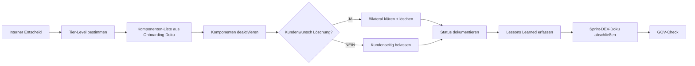

================================================================================
BETA_OFFBOARDING — HOW2 (Associate)
================================================================================
Projekt         : R+MUNI Blueprint
Dokument        : BETA_OFFBOARDING_How2_Associate_S8
Tag             : #associate #how2 #betaoffboarding #s8
Datum           : 2026-03-26
Stage           : S8 — AKTIV
Status          : ENTWURF
Verantwortlich  : EUMAXL
Review          : —
Jira-Sync       : NEIN
Hinweis         : Inhalt initial ident mit DEV-Gegenstück — inhaltliche Trennung in Stage 1
================================================================================

Verantwortlich  : EUMAXL
Review          : —
Jira-Sync       : NEIN
Erstellt        : 2026-03-21
Ablageort       : R+MUNI Doku-public\02-how2\BETA_OFFBOARDING_How2_DEV_S7.md
================================================================================

VORAUSSETZUNGEN
--------------------------------------------------------------------------------
- [[BETA_OFFBOARDING_principles_S7]] gelesen und verstanden
- [[TOOLBAUKASTEN_principles_S6]] bekannt — Tier-Stufen verstanden
- Interner Entscheid zum Offboarding ist gefallen
- Auslöser-Typ bestimmt (A / B / C / D gemäß Principles Kapitel 4)
- Onboarding-Dokumentation des Beta-Kunden vorhanden
  (enthält welche Tier-Komponenten eingerichtet wurden)
- Sprint-DEV-Doku für diesen Offboarding-Vorgang angelegt

MODI — KURZ ERKLÄRT
--------------------------------------------------------------------------------
Das Offboarding läuft in drei Phasen — unabhängig vom Tier-Level:

  Phase 1 — R+MUNI-Zugänge deaktivieren  (Umfang = Tier des Beta-Kunden)
  Phase 2 — Status und Lessons Learned dokumentieren
  Phase 3 — Abschluss formalisieren

Sonderfall Nahverhältnis:
  Phase 1 wird bilateral abgestimmt.
  Phase 2 und Phase 3 laufen unverändert.
  Siehe Principles Kapitel 7.1.

================================================================================
KURZREFERENZ — ALLE SCHRITTE
================================================================================

── PHASE 1 — R+MUNI-ZUGÄNGE DEAKTIVIEREN ───────────────────────────────────────

SCHRITT 1 — Tier-Level und eingerichtete Komponenten bestimmen
  Quelle:  Onboarding-Dokumentation des Beta-Kunden
  Frage:   Welche Tier-Komponenten hat R+MUNI für diesen Kunden eingerichtet?

  MINIMAL    →  i.d.R. keine R+MUNI-seitigen Zugänge — Phase 1 minimal
  DEFAULT    →  GitHub Sync prüfen, ggf. weitere Kollaborations-Zugänge
  ADDON      →  alle aktivierten Addon-Komponenten prüfen
                (z.B. kollaborative Plattform, Portal, externe Sync-Tools)

  Ergebnis:  Liste der zu deaktivierenden Komponenten — Grundlage für Schritt 2

SCHRITT 2 — Komponenten deaktivieren
  Aktion:   Jede R+MUNI-seitig eingerichtete Komponente deaktivieren
  Reihenfolge: von außen nach innen — zuerst externe Zugänge, dann Syncs
  Prüfen:   Nach jeder Deaktivierung — kein aktiver Zugang mehr vorhanden?
  Notieren: Was deaktiviert wurde — für Sprint-DEV-Doku Schritt 3

  Was beim Kunden verbleibt (nicht anfassen):
    - Lokal installierte Tools (Archi, Python, Camunda etc.)
    - Kundenseitige Modelle, Daten, Artefakte
    - Alles was der Kunde selbst eingerichtet hat

  Ausnahme: Expliziter Kundenwunsch nach Löschung →
            bilateral klären und in Sprint-DEV-Doku dokumentieren

── PHASE 2 — STATUS UND LESSONS LEARNED ────────────────────────────────────────

SCHRITT 3 — Beta-Kunden-Status intern dokumentieren
  Ablage:  Sprint-DEV-Doku — Kapitel Ergebnis
  Eintrag:
    Betakunde_XX   Status: OFFBOARDED — <YYYY-MM-DD>
                   Auslöser: <A / B / C / D>
                   Tier-Level: <MINIMAL / DEFAULT / ADDON>
                   Deaktiviert: <Liste der deaktivierten Komponenten>
                   Kundenseitig verbleibend: <was beim Kunden bleibt>
                   Kundenwunsch Löschung: <JA / NEIN>

SCHRITT 4 — Lessons Learned erfassen
  Ablage:   Sprint-DEV-Doku — Kapitel Lessons Learned
  Charakter: sachlich, blueprint-relevant, ohne Kundenbewertung

  Leitfragen:
    - Welche Tier-Komponenten waren sinnvoll / nicht sinnvoll für diesen Kunden?
    - Was hat im Onboarding-Prozess strukturell gefehlt?
    - Was hätte die Adoption-Hürde gesenkt?
    - Was würde beim nächsten Beta-Kunden anders gemacht?
    - Was hat gut funktioniert und wird beibehalten?

  Grenze: Subjekt ist immer der Prozess — nie die Organisation
          oder Person des Beta-Kunden.

  Zulässig:   "DEFAULT-Tier war für diesen Kontext zu komplex"
  Unzulässig: "Kunde war überfordert"

── PHASE 3 — ABSCHLUSS FORMALISIEREN ───────────────────────────────────────────

SCHRITT 5 — Sprint-DEV-Doku abschließen
  Enthält:  Ausgangslage, Tier-Check, deaktivierte Komponenten,
            Status, Lessons Learned, GOV-Check
  Aktion:   Status auf ABGESCHLOSSEN setzen
  Sync:     GitHub-Push wenn Sprint abgeschlossen

SCHRITT 6 — GOV-Check
  DEV-Umgebung berührt?              → NEIN erwartet
  Blueprint-Logik verändert?         → NEIN erwartet
  Kundenseitige Artefakte gelöscht?  → nur wenn explizit gewünscht
  Alle Komponenten dokumentiert?     → JA erwartet
  Lessons Learned vorhanden?         → JA erwartet
  Status-Dokumentation komplett?     → JA erwartet

================================================================================
FLOW — REFERENZ
================================================================================

Standardflow:

  Entscheid → Tier-Check → Komponenten deaktivieren →
  Status dokumentieren → Lessons Learned → Abschluss → GOV-Check

Sonderfall Nahverhältnis:
  Phase 1 wird bilateral abgestimmt — Schritt 2 angepasst.
  Phase 2 und Phase 3 laufen unverändert durch.

================================================================================
FEHLERBILDER
================================================================================

Fehler: Onboarding-Dokumentation fehlt oder ist unvollständig
  Ursache: Onboarding wurde ohne vollständige Doku durchgeführt
  Lösung:  Bekannte Komponenten aus dem Gedächtnis rekonstruieren,
           Lücke explizit in Lessons Learned festhalten —
           Onboarding-Doku-Pflicht für nächsten Beta-Kunden ableiten

Fehler: Kein Zugang mehr zur eingerichteten Komponente
  Ursache: Zugangsdaten abgelaufen oder Account inaktiv
  Lösung:  EUMAXL-Betreiber-Account verwenden — hat immer Admin-Rechte
           auf R+MUNI-seitig eingerichtete Komponenten

Fehler: Lessons Learned enthält Kundenbewertung
  Ursache: Grenze zwischen Prozessfeedback und Personenbewertung verwischt
  Lösung:  Formulierung prüfen — Subjekt muss der Prozess sein.
           "Der Prozess hat X nicht berücksichtigt"
           statt "Der Kunde hat X nicht getan"

Fehler: Sprint-DEV-Doku fehlt
  Ursache: Offboarding ohne begleitende Dokumentation durchgeführt
  Lösung:  Nachträglich erstellen — GOV 10.8 gilt auch rückwirkend

================================================================================
ENTSCHEIDUNGSHILFE
================================================================================

Ich will...                                           Richtiger Schritt
----------------------------------------------------- ---------------------------
Wissen was beim Kunden eingerichtet war               SCHRITT 1 + Onboarding-Doku
Komponenten-Liste für Deaktivierung erstellen         SCHRITT 1
R+MUNI-Zugänge deaktivieren                           SCHRITT 2
Kundenseitige Löschung handhaben                      SCHRITT 2 Ausnahme
Status intern festhalten                              SCHRITT 3
Erkenntnisse für nächsten Beta-Kunden sichern         SCHRITT 4
Offboarding formal abschließen                        SCHRITT 5–6
Sonderfall Nahverhältnis handhaben                    Principles Kapitel 7.1
Prüfen ob DEV-Umgebung betroffen                      SCHRITT 6 GOV-Check

================================================================================
BEZÜGE
================================================================================
[[BETA_OFFBOARDING_principles_S7]]    Designentscheidungen und Hintergrund
[[TOOLBAUKASTEN_principles_S6]]       Tier-Struktur MINIMAL/DEFAULT/ADDON
[[INST_principles_S5]]                Baum-Modell, Exitpoint-Logik
[[Global_GOV_S8]]                     Normative Grundlage
[[FREEZE-6_konsolidiert]]             Ausgangsstatus Betakunde_01

================================================================================
BETA_OFFBOARDING_How2_DEV | S7 | 2026-03-21 | R+MUNI Blueprint
================================================================================
