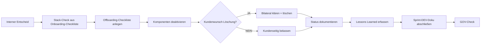

================================================================================
BETA_OFFBOARDING — HOW2 (DEV)
================================================================================
Projekt         : R+MUNI Blueprint
Dokument        : BETA_OFFBOARDING_How2_DEV_S101
Tag             : #dev #how2 #betaoffboarding #s101
Datum           : 2026-03-31
Stage           : S1.01 — AKTIV
Status          : AKTIV
Verantwortlich  : EUMAXL
Review          : —
Jira-Sync       : NEIN
Ablageort       : R+MUNI Doku-public\02-how2\BETA_OFFBOARDING_How2_DEV_S101.md
================================================================================

VORAUSSETZUNGEN
--------------------------------------------------------------------------------
- [[BETA_OFFBOARDING_principles_DEV_S101]] gelesen und verstanden
- [[BETA_ONBOARDING_Checkliste_<BETAKUNDE_XX>_S101]] vorhanden
  (enthält Stack, Modus, Installation, Used Tags — Grundlage für Schritt 1)
- [[BETA_OFFBOARDING_Checkliste_Template_S101]] bereitliegen
  (wird in Schritt 2 ausgefüllt)
- Interner Entscheid zum Offboarding ist gefallen
- Auslöser-Typ bestimmt (A / B / C / D gemäß Principles Kapitel 4)
- Sprint-DEV-Doku für diesen Offboarding-Vorgang angelegt

MODI — KURZ ERKLÄRT
--------------------------------------------------------------------------------
Das Offboarding läuft in drei Phasen — unabhängig vom Stack-Level:

  Phase 1 — R+MUNI-Zugänge deaktivieren  (Umfang = Stack des Beta-Kunden)
  Phase 2 — Status und Lessons Learned dokumentieren
  Phase 3 — Abschluss formalisieren

Sonderfall Nahverhältnis:
  Phase 1 wird bilateral abgestimmt.
  Phase 2 und Phase 3 laufen unverändert.
  Siehe Principles Kapitel 7.1.

================================================================================
KURZREFERENZ — ALLE SCHRITTE
================================================================================

── PHASE 1 — R+MUNI-ZUGÄNGE DEAKTIVIEREN ───────────────────────────────────────

SCHRITT 1 — Stack und eingerichtete Komponenten bestimmen
  Quelle:  [[BETA_ONBOARDING_Checkliste_<BETAKUNDE_XX>_S101]]
  Frage:   Welche Komponenten hat R+MUNI für diesen Kunden eingerichtet?

  Minimal    →  i.d.R. keine R+MUNI-seitigen Zugänge — Phase 1 minimal
  Core       →  GitHub Sync prüfen, ggf. weitere Kollaborations-Zugänge
  Addon      →  alle aktivierten Addon-Komponenten prüfen
               (z.B. Atlassian, Portal, externe Sync-Tools)
  Individual →  bilateral festgestellt — aus Onboarding-Checkliste entnehmen

  Ergebnis:  Liste der zu deaktivierenden Komponenten — Grundlage für Schritt 2

SCHRITT 2 — Offboarding-Checkliste anlegen und Komponenten deaktivieren
  Aktion:   [[BETA_OFFBOARDING_Checkliste_Template_S101]] kopieren,
            für diesen Kunden befüllen
  Stack / Modus / Installation / Contact / Used Tags aus Onboarding-Checkliste
  übernehmen — Übergabe am + Auslöser-Typ eintragen

  Deaktivierung:
  Reihenfolge: von außen nach innen — zuerst externe Zugänge, dann Syncs
  Prüfen:   Nach jeder Deaktivierung — kein aktiver Zugang mehr vorhanden?
  Eintragen: Jede deaktivierte Komponente mit Datum in Checkliste Block DEAKTIVIERT

  Was beim Kunden verbleibt (nicht anfassen):
    - Lokal installierte Tools (Archi, Python, Camunda etc.)
    - Kundenseitige Modelle, Daten, Artefakte
    - Alles was der Kunde selbst eingerichtet hat
  → In Checkliste Block VERBLEIBEND festhalten

  Ausnahme: Expliziter Kundenwunsch nach Löschung →
            bilateral klären, in Checkliste und Sprint-DEV-Doku dokumentieren

── PHASE 2 — STATUS UND LESSONS LEARNED ────────────────────────────────────────

SCHRITT 3 — Beta-Kunden-Status intern dokumentieren
  Ablage:  Sprint-DEV-Doku — Kapitel Ergebnis
  Eintrag:
    Betakunde_XX   Status: OFFBOARDED — <YYYY-MM-DD>
                   Auslöser: <A / B / C / D>
                   Stack: <Minimal / Core / Addon / Individual>
                   Deaktiviert: <Liste der deaktivierten Komponenten>
                   Kundenseitig verbleibend: <was beim Kunden bleibt>
                   Kundenwunsch Löschung: <JA / NEIN>
  Onboarding-Checkliste: Status auf OFFBOARDED setzen

SCHRITT 4 — Lessons Learned erfassen
  Ablage:   [[LL_Template_S101]] — unter notiz\ ablegen
  Charakter: sachlich, blueprint-relevant, ohne Kundenbewertung

  Leitfragen:
    - Welche Stack-Komponenten waren sinnvoll / nicht sinnvoll für diesen Kunden?
    - Was hat im Onboarding-Prozess strukturell gefehlt?
    - Was hätte die Adoption-Hürde gesenkt?
    - Was würde beim nächsten Beta-Kunden anders gemacht?
    - Was hat gut funktioniert und wird beibehalten?

  Grenze: Subjekt ist immer der Prozess — nie die Organisation
          oder Person des Beta-Kunden.

  Zulässig:   "Addon-Tier war für diesen Kontext zu komplex"
  Unzulässig: "Kunde war überfordert"

── PHASE 3 — ABSCHLUSS FORMALISIEREN ───────────────────────────────────────────

SCHRITT 5 — Sprint-DEV-Doku abschließen
  Enthält:  Ausgangslage, Stack-Check, deaktivierte Komponenten,
            Status, Lessons Learned, GOV-Check
  Aktion:   Status auf ABGESCHLOSSEN setzen
  Sync:     GitHub-Push wenn Sprint abgeschlossen

SCHRITT 6 — GOV-Check
  DEV-Umgebung berührt?              → NEIN erwartet
  Blueprint-Logik verändert?         → NEIN erwartet
  Kundenseitige Artefakte gelöscht?  → nur wenn explizit gewünscht
  Offboarding-Checkliste ausgefüllt? → JA erwartet
  Lessons Learned vorhanden?         → JA erwartet
  Status-Dokumentation komplett?     → JA erwartet

================================================================================
FLOW — REFERENZ
================================================================================

Standardflow:

  Entscheid → Stack-Check → Offboarding-Checkliste anlegen →
  Komponenten deaktivieren → Status dokumentieren →
  Lessons Learned → Abschluss → GOV-Check

Sonderfall Nahverhältnis:
  Phase 1 wird bilateral abgestimmt — Schritt 2 angepasst.
  Phase 2 und Phase 3 laufen unverändert durch.

================================================================================
FEHLERBILDER
================================================================================

Fehler: Onboarding-Checkliste fehlt oder ist unvollständig
  Ursache: Onboarding wurde ohne vollständige Doku durchgeführt
  Lösung:  Bekannte Komponenten aus dem Gedächtnis rekonstruieren,
           Offboarding-Checkliste so vollständig wie möglich befüllen,
           Lücke explizit in Lessons Learned festhalten

Fehler: Kein Zugang mehr zur eingerichteten Komponente
  Ursache: Zugangsdaten abgelaufen oder Account inaktiv
  Lösung:  EUMAXL-Betreiber-Account verwenden — hat immer Admin-Rechte
           auf R+MUNI-seitig eingerichtete Komponenten

Fehler: Lessons Learned enthält Kundenbewertung
  Ursache: Grenze zwischen Prozessfeedback und Personenbewertung verwischt
  Lösung:  Formulierung prüfen — Subjekt muss der Prozess sein.
           "Der Prozess hat X nicht berücksichtigt"
           statt "Der Kunde hat X nicht getan"

Fehler: Sprint-DEV-Doku fehlt
  Ursache: Offboarding ohne begleitende Dokumentation durchgeführt
  Lösung:  Nachträglich erstellen — GOV 10.8 gilt auch rückwirkend

================================================================================
ENTSCHEIDUNGSHILFE
================================================================================

Ich will...                                           Richtiger Schritt
----------------------------------------------------- ---------------------------
Wissen was beim Kunden eingerichtet war               SCHRITT 1 + Onboarding-Checkliste
Komponenten-Liste für Deaktivierung erstellen         SCHRITT 1
Offboarding-Checkliste anlegen                        SCHRITT 2
R+MUNI-Zugänge deaktivieren                           SCHRITT 2
Kundenseitige Löschung handhaben                      SCHRITT 2 Ausnahme
Status intern festhalten                              SCHRITT 3
Erkenntnisse für nächsten Beta-Kunden sichern         SCHRITT 4
Offboarding formal abschließen                        SCHRITT 5–6
Sonderfall Nahverhältnis handhaben                    Principles Kapitel 7.1
Prüfen ob DEV-Umgebung betroffen                      SCHRITT 6 GOV-Check

================================================================================
BEZÜGE
================================================================================
[[BETA_OFFBOARDING_principles_DEV_S101]]          Designentscheidungen und Hintergrund
[[BETA_ONBOARDING_Checkliste_Template_S101]]      Onboarding-Checkliste (Quelle)
[[BETA_OFFBOARDING_Checkliste_Template_S101]]     Offboarding-Checkliste (Ziel)
[[LL_Template_S101]]                              Lessons Learned Template
[[Global_GOV_DEV_S101]]                           Normative Grundlage
[[FREEZE-6_konsolidiert]]                         Ausgangsstatus Betakunde_01

================================================================================
BETA_OFFBOARDING_How2_DEV | S1.01 | 2026-03-31 | R+MUNI Blueprint
================================================================================
