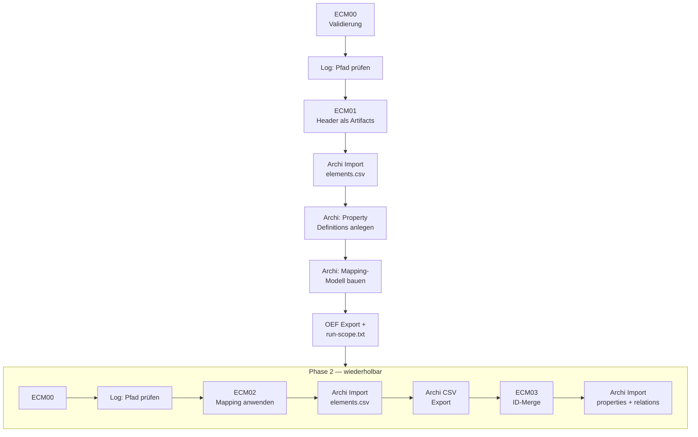

================================================================================
ECM FLOW – HOW2 (DEV)
================================================================================
Projekt         : R+MUNI Blueprint
Dokument        : ECM_FLOW_How2_S105
Tag             : #dev #how2 #ecmflow #s105
Datum           : 2026-04-14
Stage           : S105 — AKTIV
Status          : AKTIV
Verantwortlich  : EUMAXL
Review          : —
Jira-Sync       : NEIN
Erstellt        : 2026-03-21
Letzte Änderung : 2026-04-14 — S105-Update | Basis: ECM_How2_DEV_S8.md
Ablageort       : 02-how2/ECM_FLOW_How2_S105.md
================================================================================

VORAUSSETZUNGEN
--------------------------------------------------------------------------------
- [[ECM_FLOW_principles_S105]] gelesen — Konzept und Entscheidungen bekannt
- Python 3.10+
- root.cfg vorhanden und <rootfolder> korrekt gesetzt
- Scripts in 01-artifacts\01-scripts\
- Archi 5.8 installiert (manueller Import/Export-Schritt)
- trash_*.csv in 01-artifacts\02-csv\03-child\00-archimatechild\ abgelegt
  ★ NICHT in 01-artifacts\02-csv\04-import\ — das ist der häufigste Fehler (S105)
- run-scope.txt enthält SOURCE=CSV + MODEL= + MAPPING= Tripel (nach ECM01-Phase)

ZWEI PHASEN — KURZ ERKLÄRT
--------------------------------------------------------------------------------
Phase 1  (einmalig pro neuer CSV-Quelle)
  Strukturerkennung → Mapping-Modell in Archi bauen → OEF Export
  Nur einmal nötig — danach direkt Phase 2

Phase 2  (regulärer Lauf, wiederholbar)
  Daten importieren mit bestehendem Mapping-Modell

================================================================================
KURZREFERENZ — ALLE SCRIPTS
================================================================================

── PHASE 1 — ERSTMALIGE STRUKTURERKENNUNG ──────────────────────────────────────

ECM00 – Umgebung validieren
  py .\ECM00-validate_environment.py
  → Prüft root.cfg, 00-model\00-archimate\99-mappingmodel\, 02-stages\00-archimatearchive\, 01-artifacts\02-csv\03-child\00-archimatechild\
  → Meldet gefundene trash_*.csv Dateien MIT vollem Pfad
  → Log lesen und Pfad bestätigen — vor jedem Lauf
  → Ziel: 02-stages\99-logs\ECM00-root.resolved.txt

ECM01 – Müll-CSV Felder als Artifact-CSV  ★ NUR PHASE 1
  py .\ECM01-csv_fields_to_artifacts.py
  → Liest trash_*.csv aus 01-artifacts\02-csv\03-child\00-archimatechild\ — erkennt Encoding + Trennzeichen
  → Schreibt alle Spaltenköpfe als Artifact-Elemente (Name = Spaltenkopf)
  → Beispielwert aus Zeile 1 landet in Documentation-Feld — zur Orientierung
  → Ziel: 01-artifacts\02-csv\04-import\elements.csv (Archi-importfertig)
  → ECM01 deckt den Phase-1-Use-Case vollständig ab — kein weiteres Script nötig

── PHASE 2 — REGULÄRER LAUF ────────────────────────────────────────────────────

ECM00 – Umgebung validieren  (immer zuerst)
  py .\ECM00-validate_environment.py

ECM02 – Müll-CSV + OEF Mapping → Import-CSVs
  py .\ECM02-csv_to_mapping_to_csv.py
  → Liest MAPPING= aus run-scope.txt → findet OEF XML in 00-model\00-archimate\99-mappingmodel\
  → Wertet Associations aus (Element vs. Property)
  → Ziel: 01-artifacts\02-csv\04-import\elements.csv
          02-stages\00-archimatearchive\properties.csv  (geparkt, ID-los)
          02-stages\00-archimatearchive\relations.csv   (geparkt, nur Header)

ECM03 – ID-Merge  ★ NACH ARCHI EXPORT
  py .\ECM03-id_merge.py
  → Liest elements.csv (frischer Archi-Export MIT IDs) aus 01-artifacts\02-csv\04-import\
  → Merged IDs in properties.csv via Reihenfolge-Join (pro Typ-Gruppe)
  → Ziel: 01-artifacts\02-csv\04-import\properties.csv (mit IDs)
          01-artifacts\02-csv\04-import\relations.csv
  → ACHTUNG: Nur ausführen NACHDEM Archi CSV-Export in 01-artifacts\02-csv\04-import\ erfolgt ist

================================================================================
VOLLSTÄNDIGER FLOW
================================================================================

PHASE 1 — einmalig pro neuer CSV-Quelle:

  py .\ECM00-validate_environment.py
    ↓ Log prüfen: trash_*.csv Pfad bestätigen (01-artifacts\02-csv\03-child\00-archimatechild\)
  py .\ECM01-csv_fields_to_artifacts.py

  → Archi: elements.csv importieren
           File → Import → CSV → 01-artifacts\02-csv\04-import\elements.csv
  → Archi: Property Definitions anlegen (manuell oder HLP10)
  → Archi: Mapping-Modell bauen
           Artifact-Elemente auf Ziel-Typen umwandeln
           Associations für Property-Felder ziehen
  → Archi: OEF Export → 00-model\00-archimate\99-mappingmodel\<n>.xml
  → run-scope.txt ergänzen:
           SOURCE=CSV
           MODEL=<dateiname>.csv
           MAPPING=<n>.xml

PHASE 2 — regulärer Lauf (wiederholbar):

  py .\ECM00-validate_environment.py
    ↓ Log prüfen: trash_*.csv Pfad bestätigen
  py .\ECM02-csv_to_mapping_to_csv.py

  → Archi: elements.csv importieren
           File → Import → CSV → 01-artifacts\02-csv\04-import\elements.csv
  → Archi: CSV Export nach 01-artifacts\02-csv\04-import\
           File → Export → CSV → 01-artifacts\02-csv\04-import\

  py .\ECM03-id_merge.py

  → Archi: properties.csv + relations.csv importieren
           File → Import → CSV → 01-artifacts\02-csv\04-import\properties.csv
           File → Import → CSV → 01-artifacts\02-csv\04-import\relations.csv

================================================================================
KRITISCHE REGEL — IMPORT-PFAD (NEU S105)
================================================================================

Die trash_*.csv muss in 01-artifacts\02-csv\03-child\00-archimatechild\ liegen — nicht in 01-artifacts\02-csv\04-import\.

  FALSCH: 01-artifacts\02-csv\04-import\trash_nbx.csv
  RICHTIG: 01-artifacts\02-csv\03-child\00-archimatechild\trash_nbx.csv

Warum ist das kritisch?
  ECM verarbeitet den falschen Stand ohne Fehlermeldung.
  Das Ergebnis ist inhaltlich falsch — kein sichtbarer Abbruch.

Absicherung: ECM00 Log vor jedem Lauf lesen.
  Dort steht der vollständige Pfad der gefundenen trash_*.csv.

================================================================================
KRITISCHE REGEL — REIHENFOLGE-JOIN
================================================================================

ECM03 matcht Properties via Reihenfolge — NICHT via Namen-Lookup.

  ZWISCHEN ECM02-Import und ECM03-Lauf KEINE Elemente in Archi umbenennen.
  Archi exportiert in Importreihenfolge — Umbenennung bricht den Join.

  Konsequenz bei Verletzung: falsche Properties am falschen Element.
  Kein Fehler sichtbar — falsches Ergebnis im Modell.

  Empfehlung: Erst nach vollständigem Phase-2-Lauf und Validierung umbenennen.

================================================================================
KONFIGURATION — run-scope.txt
================================================================================

ECM-Tripel Format (nach Phase 1 manuell eintragen):

  SOURCE=CSV
  MODEL=<dateiname>.csv
  MAPPING=<oef-dateiname>.xml

MAPPING= referenziert direkt den Dateinamen (inkl. .xml Extension)
in 00-model\00-archimate\99-mappingmodel\

Beispiel:
  SOURCE=CSV
  MODEL=trash_nbx.csv
  MAPPING=trash_nbx.xml

================================================================================
ENCODING + TRENNZEICHEN ERKENNUNG
================================================================================

ECM01 und ECM02 erkennen automatisch:

Encoding (Reihenfolge):
  utf-8-sig → utf-8 → cp1252 → latin-1

Trennzeichen (Reihenfolge):
  ; → , → \t → |

Praxistest bestanden: cp1252 + Semikolon (Excel-Export, CRLF)
Praxistest bestanden: NBX03-Output (utf-8 + Komma)

Bei Erkennungsfehler: Log prüfen — erkanntes Encoding und Trennzeichen
werden explizit ausgegeben.

================================================================================
FEHLERBILDER
================================================================================

Fehler: "Mehrere trash_*.csv gefunden"
  Ursache: Mehr als eine trash_*.csv in 01-artifacts\02-csv\03-child\00-archimatechild\
  Lösung:  Alle außer der gewünschten Datei entfernen — nur 1 pro Lauf

Fehler: "OEF XML nicht gefunden"
  Ursache: MAPPING= Wert in run-scope.txt stimmt nicht mit Dateiname überein
  Lösung:  Dateiname in 00-model\00-archimate\99-mappingmodel\ prüfen — MAPPING= inkl. .xml angeben
           Beispiel: MAPPING=trash_nbx.xml (nicht: MAPPING=trash_nbx)

Fehler: "ECM00-root.resolved.txt nicht gefunden"
  Ursache: ECM00 wurde nicht ausgeführt oder ist fehlgeschlagen
  Lösung:  ECM00 neu ausführen, Log prüfen

Fehler: "elements.csv (04-import) nicht gefunden" bei ECM03
  Ursache: Archi CSV-Export wurde noch nicht durchgeführt
  Lösung:  In Archi: File → Export → CSV → 01-artifacts\02-csv\04-import\ — dann ECM03 neu starten

Fehler: Properties landen am falschen Element
  Ursache: Element in Archi zwischen Import und ECM03 umbenannt
  Lösung:  Phase 2 komplett neu durchlaufen — ECM02 → Import → Export → ECM03

Fehler: Mapping basiert auf altem Stand (kein Fehler sichtbar)
  Ursache: trash_*.csv lag in 04-import\ statt 00-archimatechild\ (S105)
  Lösung:  Datei in richtigen Ordner verschieben, Lauf wiederholen
           ECM00 Log vorher lesen: vollständiger Pfad ist dort dokumentiert

Fehler: root.cfg nicht gefunden
  Ursache: Script nicht aus Scripts-Ordner aufgerufen
  Lösung:  PowerShell in <rootfolder>\01-artifacts\01-scripts\ starten

================================================================================
ENTSCHEIDUNGSHILFE
================================================================================

Ich will...                                            Richtiges Script
------------------------------------------------------ -----------------------
Neue CSV-Quelle erstmalig verarbeiten                  ECM00 → ECM01 → [Archi]
Bekannte CSV-Quelle erneut importieren                 ECM00 → ECM02 → [Archi] → ECM03
Umgebung prüfen ohne Import                            ECM00
Encoding/Trennzeichen einer CSV prüfen                 ECM01 (Log lesen)
ID-Merge nach Archi-Export durchführen                 ECM03
Diagnose wenn nichts funktioniert                      ECM00 (Log + Pfad prüfen)
Property Definitions bereinigen                        HLP10

================================================================================
BEZÜGE
================================================================================

[[ECM_FLOW_principles_S105]]     Designentscheidungen, vollständiger Kontext
[[DEV_Sprint_NBX-ECM-RUN_S105]]  Produktivrun — Erkenntnisse S105
[[ECM_How2_DEV_S8]]              Vorgänger-Dokument (read-only)
[[Global_GOV_DEV_S102]]          normative Grundlage
[[CSV_FLOW_How2_S105]]           Bestehender CSV-Flow (Übergabe-Kanal)
[[NBX_How2_DEV_S102]]            Producer-Referenz NBX

================================================================================
ECM_FLOW_How2 | S105 | 2026-04-14 | R+MUNI Blueprint
================================================================================
