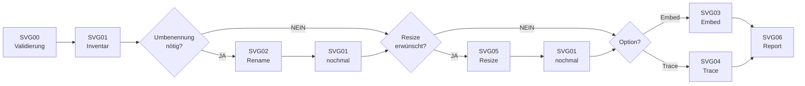

================================================================================
SVG-REIHE – IMG2SVG – HOW2 (DEV)
================================================================================
Projekt         : R+MUNI Blueprint
Dokument        : SVG_How2_DEV_S105
Tag             : #dev #how2 #svg #img2svg #s105
Datum           : 2026-04-14
Stage           : S105 — AKTIV
Status          : AKTIV
Verantwortlich  : EUMAXL
Review          : —
Jira-Sync       : NEIN
Erstellt        : 2026-04-12
Letzte Änderung : 2026-04-14 — S105-Update | Basis: SVG_How2_DEV_S104.md
Ablageort       : R+MUNI Doku-public\02-how2\SVG_How2_DEV_S105.md
================================================================================

VORAUSSETZUNGEN
--------------------------------------------------------------------------------
- [[SVG_principles_DEV_S105]] gelesen und verstanden
- Python 3.x installiert, im PATH verfügbar
- HLP00_resolve_root.py in 01-artifacts\01-scripts\
- root.cfg vorhanden und rootfolder korrekt gesetzt
- Inkscape installiert — Pfad zur inkscape.exe bekannt
- svg_config.txt befüllt in <rootfolder>\99-doku\svg_config.txt
- Quellordner mit Bilddateien vorhanden
- Zielordner manuell angelegt (wird nicht automatisch erstellt)
- Pillow installiert wenn SVG05 verwendet wird:
    pip install pillow
- PowerShell 7 gestartet in:
    <rootfolder>\01-artifacts\01-scripts\

MODI — KURZ ERKLÄRT
--------------------------------------------------------------------------------
Embed  (SVG03)  →  Bild als Base64 in SVG-Hülle — schnell, verlustfrei,
                   für alle Bildtypen geeignet
Trace  (SVG04)  →  Vektorisierung via Inkscape Trace Bitmap — editierbare
                   Pfade, nur für Strichzeichnungen/Icons sinnvoll

================================================================================
KURZREFERENZ — ALLE SCRIPTS
================================================================================

── VORBEREITUNG ────────────────────────────────────────────────────────────────

SVG00 – Umgebungsvalidierung
  py .\SVG00-validate_environment.py
  → Liest root.cfg und validiert svg_config.txt vollständig
  → Prüft: inkscape_exe, source_folder, target_folder, svg_formats
  → Ziel: 02-stages\99-logs\SVG00-validate_environment.log
  → Bei kritischem Fehler: Abbruch mit Hinweis auf Ursache

SVG01 – Inventarisierung Quellordner
  py .\SVG01-inventory.py
  → Scannt Quellordner (nur oberste Ebene, keine Rekursion)
  → Klassifiziert: OK | RENAME_REQUIRED | SKIP
  → Ziel: 02-stages\99-logs\SVG01-inventory.log
  → Muss nach SVG02 und nach SVG05 erneut ausgeführt werden

── BEREINIGUNG (OPTIONAL) ──────────────────────────────────────────────────────

SVG02 – Dateinamen-Bereinigung
  py .\SVG02-rename.py
  → Benennt RENAME_REQUIRED Dateien um: Leerzeichen → _, Sonderzeichen weg
  → Kollisionsprüfung vor Umbenennung — keine Überschreibung bei Kollision
  → Ziel: 02-stages\99-logs\SVG02-rename.log
  → Nach SVG02 immer SVG01 erneut ausführen

SVG05 – Resize / Compress  ★ OPTIONAL
  py .\SVG05-resize.py
  → Optimiert Bilder auf A4 Querformat 150 DPI (max 1754 × 1240px)
  → Nur verkleinern, nie hochskalieren — Seitenverhältnis bleibt erhalten
  → JPEG: Qualität 85% | PNG: verlustfrei, optimize
  → EXIF-Orientierung wird korrigiert (Handy-Fotos)
  → Ziel: Originaldatei wird überschrieben (svg_overwrite=true erforderlich)
  → Log: 02-stages\99-logs\SVG05-resize.log
  → Nach SVG05 immer SVG01 erneut ausführen
  → Abhängigkeit: pip install pillow

── KONVERTIERUNG ───────────────────────────────────────────────────────────────

SVG03 – Embed-Konvertierung (Option A)
  py .\SVG03-embed.py
  → Konvertiert alle OK/RENAME_REQUIRED Dateien aus SVG01-Inventar
  → Bild als Base64-Objekt in SVG-Hülle — kein Qualitätsverlust
  → CLI: inkscape.exe "<quelle>" --export-type=svg --export-filename="<ziel>"
  → Timeout: 60 Sekunden je Datei
  → Ziel: SVG-Dateien in svg_target_folder + SVG03-embed.log

SVG04 – Trace-Konvertierung (Option B)  ★ EXPERIMENTELL
  py .\SVG04-trace.py
  → Vektorisiert via Inkscape --actions Trace Bitmap
  → Erzeugt echte SVG-Pfade — editierbar in Inkscape
  → Timeout: 120 Sekunden je Datei
  → Ziel: SVG-Dateien in svg_target_folder + SVG04-trace.log
  → Qualität bildinhaltabhängig — Strichzeichnungen/Icons: gut
     Fotos/KI-Bilder: meist unbrauchbar
  → --actions String ist Inkscape-versionsabhängig
     Bei Fehler: Inkscape-Version prüfen

── ABSCHLUSS ───────────────────────────────────────────────────────────────────

SVG06 – Handoff-Report
  py .\SVG06-handoff_report.py
  → Liest alle SVG-Reihe Logs (SVG00–SVG05)
  → Zeigt Script-Status, Zusammenfassungen, SVG-Zieldateien
  → Prüft: VORHANDEN | LEER | FEHLEND je erwartetem SVG
  → Zeigt Umbenennungen aus SVG02 explizit aus
  → Abschluss-Banner: OK oder WARNUNG
  → Ziel: 02-stages\99-logs\SVG06-handoff_report.log

================================================================================
HÄUFIGE KOMBINATIONEN
================================================================================

Standardlauf Embed (kleine Dateien, saubere Namen):
  py .\SVG00-validate_environment.py
  py .\SVG01-inventory.py
  py .\SVG03-embed.py
  py .\SVG06-handoff_report.py

Standardlauf mit Bereinigung (Leerzeichen im Dateinamen):
  py .\SVG00-validate_environment.py
  py .\SVG01-inventory.py
  py .\SVG02-rename.py
  py .\SVG01-inventory.py
  py .\SVG03-embed.py
  py .\SVG06-handoff_report.py

Vollständiger Lauf mit Resize (große Bilder für Dokumentation):
  py .\SVG00-validate_environment.py
  py .\SVG01-inventory.py
  py .\SVG02-rename.py
  py .\SVG01-inventory.py
  py .\SVG05-resize.py
  py .\SVG01-inventory.py
  py .\SVG03-embed.py
  py .\SVG06-handoff_report.py

Trace testen (Strichzeichnungen/Icons):
  py .\SVG01-inventory.py
  py .\SVG04-trace.py
  py .\SVG06-handoff_report.py

================================================================================
FLOW — REFERENZ
================================================================================

Standardflow Embed:
  SVG00 → SVG01 → SVG03 → SVG06

Vollständiger Flow mit allen optionalen Schritten:
  SVG00 → SVG01 → SVG02 → SVG01* → SVG05 → SVG01* → SVG03/SVG04 → SVG06
  * SVG01 nach SVG02 und nach SVG05 erneut ausführen

Abweichungen:
  SVG00 kann übersprungen werden wenn Umgebung bereits validiert ist.
  SVG02 kann übersprungen werden wenn alle Dateinamen sauber sind.
  SVG05 ist optional — nur bei großen Bildern für Dokumentation sinnvoll.
  SVG03 und SVG04 schließen sich nicht aus — beide können nacheinander
  auf dasselbe Inventar angewendet werden (unterschiedliche Zielordner
  empfohlen).

================================================================================
LOG-AUSGABE VERSTEHEN
================================================================================

Standardfall SVG03 (Konvertierung):
  [2026-04-14 13:14:55] [OK     ] inkscape_exe gefunden
  [2026-04-14 13:14:55] [OK     ] SVG01-inventory.log gelesen — 2 Datei(en)
    Bomb.png                         Bomb.svg           OK       66.3 KB
    Header_Logo_34.png               Header_Logo_34.svg OK       41.4 KB
  [SVG03] Verarbeitet: 2 | OK: 2 | Übersprungen: 0 | Fehler: 0

[SKIP] — SVG bereits vorhanden (svg_overwrite=false):
  Header_Logo.png    Header_Logo.svg    SKIP     bereits vorhanden
  → Kein Fehler — svg_overwrite=true setzen um zu überschreiben

[RENAME_REQUIRED] — Dateiname mit Leerzeichen:
  RENAME_REQUIRED    Header Logo.png    PNG      28.4 KB
  → SVG02 ausführen, dann SVG01 erneut, dann SVG03

[FEHLER] — Quelldatei nicht gefunden nach Umbenennung:
  Header Logo.png    —                  FEHLER   Quelldatei nicht gefunden
  → SVG01 nach SVG02 nicht erneut ausgeführt
  → SVG01 nochmal starten, dann SVG03 erneut

================================================================================
FEHLERBILDER
================================================================================

Fehler: svg_config.txt nicht gefunden
  Ursache: Datei liegt nicht in <rootfolder>\99-doku\ oder rootfolder leer
  Lösung:  SVG00 ausführen — zeigt erwarteten Pfad
           svg_config.txt an korrekten Ort kopieren

Fehler: inkscape_exe nicht gefunden
  Ursache: Pfad in svg_config.txt falsch oder Inkscape nicht installiert
  Lösung:  inkscape_exe in svg_config.txt auf korrekten absoluten Pfad setzen
           Inkscape-Installation prüfen

Fehler: Quelldatei nicht gefunden (nach SVG02)
  Ursache: SVG01 nach SVG02 nicht erneut ausgeführt —
           Inventar enthält noch alte Dateinamen vor Umbenennung
  Lösung:  SVG01 ausführen, dann SVG03/SVG04 erneut starten

Fehler: SVG04 Trace schlägt fehl / leere SVGs
  Ursache: --actions String ist Inkscape-versionsabhängig
  Lösung:  Inkscape-Version prüfen (inkscape --version)
           SVG03 Embed als Alternative verwenden

Fehler: root.cfg nicht gefunden
  Ursache: Script wird nicht aus dem Scripts-Ordner aufgerufen
           oder root.cfg liegt nicht zwei Ebenen über dem Script
  Lösung:  Arbeitsverzeichnis prüfen — PowerShell starten in
           <rootfolder>\01-artifacts\01-scripts\

Fehler: Pillow nicht installiert (SVG05)
  Ursache: pip install pillow wurde nicht ausgeführt
  Lösung:  pip install pillow
           Dann SVG05 erneut starten

Fehler: SVG wird größer nach SVG05 (kleine PNG)
  Ursache: PNG optimize schreibt Metadaten neu — bei sehr kleinen Dateien
           kann das minimal größer werden. Kein echter Fehler.
  Lösung:  Kein Handlungsbedarf — Randfall bei Dateien unter ~50KB

================================================================================
ENTSCHEIDUNGSHILFE
================================================================================

Ich will...                                         Richtiges Script
--------------------------------------------------- ---------------------------
Umgebung prüfen bevor ich starte                    SVG00
Sehen welche Bilder im Quellordner liegen           SVG01
Leerzeichen aus Dateinamen entfernen                SVG02 → SVG01 (nochmal)
Bild 1:1 als SVG verpacken (alle Bildtypen)         SVG03
Strichzeichnung vektorisieren (echte Pfade)         SVG04  ← nicht SVG03!
Große Bilder für Doku-Verwendung optimieren         SVG05 → SVG01 → SVG03
Prüfen ob alle SVGs vorhanden sind                  SVG06
Gesamtstatus nach einem Lauf sehen                  SVG06
Diagnose wenn nichts funktioniert                   SVG00 → Log lesen

================================================================================
BEZÜGE
================================================================================

[[SVG_principles_DEV_S105]]     Designentscheidungen und Hintergrund
[[SVG_MASTER_DEV_S102]]         SVG-Designsystem — Farben, Formen, Regeln
[[naming_and_structure_S104]]   Ablagestruktur und Namenskonventionen
[[Global_GOV_DEV_S102]]         Normative Grundlage

================================================================================
SVG_How2_DEV | S105 | 2026-04-14 | R+MUNI Blueprint
================================================================================
