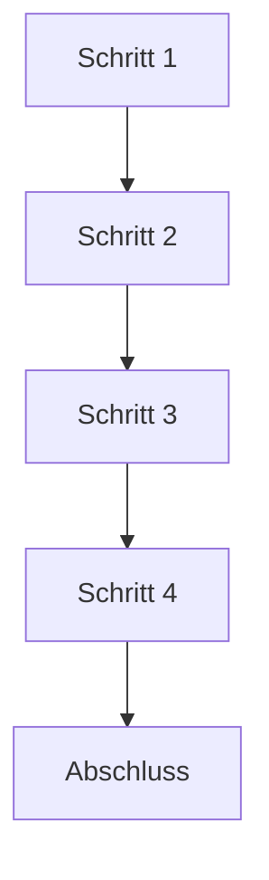

================================================================================
SPRINT-DEV-DOKU – <BEZEICHNUNG>
================================================================================
Projekt             : R+MUNI Blueprint
Dokument            : Sprint-DEV-Doku_Template_S8
Tag                 : #dev #template #sprint #s8
Datum               : 2026-03-28
Stage               : S8 — AKTIV
Status              : AKTIV
Verantwortlich      : EUMAXL
Review              : —
Jira-Sync           : NEIN
================================================================================
<!-- HINWEIS FÜR DEV
     Dieses Template ist die verbindliche Vorlage für alle Sprint-DEV-Doku-Dokumente.
     Platzhalter in <GROSSBUCHSTABEN> sind zu ersetzen.
     Kommentarblöcke (wie dieser) werden im fertigen Dokument entfernt.

     CHARAKTER DER SPRINT-DEV-DOKU — verbindlich einzuhalten:
     - Vollständiges Arbeitsgedächtnis — kein schlankes Nachweis-Dokument
     - Ein DEV-Mitglied muss diesen Sprint in einem Jahr ohne Rückfragen
       vollständig nachvollziehen können
     - Enthält: Kontext, Entscheidungen, verworfene Alternativen, Umsetzung,
       Script-Inhalte wo relevant, Diagramme, Ergebnis, Lessons Learned
     - Script-Auszüge direkt einbetten wenn sie das Verständnis fördern
     - Mermaid-Diagramme ausdrücklich erwünscht für Flows und Abhängigkeiten
     - Verlinkungen zu Creative-Assets im Doku-creative Repo sind zulässig
     - Tiefe skaliert mit Komplexität:
         Bugfix        →  kompakter, fokussiert auf Ursache/Lösung/Test
         Strukturell   →  volle Tiefe, Vorher/Nachher, alle Entscheidungen
         Neue Reihe    →  volle Tiefe, Designentscheidungen explizit
     - Nach Abschluss unveränderlich — vor Abschluss lebend
     - Obsidian-Links sind erwünscht — dort einsetzen wo Bezüge bestehen
     - Formstabilität hat Vorrang vor sprachlicher Variation
-->

— Ausgefülltes Dokument verwendet diesen Header —
================================================================================
SPRINT-DEV-DOKU – <BEZEICHNUNG>
================================================================================
Projekt             : R+MUNI Blueprint
Sprint-Bezeichnung  : Sprint-DEV-<BEZEICHNUNG>
Tag                 : #dev #sprint #s8 #<thema>
Datum               : <YYYY-MM-DD>
Stage               : S8 — AKTIV
Status              : <Sprint Definition / In Umsetzung / Abgeschlossen>
Verantwortlich      : EUMAXL
Review              : —
Jira-Sync           : <JA — Ticket <NR> / NEIN>
Erstellt durch      : EUMAXL + Claude (Pair-Session)
Vorgänger           : [[<letzter Freeze oder Sprint>]]
Nachfolger          : <noch offen / [[<nächster Sprint oder Freeze>]]>
================================================================================


================================================================================
1. AUSGANGSLAGE UND KONTEXT
================================================================================

1.1 Ist-Zustand vor diesem Sprint
-----------------------------------
<!-- Was war der Zustand des Systems bevor dieser Sprint startete?
     Konkret und faktisch — was war bekannt, was fehlte, was funktionierte nicht?
     Bezug auf letzten Freeze oder vorherigen Sprint. -->

<Beschreibung des Ist-Zustands>

Relevante Artefakte vor dem Sprint:
  - <Datei / Script / Konfiguration>    Status: <Zustand>
  - <Datei / Script / Konfiguration>    Status: <Zustand>

Bezug: [[<letzter Freeze oder Sprint>]]


1.2 Konkrete Diskrepanz oder Problemstellung
---------------------------------------------
<!-- Was war konkret das Problem, die Lücke oder der Auslöser?
     IST vs. SOLL wenn möglich als Gegenüberstellung.
     Nicht abstrakt — so konkret wie möglich. -->

  IST:  <Konkreter Ist-Zustand>
  SOLL: <Konkreter Soll-Zustand>

<Ergänzende Beschreibung der Diskrepanz>


1.3 Auslöser
-------------
Auslöser-Typ: <Bugfix / Feature / Strukturbereinigung / Kundenbedarf / Entwicklerwunsch>

<Beschreibung des konkreten Auslösers>
<Warum jetzt — was hat den Zeitpunkt bestimmt?>


================================================================================
2. ENTSCHEIDUNGEN UND GRUNDSÄTZE DIESES SPRINTS
================================================================================
<!-- Das wichtigste Kapitel für die Langzeit-Nachvollziehbarkeit.
     Jede wesentliche Entscheidung gehört hier — mit Begründung.
     Verworfene Alternativen MÜSSEN dokumentiert werden.
     Format je Entscheidung: Entscheidung → Begründung → Alternativen → Auswirkung -->

2.1 <Entscheidung 1>
---------------------
Entscheidung:
  <Was wurde entschieden>

Begründung:
  <Warum wurde so entschieden — nicht nur was, sondern warum>

Verworfene Alternativen:
  Alternative A: <Beschreibung>
    Verworfen weil: <Begründung>
  Alternative B: <Beschreibung>
    Verworfen weil: <Begründung>

Auswirkung:
  <Was ändert sich durch diese Entscheidung — für Scripts, Struktur, GOV>


2.2 <Entscheidung 2>
---------------------
Entscheidung:
  <Was wurde entschieden>

Begründung:
  <Warum>

Verworfene Alternativen:
  <Alternative oder: Keine Alternativen geprüft — direkte Lösung>

Auswirkung:
  <Was ändert sich>


<!-- Offene Entscheidungen die erst im Sprint geklärt werden -->
2.x OFFENE ENTSCHEIDUNGEN — werden im Sprint geklärt
------------------------------------------------------
<!-- Nicht alle Entscheidungen sind vor Sprint-Start bekannt.
     Offene Punkte hier vorhalten — nach Klärung in eigene Abschnitte übertragen. -->

  OFFEN A: <Thema>
    <Was muss entschieden werden>
    Auswirkung: <Was hängt davon ab>
    → Entschieden am <YYYY-MM-DD>: <Ergebnis>

  OFFEN B: <Thema>
    <Was muss entschieden werden>
    → Entschieden am <YYYY-MM-DD>: <Ergebnis>


================================================================================
3. SPRINT-ZIELE
================================================================================
<!-- Jedes Ziel bekommt einen eigenen Abschnitt.
     IST → SOLL Darstellungen und Tabellen sind ausdrücklich erwünscht.
     Vorgehen und Begründung für das Vorgehen explizit festhalten. -->

3.1 Ziel 1 — <BEZEICHNUNG>
----------------------------
<Klare Beschreibung was erreicht werden soll>

<!-- IST → SOLL Tabelle wenn sinnvoll -->
  IST                    →  SOLL
  <Ist-Zustand 1>        →  <Soll-Zustand 1>
  <Ist-Zustand 2>        →  <Soll-Zustand 2>

Vorgehen:
  <Wie wird dieses Ziel erreicht — konkret>

Begründung für dieses Vorgehen:
  <Warum genau so und nicht anders>


3.2 Ziel 2 — <BEZEICHNUNG>
----------------------------
<Beschreibung>

Vorgehen:
  <Konkret>


<!-- Weitere Ziele nach demselben Muster -->


================================================================================
4. ABGRENZUNG — WAS DIESER SPRINT NICHT TUT
================================================================================
<!-- Explizit benennen was bewusst ausgeschlossen wurde.
     Verhindert Scope-Creep und klärt Erwartungen. -->

Dieser Sprint tut explizit nicht:
  - <Ausschluss 1>
  - <Ausschluss 2>
  - <Ausschluss 3>

Begründung der wichtigsten Ausschlüsse:
  <Ausschluss X>: <Warum — und wo es stattdessen behandelt wird>


================================================================================
5. BETROFFENE ARTEFAKTE
================================================================================
<!-- Vollständige Liste aller Artefakte die in diesem Sprint berührt werden.
     Neu / Geändert / Verschoben / Gelöscht / Unverändert klar trennen. -->

Neu erstellt:
  <Dateiname>              <Zweck>
  <Dateiname>              <Zweck>

Geändert:
  <Dateiname>              <Was wurde geändert — Pfad-String / Logik / Struktur>
  <Dateiname>              <Was wurde geändert>

Verschoben:
  <Dateiname>              von: <Quelle>  →  nach: <Ziel>

Gelöscht:
  <Dateiname>              <Begründung>

Unverändert (relevant zu erwähnen):
  <Dateiname>              <Warum explizit unverändert>


================================================================================
6. UMSETZUNG — SCHRITT FÜR SCHRITT
================================================================================
<!-- Der vollständige Umsetzungspfad — chronologisch.
     Reihenfolge und Begründung der Reihenfolge explizit.
     Script-Inhalte oder Auszüge einbetten wenn sie das Verständnis fördern.
     Mermaid-Diagramme für Flows und Abhängigkeiten einsetzen. -->

<!-- Optional: Ablauf als Mermaid-Diagramm -->


Schritt 1 — <BEZEICHNUNG>
  <Was konkret getan wird>
  <Begründung der Reihenfolge wenn nicht selbsterklärend>
  Ergebnis: <Was danach vorliegt>

Schritt 2 — <BEZEICHNUNG>
  <Was konkret getan wird>
  Ergebnis: <Was danach vorliegt>

<!-- Script-Auszug einbetten wenn relevant -->
<!-- Beispiel:
Schritt 3 — root.cfg Pfadauflösung anpassen
  Geänderte Zeile in HLP00_resolve_root.py:

  ```python
  # Vorher:
  cfg_path = os.path.join(script_dir, "..", "..", "root.txt")

  # Nachher:
  cfg_path = os.path.join(script_dir, "..", "..", "root.cfg")
  ```

  Begründung: root.txt wurde zu root.cfg umbenannt (→ Entscheidung 2.1).
  Alle Scripts die HLP00 importieren erben diese Änderung automatisch.
  Ergebnis: root.cfg wird korrekt aufgelöst in allen abhängigen Scripts.
-->

Schritt 3 — <BEZEICHNUNG>
  <Was konkret getan wird>
  Ergebnis: <Was danach vorliegt>

<!-- Weitere Schritte nach demselben Muster -->


================================================================================
7. BEOBACHTUNGEN UND ERKENNTNISSE WÄHREND DER UMSETZUNG
================================================================================
<!-- Was wurde während der Umsetzung entdeckt das nicht geplant war?
     Überraschungen, Abweichungen vom Plan, neue Erkenntnisse.
     Bewusst getrennt von der Planung — zeigt die Realität des Sprints. -->

7.1 <Beobachtung 1>
--------------------
  <Was wurde entdeckt>
  Auswirkung: <Was wurde deswegen angepasst oder zurückgestellt>
  Dokumentiert: <Ja — in Kapitel X / Backlog-Eintrag / GOV-Erweiterung>

7.2 <Beobachtung 2>
--------------------
  <Was wurde entdeckt>
  Auswirkung: <Keine / Anpassung / Zurückgestellt>


================================================================================
8. ERGEBNIS
================================================================================
<!-- Was liegt nach dem Sprint vor?
     Konkreter Endzustand — nicht abstrakt.
     Vorher/Nachher wenn hilfreich. -->

8.1 Erreichter Zustand
-----------------------
<Beschreibung des Endzustands nach dem Sprint>

Entstandene Artefakte:
  - <Artefakt>    <Beschreibung / Ablageort>
  - <Artefakt>    <Beschreibung / Ablageort>

Geänderter Systemzustand:
  <Was hat sich im System grundlegend verändert>


8.2 Abweichungen vom Plan
--------------------------
<!-- Was wurde nicht wie geplant umgesetzt — und warum?
     Keine Ausreden — sachliche Dokumentation. -->

  <Abweichung oder: Keine wesentlichen Abweichungen vom Plan>
  Begründung: <Warum>
  Konsequenz: <Was folgt daraus>


================================================================================
9. TEST UND VALIDIERUNG
================================================================================
<!-- Wie wurde geprüft dass die Ziele erreicht wurden?
     Prüfpunkte als Tabelle — Ergebnis explizit. -->

| Prüfpunkt                                    | Ergebnis      | Anmerkung               |
|----------------------------------------------|---------------|-------------------------|
| <Erfolgskriterium 1>                         | <OK / NOK>    | <Anmerkung>             |
| <Erfolgskriterium 2>                         | <OK / NOK>    | <Anmerkung>             |
| <Erfolgskriterium 3>                         | <OK / NOK>    | <Anmerkung>             |
| Stage-3/4/5/6/7-Scripts logisch unverändert  | <OK / NOK>    | <Anmerkung>             |
| Kein unbeabsichtigter Seiteneffekt           | <OK / NOK>    | <Anmerkung>             |

Testmethode:
  <Wie wurde getestet — manuell, Script-Aufruf, GitHub-Sync, etc.>

Log-Referenz:
  <Pfad zu relevanten Logs wenn vorhanden>


================================================================================
10. OFFENE PUNKTE NACH SPRINT-ABSCHLUSS
================================================================================
<!-- Was bleibt offen — bewusst zurückgestellt oder neu entdeckt?
     Jeder offene Punkt wird entweder in den Backlog überführt oder
     explizit als "kein Handlungsbedarf" eingestuft. -->

| Thema                    | Status                        | Nächste Aktion                    |
|--------------------------|-------------------------------|-----------------------------------|
| <Thema 1>                | <Zurückgestellt / Beobachten> | [[Sprint-DEV-BACKLOG_<n>_S8]]     |
| <Thema 2>                | <Kein Handlungsbedarf>        | Beobachten bis Stage-Ende         |
| <Thema 3>                | <Offen>                       | <Nächster Sprint>                 |


================================================================================
11. GOVERNANCE-KONFORMITÄTSCHECK
================================================================================
<!-- GOV-Prüfung vor finalem Abschluss des Sprints.
     Alle Punkte müssen explizit beantwortet sein.
     NOK ist kein Abbruchgrund — aber muss begründet und dokumentiert werden. -->

| GOV-Kriterium                              | Status      | Anmerkung                      |
|--------------------------------------------|-------------|--------------------------------|
| GOV 10.3  Auslöser zulässig               | <OK / NOK>  | <Auslöser-Typ>                 |
| GOV 10.5  Fachlicher Mehrwert benennbar   | <OK / NOK>  | <Mehrwert in einem Satz>       |
| GOV 10.5  Keine implizite GOV-Änderung    | <OK / NOK>  | <Seiteneffekte geprüft>        |
| GOV 10.6  Ziel explizit definiert         | <OK / NOK>  | Kapitel 3                      |
| GOV 10.6  Ziel überprüfbar               | <OK / NOK>  | Kapitel 9                      |
| GOV 10.7  Zwischenschritte dokumentiert   | <OK / NOK>  | Kapitel 6                      |
| GOV 10.8  Dev-Doku vollständig            | <OK / NOK>  | Dieses Dokument                |
| GOV 10.9  Stage-Ende Doku                 | <OFFEN>     | Fällig bei Stage-Abschluss     |
| GOV 10.10 Keine GOV-Regel aufgehoben      | <OK / NOK>  | <Prüfung>                      |
| Rückkopplungsschutz eingehalten           | <OK / NOK>  | Stage-3/4/5/6/7 unberührt      |


================================================================================
12. LESSONS LEARNED
================================================================================
<!-- Was wurde aus diesem Sprint gelernt?
     Was würde man beim nächsten Mal anders machen?
     Was hat besonders gut funktioniert?
     Ehrlich — keine Schönfärberei. -->

12.1 Was gut funktioniert hat
------------------------------
  - <Erkenntnis 1>
  - <Erkenntnis 2>

12.2 Was beim nächsten Mal anders gemacht werden sollte
--------------------------------------------------------
  - <Erkenntnis 1>
  - <Erkenntnis 2>

12.3 Erkenntnisse für das System
----------------------------------
<!-- Erkenntnisse die über diesen Sprint hinaus relevant sind.
     Kandidaten für GOV-Erweiterung, Principles-Update oder neuen Backlog-Eintrag. -->

  - <Systemerkenntnis>    →  <Konsequenz: GOV / Principles / Backlog / nichts>
  - <Systemerkenntnis>    →  <Konsequenz>


================================================================================
13. BEZÜGE UND VERLINKUNGEN
================================================================================
<!-- Vollständige Referenzliste dieses Sprints.
     Obsidian-Links für alle relevanten Dokumente.
     Creative-Assets verlinken wenn vorhanden. -->

Ausgangspunkt:
  [[<letzter Freeze>]]                          Baseline für diesen Sprint
  [[<Sprint-DEV-BACKLOG falls vorhanden>]]       Planung die zu diesem Sprint geführt hat

Entstanden:
  [[FREEZE-<N>_S<N>]]                           Freeze der auf diesem Sprint aufbaut
                                                (wenn vorhanden)

Verwandte Dokumente:
  [[GOV_Global_S8]]                             normative Grundlage
  [[<betroffene Principles>]]                   <Bezug>
  [[<betroffene How2>]]                         <Bezug>

Creative-Assets:
  <Verlinkung auf Diagramme / Grafiken im Doku-creative Repo wenn vorhanden>
  <Oder: Keine Creative-Assets für diesen Sprint>


================================================================================
Sprint-DEV-<BEZEICHNUNG> | S8 | <YYYY-MM-DD> | R+MUNI Blueprint
Erstellt durch: EUMAXL + Claude (Pair-Session)
================================================================================
