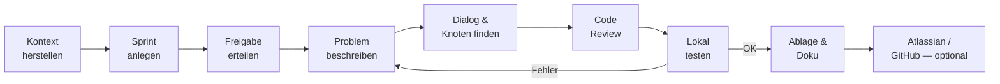

================================================================================
AI DRIVEN DEV METHODE – ARBEITSABLAUF – HOW2 (DEV)
================================================================================
Projekt         : R+MUNI Blueprint
Dokument        : AI_DRIVEN_DEV_METHODE_How2_DEV_S102
Tag             : #dev #how2 #aidriven #methode #s102
Datum           : 2026-04-06
Stage           : S1.02 — AKTIV
Status          : AKTIV
Verantwortlich  : EUMAXL
Review          : —
Jira-Sync       : NEIN
Ablageort       : R+MUNI Doku-public\02-how2\AI_DRIVEN_DEV_METHODE_How2_DEV_S102.md
================================================================================

VORAUSSETZUNGEN
--------------------------------------------------------------------------------
- [[AI_DRIVEN_DEV_METHODE_principles_DEV_S102]] gelesen und verstanden
- [[Global_GOV_S102]] bekannt — normative Grundlage
- Claude Pro (oder gleichwertiges Modell) aktiv
- Projektfolder vollständig und aktuell geladen
- root.cfg vorhanden, <rootfolder> korrekt gesetzt
- PowerShell-Arbeitsverzeichnis: <rootfolder>\01-artifacts\01-scripts\

DREI ROLLEN — KURZ ERKLÄRT
--------------------------------------------------------------------------------
DEV        (Default)     →  Vollständiger Blueprint-Kontext, GOV-konform.
                             Primär für alle technischen und konzeptionellen Arbeiten.
CUSTO      (auf Abruf)   →  Kundenkontakt-Modus. Nur bei expliziter Anforderung.
CUSTO→RMUNI (auf Abruf)  →  Anonymisierter Transfer von Kundenerkenntnissen.
                             Claude übersetzt — Entwickler prüft und gibt frei.

================================================================================
KURZREFERENZ — SESSION-ABLAUF
================================================================================

── PHASE 1 — KONTEXT HERSTELLEN ────────────────────────────────────────────────

Schritt 1 — Projektfolder laden
  Projektfolder in Claude aktiv setzen (aktuell und vollständig)
  → Wahrheit: Projektfolder + aktive Skills — kein Start ohne beides
  → Bei Unklarheit welches Template passt: nachfragen, nicht annehmen

Schritt 2 — Kontext dosieren
  IMMER laden:    GOV, AI Driven Methode
  NUR BEI BEDARF: Scripts, How2, Sprint-Doku, weitere Principles
  NICHT LADEN:    veraltete .md, fremde Flow-Serien, mehrere Sprint-Dokus gleichzeitig
  → Zu viel Kontext erzeugt Drift durch Überlastung

── PHASE 2 — GOVERNANCE VOR CODE ───────────────────────────────────────────────

Schritt 3 — Sprint anlegen
  Sprint-Template laden: [[DEV_Sprint_Template_S102]]
  Ziel definieren — eindeutig und überprüfbar
  Stage zuordnen — kein Sprint ohne Stage-Zuordnung
  Abgrenzung explizit — was ist NICHT Gegenstand des Sprints

Schritt 4 — Freigabe erteilen
  Freigabe ist explizit — kein Nicken, kein Schweigen, kein Implizit
  Kritische Bereiche: immer explizit bestätigen bevor Claude weiterarbeitet

── PHASE 3 — ENTWICKLUNG ────────────────────────────────────────────────────────

Schritt 5 — Problem beschreiben
  Alltagssprache, Halbsätze, Gedankensprünge — alles ok
  Claude fragt nach bevor er annimmt — kein Raten, kein implizites Annehmen
  Missverständnisse sofort auflösen

Schritt 6 — Dialog und Knoten finden
  Claude erklärt → Entwickler korrigiert → Lösung
  Iterativ — nicht: Aufgabe stellen und Ergebnis abnehmen
  Verhaltenshinweise beachten — sie sind das Frühwarnsystem

Schritt 7 — Code Review
  Claude erklärt in Alltagssprache — Entwickler nimmt ab (ohne Code zu lesen)
  Prüfung: Absicht korrekt? GOV-konform? Stage passend? Rückwärtskompatibel?

── PHASE 4 — TEST UND ABNAHME ───────────────────────────────────────────────────

Schritt 8 — Lokal testen
  Kein Script fertig ohne lokalen Testlauf
  Log lesen — Ergebnis prüfen
  Bei Fehler: Fehlerbeschreibung an Claude — Debugging im Dialog

Schritt 9 — Abnahme
  Vier-Augen-Prinzip: Claude erklärt → Entwickler nimmt ab
  Ergebnis entspricht Sprintziel? → JA → weiter | NEIN → zurück zu Schritt 5

── PHASE 5 — ABLAGE UND DOKUMENTATION ───────────────────────────────────────────

Schritt 10 — Artefakte ablegen
  Claude gibt Dokumente als .md File im Chat aus — nie als Rohtext
  Visualisierungen als eigenes .svg File — in .md eingebettet
  Nicht lesbare Formate (.xlsx, .svg) NICHT im Projektfolder
  Mappings und Konfigurationen immer als .txt

Schritt 11 — Sprint dokumentieren
  Kein Sprint ohne Dokumentation — kein Stage-Ende ohne Vollständigkeit
  Erkenntnisse die Dokumente verändern → sofort Sprint oder Backlog anlegen

Schritt 12 — Atlassian / GitHub (nur auf Abruf)
  GitHub:     Zentraler Dreh- und Angelpunkt für Repos und Kundenkommunikation
  Atlassian:  NUR nach expliziter Aufforderung — kein automatischer Reflex
    Backlog2Jira  → Claude erstellt Story im Jira-Bereich R+MUNI EA
    MD2Confluence → Claude erstellt Beitrag im Confluence R+MUNI Bereich
                    Basis: letztes .md im Chat — bei Unklarheit nachfragen

================================================================================
HÄUFIGE KOMBINATIONEN
================================================================================

Neuen Sprint starten:
  Projektfolder laden → GOV + AI Driven Methode laden → Sprint-Template öffnen
  → Ziel definieren → Freigabe → Entwicklung

Erkenntnisse sichern:
  Erkenntnis benennen → Auswirkungen identifizieren → Sprint / Backlog anlegen
  → Nicht als losen Chat-Inhalt lassen

CUSTO→RMUNI Transfer:
  Anonymisierung anfragen → Claude übersetzt → Entwickler prüft 5 Kriterien
  → Freigabe → ASSOCIATE-Reihe einbauen
  Kriterien: keine echten Namen | ohne Quellkenntnis verständlich |
             Quelle nicht rekonstruierbar | Entwickler freigegeben | GOV 13

================================================================================
FLOW — REFERENZ
================================================================================

Standardflow einer DEV-Session:

  Kontext → Sprint → Freigabe → Dialog → Code Review → Test → Ablage → Doku

Abweichungen:
  Fetch / Projektfolder-Update → immer an den Anfang — nicht mitten in Session
  Iterative Neugenerierung von bestehenden Artefakten → chirurgische Eingriffe
  statt Neugenerierung — Drift akkumuliert sich sonst

================================================================================
LOG-AUSGABE VERSTEHEN
================================================================================

Verhaltenshinweise Claude — Format und Bedeutung:

  ⚠ Verhaltenshinweis: Scope-Expansion erkannt — Freigabe eingeholt.
  → Claude hat erkannt dass er über den definierten Scope hinausgeht
  → Reaktion: Freigabe geben oder einschränken

  ⚠ Verhaltenshinweis: Ich treffe hier eine Annahme — stimmt das so?
  → Claude ist unsicher — keine implizite Bestätigung
  → Reaktion: Annahme bestätigen oder korrigieren

  ⚠ Verhaltenshinweis: GOV-Regel [Kap. X] kann ich hier nicht anwenden.
  → Claude meldet Konflikt — nicht stillschweigend übergehen
  → Reaktion: Abweichung explizit dokumentieren oder Richtung ändern

Diese Meldungen sind kein Fehler — sie sind das Frühwarnsystem gegen Drift.
EUMAXL hat bestätigt: Meldungen sind erwünscht, auch wenn unbequem.

================================================================================
FEHLERBILDER
================================================================================

Fehler: KI antwortet nicht mehr konsistent zur GOV
  Ursache: Zu viel Kontext geladen oder Session zu lang ohne Zwischenablage
  Lösung:  Session neu starten — Projektfolder und GOV frisch laden

Fehler: Artefakt wurde ohne Freigabe verändert
  Ursache: Implizite Annahme durch Claude — Freigabe nicht eingeholt
  Lösung:  Verhaltenshinweis-Protokoll prüfen — Freigabe-Disziplin schärfen
           Artefakt auf letzten freigegebenen Stand zurücksetzen

Fehler: Erkenntnis aus Session nicht mehr rekonstruierbar
  Ursache: Nicht abgelegt — nur als Chat-Inhalt vorhanden
  Lösung:  Sofort Sprint oder Backlog anlegen — Lessons Learned dokumentieren
           Künftig: Erkenntnisse sofort sichern (Prinzip 3.5)

Fehler: Claude driftet thematisch ab
  Ursache: Zu viel Kontext oder unklare Zieldefinition im Sprint
  Lösung:  Verhaltenshinweis absetzen — Ziel neu schärfen — Kontext reduzieren

Fehler: CUSTO-Erkenntnis nicht anonymisiert in Artefakt gelandet
  Ursache: Rollentrennung nicht eingehalten — CUSTO und DEV vermischt
  Lösung:  Artefakt bereinigen — Transfer über CUSTO→RMUNI-Prozess wiederholen
           Vollständige Governance: GOV Kapitel 13

Fehler: root.cfg nicht gefunden
  Ursache: Script nicht aus Scripts-Ordner aufgerufen
           oder root.cfg liegt nicht korrekt relativ zum Script
  Lösung:  Arbeitsverzeichnis prüfen — PowerShell in
           <rootfolder>\01-artifacts\01-scripts\ starten

================================================================================
ENTSCHEIDUNGSHILFE
================================================================================

Ich will...                                            Richtiges Vorgehen
------------------------------------------------------ --------------------------
Neue Session starten                                   Projektfolder laden → GOV
                                                       → Sprint-Template
Erkenntnisse aus Session sichern                       Sofort → Sprint / Backlog
Kundenthema anonymisiert einbauen                      CUSTO→RMUNI Transfer
Artefakt in Jira / Confluence ablegen                  Explizit anfragen → Claude
                                                       erstellt auf Abruf
Fehler in bestehendem Script beheben                   Fehlerbeschreibung + Log
                                                       → Claude diagnostiziert
Verhaltenshinweis erhalten haben                       Inhalt prüfen → Freigabe
                                                       oder Einschränkung
Diagnose wenn Session nicht mehr konsistent läuft      Session neu starten —
                                                       Kontext frisch laden

================================================================================
BEZÜGE
================================================================================

[[AI_DRIVEN_DEV_METHODE_principles_DEV_S102]]   Grundprinzipien und Hintergrund
[[Global_GOV_S102]]                         Normative Grundlage
[[DEV_Sprint_Template_S102]]                Sprint-Vorlage für jede Session
[[DEV_Sprint_NBX_S102]]                     Beispiel-Sprint als Referenz

================================================================================
AI_DRIVEN_DEV_METHODE_How2_DEV | S1.02 | 2026-04-06 | R+MUNI Blueprint
================================================================================
