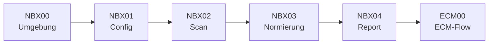

================================================================================
NBX – NETZWERK-ERFASSUNG – HOW2 (DEV)
================================================================================
Projekt         : R+MUNI Blueprint
Dokument        : NBX_How2_DEV_S102
Tag             : #dev #how2 #nbx #s102
Datum           : 2026-04-06
Stage           : S1.02 — AKTIV
Status          : AKTIV
Verantwortlich  : EUMAXL
Review          : —
Jira-Sync       : NEIN
Ablageort       : R+MUNI Doku-public\02-how2\NBX_How2_DEV_S102.md
================================================================================

---
title: "NBX – Netzwerk-Erfassung – How2 DEV"
stage: S1.02
status: "AKTIV"
typ: "How2"
datum: "2026-04-06"
autor: EUMAXL
tags: [rmuni, blueprint, dev, how2, nbx, s102]
---

================================================================================
NBX – NETZWERK-ERFASSUNG – HOW2 (DEV)
Stage S1.02 | AKTIV | R+MUNI Blueprint
================================================================================

---

## Kontext

Technische Referenz für den NBX-Flow. Setzt Kenntnis der Principles voraus.
Enthält alle Scripts, Pfade, Log-Beispiele und Fehlerbilder.

---

## Verwandte Dokumente

- [[NBX_principles_DEV_S102]]      Designentscheidungen und Hintergrund
- [[Global_GOV_DEV_S102]]          normative Grundlage
- [[DEV_Sprint_NBX_S102]]          Sprint-Dokumentation
- [[ECM_How2_DEV_S8]]              Consumer des NBX-Outputs
- [[CSV_FLOW_How2_S8]]             Ziel-Flow nach ECM

---

## Inhalt

VORAUSSETZUNGEN
--------------------------------------------------------------------------------
- [[NBX_principles_DEV_S102]] gelesen und verstanden
- Python 3.10+
- nmap binary installiert — https://nmap.org/download.html
  Windows: Standard-Installer ausführen, danach PowerShell neu starten
- python-nmap installiert: `pip install python-nmap`
- nbx_config.txt vorhanden:
  `01-artifacts\02-csv\01-mapping\nbx_config.txt`
- Scripts in `01-artifacts\01-scripts\`
- Empfohlen: PowerShell als Administrator starten für vollständige ARP-Scans


================================================================================
KURZREFERENZ — ALLE SCRIPTS
================================================================================

── SETUP UND VALIDIERUNG ───────────────────────────────────────────────────────

NBX00 – Umgebungsvalidierung
  py .\NBX00-validate_environment.py
  → root.cfg auflösen via HLP00
  → nbx_config.txt und 00-archimatechild prüfen
  → Ziel: 02-stages\99-logs\NBX00-root.resolved.txt
  → Ziel: 02-stages\99-logs\NBX00-validate_environment.log

NBX01 – Konfigurationsvalidierung
  py .\NBX01-validate_config.py
  → nbx_config.txt lesen, Pflichtfelder prüfen
  → ip_range, scan_ports, output_label validieren
  → Ziel: 02-stages\99-logs\NBX01-validate_config.log


── SCAN UND NORMIERUNG ──────────────────────────────────────────────────────────

NBX02 – Netzwerk-Scan  ★ LAUFZEIT BIS 5 MINUTEN
  py .\NBX02-scan_network.py
  → Phase 1: Ping-Sweep — alle aktiven Hosts im IP-Bereich finden
  → Phase 2: Port-Scan der gefundenen Hosts mit Countdown
  → Hosts ohne offene Ports werden trotzdem erfasst (aus Phase 1)
  → Ziel: 02-stages\00-archimatearchive\nbx_raw.json
  → Hinweis: 00-archimatearchive\ liegt in .gitignore — kein manuelles Ausschließen nötig

NBX03 – Normierung und CSV-Export
  py .\NBX03-normalize_to_csv.py
  → nbx_raw.json lesen, eine Zeile pro Host normieren
  → Hostnamen bereinigen (fritz.box, .local etc. entfernen)
  → Ziel: 01-artifacts\02-csv\03-child\00-archimatechild\trash_nbx.csv
  → Ziel: 01-artifacts\02-csv\03-child\00-archimatechild\properties_nbx.csv


── ABSCHLUSS ────────────────────────────────────────────────────────────────────

NBX04 – Übergabe-Report
  py .\NBX04-handoff_report.py
  → trash_nbx.csv und properties_nbx.csv auswerten
  → Statistik und nächste Schritte ausgeben
  → Ziel: 02-stages\99-logs\NBX04-handoff_report.txt


================================================================================
KONFIGURATION — nbx_config.txt
================================================================================

Ablageort: `01-artifacts\02-csv\01-mapping\nbx_config.txt`

```
# Scan-Ziel
ip_range=192.168.1.0/24

# Ports — Standard + IoT/Smart Home/Drucker
scan_ports=22,23,25,53,80,110,135,139,143,161,389,443,445,515,548,631,
           1900,2049,3306,3389,5000,5432,5900,7000,8008,8009,8080,8443,
           8888,9100,49152,49153,49154

# nmap Argumente
scan_args=-sV --open

# Output-Label (wird als nbx_source in CSV eingetragen)
output_label=scan_lokal
```

Hinweis: nbx_config.txt enthält keine sensiblen Daten — kein Token,
kein Passwort. Kein .gitignore-Eintrag erforderlich.


================================================================================
OUTPUT-FORMAT
================================================================================

trash_nbx.csv — eine Zeile pro Host
  Header: 3PartyID, nbx_objecttype, Name, Manufacturer, Status,
          Description, nbx_source, nbx_raw_id

  Beispiel:
  nbx_192_168_1_12, host, Gaming-PC, , up, , scan_lokal, 192.168.1.12
  nbx_192_168_1_138, host, FRITZ!Box, AVM ..., up, AVM | MAC:3C:..., scan_lokal, 192.168.1.138

properties_nbx.csv — Key-Value Attribute je Host
  Header: 3PartyID, Key, Value

  Beispiel:
  nbx_192_168_1_12, mac,          F0:1D:BC:A4:8D:D3
  nbx_192_168_1_12, port_tcp_135, msrpc | Microsoft Windows RPC
  nbx_192_168_1_12, port_tcp_445, microsoft-ds
  nbx_192_168_1_17, vendor,       Nintendo

3PartyID-Schema: nbx_<IP mit Unterstrichen>
  Beispiel: 192.168.1.12 → nbx_192_168_1_12


================================================================================
FLOW — REFERENZ
================================================================================

Standardflow:
  NBX00 → NBX01 → NBX02 → NBX03 → NBX04 → ECM00 → ECM01/ECM02



Abweichungen:
  Erneuter Scan ohne Neuvalidierung:
    NBX02 → NBX03 → NBX04 direkt ausführen — NBX00/NBX01 nur bei
    Änderung der Umgebung oder Config erneut nötig.

  Nur Config-Änderung:
    NBX01 → NBX02 → NBX03 → NBX04


================================================================================
LOG-AUSGABE VERSTEHEN
================================================================================

Standardfall NBX02 (Scan):
```
[2026-04-06 18:06:20] ============================================================
[2026-04-06 18:06:20] START NBX02-scan_network
[2026-04-06 18:06:20] ============================================================
[2026-04-06 18:06:20] ip_range     : 192.168.1.0/24
[2026-04-06 18:06:20] Phase 1: Ping-Sweep (alle aktiven Hosts) ...
[2026-04-06 18:06:35] Phase 1 abgeschlossen: 7 Host(s) gefunden
[2026-04-06 18:06:35] Phase 2: Port-Scan 7 Host(s) | Ports: 22,80,443,...
[2026-04-06 18:06:35]   Timeout: 5 Minuten — bitte warten (Kaffeepause) ...
[2026-04-06 18:07:10]   ... noch ca. 240s
[2026-04-06 18:08:10]   ... noch ca. 180s
[2026-04-06 18:11:20] Phase 2 abgeschlossen.
[2026-04-06 18:11:20] Hosts gesamt (Phase 1 + 2): 7
[2026-04-06 18:11:20]   192.168.1.12   hostname: Gaming-PC    status: up   offene Ports: 3
[2026-04-06 18:11:20]   192.168.1.17   hostname: nintendoswitch  status: up  offene Ports: 0
```

Host ohne offene Ports (normal — z.B. Handy, TV, Nintendo):
```
[2026-04-06 18:11:20]   192.168.1.17   hostname: nintendoswitch  status: up  offene Ports: 0
```
→ Kein Fehler — Host wurde in Phase 1 gefunden und landet in trash_nbx.csv.
  Keine properties_nbx.csv Einträge für Ports — nur MAC/Vendor wenn vorhanden.


================================================================================
FEHLERBILDER
================================================================================

Fehler: nmap binary nicht gefunden
```
nmap.nmap.PortScannerError: 'nmap program was not found in path.'
```
  Ursache: nmap binary nicht installiert oder nicht im PATH
  Lösung:  https://nmap.org/download.html — Installer ausführen,
           danach PowerShell neu starten

Fehler: nbx_config.txt nicht gefunden
```
[FEHLER] nbx_config.txt nicht gefunden: ...\01-mapping\nbx_config.txt
```
  Ursache: nbx_config.txt fehlt oder liegt am falschen Ort
  Lösung:  Datei anlegen unter 01-artifacts\02-csv\01-mapping\nbx_config.txt

Fehler: NBX00-root.resolved.txt nicht gefunden
```
[FEHLER] NBX00-root.resolved.txt nicht gefunden.
         Bitte zuerst NBX00-validate_environment.py ausfuehren.
```
  Ursache: NBX00 wurde nicht oder nicht erfolgreich ausgeführt
  Lösung:  NBX00 zuerst ausführen — Log prüfen

Fehler: root.cfg nicht gefunden
  Ursache: Script wird nicht aus dem Scripts-Ordner aufgerufen
  Lösung:  PowerShell nach 01-artifacts\01-scripts\ wechseln:
           `cd <rootfolder>\01-artifacts\01-scripts`

Warnung: Keine Hosts gefunden
```
[WARNUNG] Keine Hosts gefunden — ip_range und Netzwerk pruefen.
```
  Ursache: ip_range passt nicht zum lokalen Netz, oder
           Firewall blockiert ICMP (Ping), oder
           Script ohne Admin-Rechte bei restriktivem Netz
  Lösung:  ip_range in nbx_config.txt prüfen (z.B. 192.168.0.0/24 statt /1)
           PowerShell als Administrator starten


================================================================================
ENTSCHEIDUNGSHILFE
================================================================================

Ich will...                                        Richtiges Script
------------------------------------------------   --------------------------------
Ersten Lauf starten                                NBX00 → NBX01 → NBX02 → NBX03 → NBX04
Erneut scannen (Config unverändert)                NBX02 → NBX03 → NBX04
Config geändert, neu scannen                       NBX01 → NBX02 → NBX03 → NBX04
Nur CSV neu erzeugen (Raw-Daten vorhanden)         NBX03 → NBX04
Prüfen ob Umgebung noch stimmt                     NBX00
Scan-Ergebnis an ECM übergeben                     ECM00 → ECM01 (Phase 1)
                                                   ECM00 → ECM02 (Phase 2)
Diagnose wenn nichts funktioniert                  NBX00 Log prüfen →
                                                   02-stages\99-logs\


================================================================================
BEZÜGE
================================================================================

[[NBX_principles_DEV_S102]]     Designentscheidungen und Hintergrund
[[Global_GOV_DEV_S102]]         normative Grundlage
[[DEV_Sprint_NBX_S102]]         Sprint-Dokumentation
[[ECM_How2_DEV_S8]]             Consumer des NBX-Outputs (Phase 1 + 2)
[[CSV_FLOW_How2_S8]]            Ziel-Flow nach ECM → Archi Import

---

================================================================================
NBX_How2_DEV_S102 | S1.02 | 2026-04-06 | R+MUNI Blueprint
================================================================================
