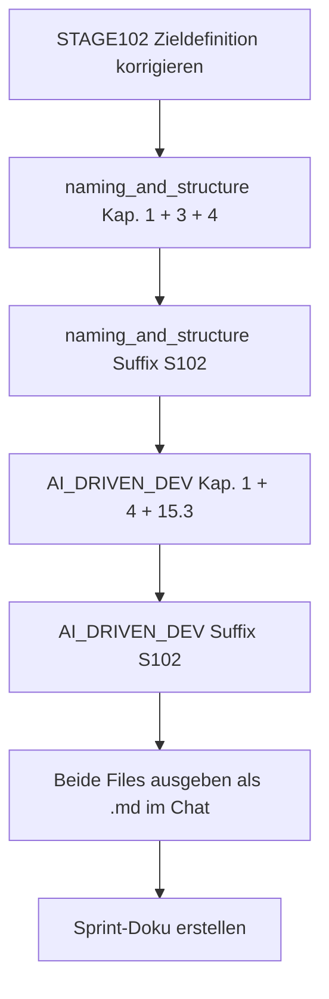

================================================================================
SPRINT-DEV-DOKU – S102-Naming-AIDriven
================================================================================
Projekt             : R+MUNI Blueprint
Sprint-Bezeichnung  : Sprint-DEV-S102-Naming-AIDriven
Tag                 : #dev #sprint #s102 #naming #aidriven #methodik
Datum               : 2026-04-01
Stage               : S1.02 — AKTIV
Status              : Abgeschlossen
Verantwortlich      : EUMAXL
Review              : —
Jira-Sync           : NEIN
Erstellt durch      : EUMAXL + Claude (Pair-Session)
Vorgänger           : [[FREEZE_101]]
Nachfolger          : noch offen
================================================================================

================================================================================
1. AUSGANGSLAGE UND KONTEXT
================================================================================

1.1 Ist-Zustand vor diesem Sprint
-----------------------------------

Stage 1.02 wurde soeben eröffnet. Die normativen Dokumente aus S101 waren
stabil aber unvollständig für die neuen Anforderungen:

  - Varianten-Kürzel (DEV/EXP/ASC/MGT) waren nicht offiziell definiert
  - ASC war bisher kein explizites Kürzel — nur Vollname ASSOCIATE
  - EXP existierte noch nicht
  - Die AI_DRIVEN_DEV_METHODE kannte keine Varianten-Logik
  - Atlassian-Trigger waren generisch formuliert — keine konkreten Trigger-Worte
  - Output-Regel (wie Claude Dokumente ausgibt) war nicht dokumentiert
  - Meldepflicht bei Verhaltensänderung war in Kap. 15.3 nur ein Einzeiler
  - Zieldefinitions-Problem: Stage 1.02 Zieldokument hatte DEV-as-is-Push
    als Ziel — was eine Nachtidee war und korrigiert werden musste

Relevante Artefakte vor dem Sprint:
  - naming_and_structure_S101.md    Status: stabil, S101-Stand, Kürzel unvollständig
  - AI_DRIVEN_DEV_METHODE_DEV_S101  Status: stabil, S101-Stand, Varianten fehlen
  - STAGE102_ZIELE_S102.md          Status: fehlerhaftes Ziel (DEV-Push) — korrigiert
                                    vor diesem Sprint (eigene Korrektur-Session)

Bezug: [[FREEZE_101]]

1.2 Konkrete Diskrepanz oder Problemstellung
---------------------------------------------

  IST:  Kürzel ASC und EXP existieren nicht offiziell. MGT ist Platzhalter
        ohne Definition. naming_and_structure kennt nur DEV. Die Methode
        kennt keine Varianten-Logik, keine konkreten Atlassian-Trigger,
        keine Output-Regel und keine ausgebaute Meldepflicht.

  SOLL: Vier offizielle Varianten-Kürzel (DEV/EXP/ASC/MGT) sind in
        naming_and_structure verankert. Die AI_DRIVEN_DEV_METHODE_DEV
        kennt die Varianten, die Atlassian-Trigger, die Output-Regel
        und hat eine ausgebaute Meldepflicht. Beide Dokumente tragen
        Stage-Suffix S102.

1.3 Auslöser
-------------
Auslöser-Typ: Entwicklerwunsch / Strukturbereinigung

Stage 1.02 eröffnet mit neuem Außenwirkungs-Fokus — EXP-Variante ist
geplant, ASC-Kürzel wird formalisiert. Ohne definierte Kürzel und
Output-Regeln wäre der nächste Chat-Start fehleranfällig.
Timing: Erster Sprint in Stage 1.02 — saubere Basis vor allen weiteren Sprints.

================================================================================
2. ENTSCHEIDUNGEN UND GRUNDSÄTZE DIESES SPRINTS
================================================================================

2.1 Varianten-Kürzel offiziell fixiert
----------------------------------------
Entscheidung:
  Vier Kürzel ab Stage 1.02 verbindlich:
  DEV (unverändert), EXP (neu), ASC (neu als Kürzel), MGT (Platzhalter)

Begründung:
  EXP und ASC waren bisher nie als offizielle Kürzel definiert.
  ASSOCIATE war Vollname — kein File-Naming-Kürzel. EXP existierte
  nicht. Ohne Fixierung entsteht Inkonsistenz in Dateinamen und Bezügen.

Verworfene Alternativen:
  Alternative A: ELITE statt EXP
    Verworfen weil: ELITE war ein früherer Begriff — EXP ist präziser
    für die Zielgruppe (erfahrene externe Nutzer, kein Elite-Marketing)
  Alternative B: Kein eigenes Kürzel für ASC, weiter ohne Prefix
    Verworfen weil: Ohne Kürzel ist die Pendant-Logik nicht lesbar
    wenn EXP dazukommt

Auswirkung:
  naming_and_structure_S102 ist neue Single Source of Truth für Kürzel.
  Renaming bestehender ASC-Dokumente: beim nächsten Editieren, kein Zwang.

2.2 ASC-Renaming: organisch, kein Bulk-Renaming
-------------------------------------------------
Entscheidung:
  Bestehende ASSOCIATE-Dokumente werden nicht sofort umbenannt.
  Renaming erfolgt beim nächsten Editieren des jeweiligen Dokuments.

Begründung:
  Bulk-Renaming erzeugt Aufwand ohne Mehrwert. Obsidian-Links würden
  brechen. Kontinuität vor Perfektion — Regel ist dokumentiert,
  Umsetzung läuft organisch.

Verworfene Alternativen:
  Sofortiges Bulk-Renaming aller ASSOCIATE-Dokumente
    Verworfen weil: unverhältnismäßiger Aufwand, Linkbruch-Risiko

Auswirkung:
  Übergangsphase mit gemischten Suffixen ist akzeptiert und dokumentiert.

2.3 Atlassian-Trigger als konkrete Schlüsselwörter
----------------------------------------------------
Entscheidung:
  Zwei konkrete Trigger-Worte statt generischer "nur auf Aufforderung" Regel:
    Backlog2Jira  → Story im Jira-Bereich R+MUNI EA
    MD2Confluence → Beitrag im Confluence R+MUNI Bereich

Begründung:
  Generische Formulierung ("nur auf explizite Aufforderung") war bereits
  drin — aber zu offen. Konkrete Trigger machen die Grenze eindeutig
  und verhindern Interpretationsspielraum. Basis für MD2Confluence ist
  immer das letzte .md im Chat — bei Unklarheit nachfragen.

Verworfene Alternativen:
  Eigenes Kapitel 18 für Atlassian
    Verworfen weil: Atlassian ist Ablage-Thema — gehört in Kap. 4
    (Ablage-Regeln). Kein neues Kapitel nötig, keine Doppelung.

Auswirkung:
  Kap. 4 Ablage-Regeln in AI_DRIVEN_DEV_METHODE_DEV_S102 erweitert.

2.4 Output-Regel explizit dokumentiert
----------------------------------------
Entscheidung:
  Neue Output-Regel in Kap. 4: Claude gibt Dokumente immer als .md File
  im Chat aus — nie als Rohtext, nie direkt in Projektfolder.

Begründung:
  In der Praxis entstanden Missverständnisse: Claude schrieb in den
  Projektfolder statt eine .md Ausgabe im Chat zu liefern. EUMAXL
  konnte nicht reviewen bevor er entschied. Die Regel macht den
  Default-Workflow explizit und verhindert Wiederholung.

Verworfene Alternativen:
  Keine — Regel war in der Praxis bereits gelebter Standard,
  fehlte nur als Dokumentation.

Auswirkung:
  "Push" von EUMAXL = .md File im Chat zur Review.
  EUMAXL entscheidet allein über Ablage und GitHub-Sync.

2.5 Meldepflicht ausgebaut
----------------------------
Entscheidung:
  Kap. 15.3 von Einzeiler zu ausgebautem Abschnitt mit Meldeformat
  und konkreten Beispielen erweitert.

Begründung:
  EUMAXL hat in der Praxis festgestellt dass Verhaltensmeldungen
  von Claude ausgeblieben sind — auch wenn Claude abzudriften drohte.
  Der Einzeiler war zu schwach als Verhaltensanker. Konkrete Beispiele
  und ein Meldeformat machen die Meldepflicht operativ.

Verworfene Alternativen:
  Keine — Erweiterung war klar, Frage war nur Detailtiefe.

Auswirkung:
  Claude meldet aktiv mit ⚠ Verhaltenshinweis wenn Scope-Drift,
  Annahmen oder Verhaltensänderungen eintreten.

2.6 Stage-Suffix S102 in Dateinamen
-------------------------------------
Entscheidung:
  Beide bearbeiteten Dokumente erhalten Suffix _S102 statt _S101.
  Neue Dateien — alte S101-Varianten bleiben historisch erhalten.

Begründung:
  GOV-Prinzip: Suffix zeigt den Stage ab dem das Dokument gilt.
  S102-Änderungen in einem S101-Dokument wäre inkonsistent.

Verworfene Alternativen:
  Stage nur im Header ändern, Dateiname bleibt _S101
    Verworfen weil: Dateiname und Header müssen konsistent sein.
    Suffix ist primäres Versionserkennungsmerkmal.

Auswirkung:
  naming_and_structure_S102.md und AI_DRIVEN_DEV_METHODE_DEV_S102.md
  sind die neuen normativen Dokumente ab Stage 1.02.

================================================================================
3. SPRINT-ZIELE
================================================================================

3.1 Ziel 1 — naming_and_structure erweitern
---------------------------------------------
Varianten-Kürzel DEV/EXP/ASC/MGT offiziell definieren und
Rollenprefix-Logik sowie Pendant-Logik entsprechend erweitern.

  IST                                    →  SOLL
  Kap. 1: nur _DEV_ als Rollenprefix    →  DEV / EXP / ASC / MGT alle definiert
  Kap. 3: nur DEV/ASSOCIATE Pendant     →  alle vier Varianten im Schema
  Kap. 4: ELITE/MGT Platzhalter         →  Varianten-Kürzel ab S102 vollständig
  Dateiname: _S101                       →  _S102

Vorgehen:
  Chirurgische Eingriffe: Kap. 1, Kap. 3, Kap. 4 ersetzen, Header/Footer anpassen.
  Kein Eingriff in Kap. 2 (Ablagestruktur) und Kap. 5 (R-MUNI/R+MUNI).

Begründung für dieses Vorgehen:
  Nur die direkt betroffenen Kapitel anfassen — Rückkopplungsschutz.

3.2 Ziel 2 — AI_DRIVEN_DEV_METHODE_DEV erweitern
--------------------------------------------------
Varianten-Logik verankern, Atlassian-Trigger definieren, Output-Regel
dokumentieren, Meldepflicht ausbauen.

  IST                                         →  SOLL
  Kap. 1: kein Varianten-Hinweis             →  DEV/EXP/ASC/MGT genannt
  Kap. 4: generische Atlassian-Regel         →  Backlog2Jira / MD2Confluence
  Kap. 4: keine Output-Regel                 →  Output-Regel explizit
  Kap. 15.3: Einzeiler Meldepflicht          →  ausgebaut mit Format + Beispielen
  Dateiname: _S101                            →  _S102

Vorgehen:
  Chirurgische Eingriffe: Kap. 1, Kap. 4 Ablage-Regeln, Kap. 15.3, Header/Footer.

Begründung für dieses Vorgehen:
  Minimaler Eingriff — nur was sich inhaltlich geändert hat wird angefasst.

================================================================================
4. ABGRENZUNG — WAS DIESER SPRINT NICHT TUT
================================================================================

Dieser Sprint tut explizit nicht:
  - EXP-Variante (AI_DRIVEN_DEV_METHODE_EXP) erstellen — eigener Chat
  - MGT-Variante definieren oder erstellen — noch nicht aktiv
  - Bestehende ASSOCIATE-Dokumente umbenennen — organisches Renaming
  - GOV anfassen — keine GOV-Änderung in diesem Sprint
  - Scripts oder technische Artefakte berühren

Begründung der wichtigsten Ausschlüsse:
  EXP-Erstellung: eigener Chat, eigener Sprint — Scope-Trennung ist bewusst.
  GOV: Varianten-Kürzel sind in naming verankert, GOV verweist auf naming.
       Kein doppelter Eingriff nötig.

================================================================================
5. BETROFFENE ARTEFAKTE
================================================================================

Neu erstellt:
  naming_and_structure_S102.md         Erweiterte Namenskonvention ab S102
  AI_DRIVEN_DEV_METHODE_DEV_S102.md    Erweiterte DEV-Methodik ab S102
  Sprint-DEV-S102-Naming-AIDriven.md   Dieses Dokument

Historisch erhalten (read-only):
  naming_and_structure_S101.md         Vorgänger — S101-Stand, unverändert
  AI_DRIVEN_DEV_METHODE_DEV_S101.md    Vorgänger — S101-Stand, unverändert

Unverändert:
  Global_GOV_DEV_S101.md               Keine GOV-Änderung in diesem Sprint
  STAGE102_ZIELE_S102.md               Wurde vor diesem Sprint korrigiert
  Alle Scripts                          Kein Eingriff

================================================================================
6. UMSETZUNG — SCHRITT FÜR SCHRITT
================================================================================

Schritt 0 — STAGE102_ZIELE_S102 korrigieren
  DEV-as-is-Push aus Zielen gestrichen. Associate-Push + Expert-Variante
  als korrekte Ziele eingetragen. Freigabe EUMAXL dokumentiert.
  Ergebnis: STAGE102_ZIELE_S102.md ist GOV-konform und inhaltlich korrekt.

Schritt 1 — naming_and_structure Kap. 1 Rollenprefix erweitern
  _EXP_, _ASC_, _MGT_ als neue Rollenprefix-Einträge ergänzt.
  Beispiele aktualisiert — EXP und ASC mit konkreten Dateinamen.
  Ergebnis: Kap. 1 kennt alle vier Varianten.

Schritt 2 — naming_and_structure Kap. 3 Pendant-Logik erweitern
  Schema um _EXP_S102 und _ASC_S102 ergänzt.
  Renaming-Regel für organisches ASC-Renaming dokumentiert.
  Ergebnis: Kap. 3 deckt alle vier Varianten ab.

Schritt 3 — naming_and_structure Kap. 4 neu
  ELITE/MGT-Platzhalter-Kapitel ersetzt durch "Varianten-Kürzel ab S102".
  Alle vier Kürzel mit Charakter, Status und Dateinamen-Schema definiert.
  Übergangsregel für bestehende S101-Dokumente dokumentiert.
  Ergebnis: Kap. 4 ist neue normative Referenz für Kürzel.

Schritt 4 — naming_and_structure Suffix S102
  Neue Datei naming_and_structure_S102.md. Header, Ablageort, Footer angepasst.
  Bezüge aktualisiert (FREEZE_8 → FREEZE_101, AI_DRIVEN S101 → S102).
  Ergebnis: naming_and_structure_S102.md ist bereit.

Schritt 5 — AI_DRIVEN_DEV Kap. 1 Varianten-Logik
  Zweck-Abschnitt um Varianten-Übersicht (DEV/EXP/ASC/MGT) erweitert.
  Ergebnis: Kap. 1 gibt sofort Orientierung über Varianten-Landschaft.

Schritt 6 — AI_DRIVEN_DEV Kap. 4 Atlassian-Trigger + Output-Regel
  Bestehende generische Atlassian-Zeile zu konkreten Triggern ausgebaut:
    Backlog2Jira / MD2Confluence mit Beschreibung.
  Neue Output-Regel als eigener Block in Kap. 4 ergänzt.
  Ergebnis: Kap. 4 deckt Atlassian und Output-Verhalten vollständig ab.

Schritt 7 — AI_DRIVEN_DEV Kap. 15.3 Meldepflicht ausbauen
  Einzeiler ersetzt durch ausgebauten Abschnitt mit:
    Auslöserliste, Meldeformat, konkreten Beispielen, Bestätigung EUMAXL.
  Ergebnis: Kap. 15.3 ist operativ nutzbar als Verhaltensanker.

Schritt 8 — AI_DRIVEN_DEV Suffix S102
  Neue Datei AI_DRIVEN_DEV_METHODE_DEV_S102.md. Header, YAML, Footer angepasst.
  Ergebnis: AI_DRIVEN_DEV_METHODE_DEV_S102.md ist bereit.

Schritt 9 — Beide Files als .md im Chat ausgeben
  present_files für beide S102-Dokumente.
  EUMAXL reviewt und entscheidet über Push in Projektfolder.
  Ergebnis: Review-fähige Files im Chat.

Schritt 10 — Sprint-Doku erstellen
  Dieses Dokument. Template Sprint-DEV-Doku_Template_S8 als Basis.
  Ergebnis: Sprint vollständig dokumentiert.

================================================================================
7. BEOBACHTUNGEN UND ERKENNTNISSE WÄHREND DER UMSETZUNG
================================================================================

7.1 Scoping wurde übersprungen
--------------------------------
  Claude hat mit der Umsetzung begonnen ohne das Scoping formal abzuschließen
  (GOV 10.6 Verletzung). EUMAXL hat das korrekt angemerkt.
  Auswirkung: Scoping wurde nachgeholt, Sprint-Doku dokumentiert den
  korrekten Ablauf. Verhaltenshinweis-Regel bestätigt sich als notwendig.
  Dokumentiert: Ja — Kap. 15.3 Erweiterung ist direkte Konsequenz.

7.2 S101 vs. S102 Suffix — erst spät bemerkt
----------------------------------------------
  Dokumente wurden initial mit Stage S102 im Header aber _S101 im Dateinamen
  angelegt. EUMAXL hat das korrekt erkannt.
  Auswirkung: Neue Dateien mit _S102 angelegt, S101-Varianten bleiben historisch.
  Dokumentiert: Ja — Entscheidung 2.6.

7.3 Output-Regel war nicht klar definiert
------------------------------------------
  "Push" wurde von Claude zunächst als "Datei in Projektfolder schreiben"
  interpretiert. EUMAXL hat klargestellt: Push = .md File im Chat zur Review.
  Auswirkung: Output-Regel in Kap. 4 verankert — Wiederholung verhindert.
  Dokumentiert: Ja — Entscheidung 2.4.

================================================================================
8. ERGEBNIS
================================================================================

8.1 Erreichter Zustand
-----------------------
Beide normativen Dokumente sind auf S102-Stand gebracht und erweitert.
Varianten-Kürzel sind offiziell definiert. Atlassian-Trigger sind konkret.
Output-Regel ist dokumentiert. Meldepflicht ist operativ.

Entstandene Artefakte:
  - naming_and_structure_S102.md          04-notes\ (DEV-internal)
  - AI_DRIVEN_DEV_METHODE_DEV_S102.md     00-governance\ (DEV-internal)
  - Sprint-DEV-S102-Naming-AIDriven.md    06-sprints\S102\ (DEV-internal)

Geänderter Systemzustand:
  Ab Stage 1.02 gelten vier offizielle Varianten-Kürzel.
  Claude kennt Output-Regel, Atlassian-Trigger und Meldepflicht normativ.

8.2 Abweichungen vom Plan
--------------------------
  Scoping wurde nicht vor Umsetzungsbeginn formal abgeschlossen.
  Begründung: Claude hat GOV 10.6 nicht eingehalten — Reflex statt Disziplin.
  Konsequenz: Nachgeholt, dokumentiert, Meldepflicht als Systemantwort verankert.

================================================================================
9. TEST UND VALIDIERUNG
================================================================================

| Prüfpunkt                                           | Ergebnis | Anmerkung                        |
|-----------------------------------------------------|----------|----------------------------------|
| Varianten-Kürzel in naming_and_structure definiert  | OK       | Kap. 4 vollständig               |
| Rollenprefix-Logik in Kap. 1 erweitert              | OK       | EXP / ASC / MGT ergänzt          |
| Pendant-Logik in Kap. 3 erweitert                   | OK       | Alle vier Varianten im Schema     |
| Atlassian-Trigger konkret in Kap. 4                 | OK       | Backlog2Jira / MD2Confluence      |
| Output-Regel in Kap. 4 dokumentiert                 | OK       | .md File im Chat als Default      |
| Meldepflicht in Kap. 15.3 ausgebaut                 | OK       | Format + Beispiele vorhanden      |
| Beide Dokumente tragen Suffix _S102                 | OK       | naming + AI_DRIVEN               |
| Stage-3 bis Stage-101-Artefakte unberührt           | OK       | Kein Eingriff in Scripts/GOV      |
| Kein unbeabsichtigter Seiteneffekt                  | OK       | Nur Kap. 1/3/4/15.3 angefasst    |

Testmethode:
  Manuelle Review durch EUMAXL anhand der ausgegebenen .md Files im Chat.

Log-Referenz:
  Keine Logs — reine Dokumentationsarbeit.

================================================================================
10. OFFENE PUNKTE NACH SPRINT-ABSCHLUSS
================================================================================

| Thema                              | Status           | Nächste Aktion                          |
|------------------------------------|------------------|-----------------------------------------|
| EXP-Variante erstellen             | Zurückgestellt   | Eigener Chat / Sprint-DEV-S102-EXP      |
| MGT-Variante                       | Platzhalter      | Eigener Sprint wenn Phase gestartet     |
| ASC-Dokumente umbenennen           | Organisch        | Beim nächsten Editieren je Dokument     |
| GOV auf S102-Bezüge prüfen         | Beobachten       | Bei nächster GOV-Session                |

================================================================================
11. GOVERNANCE-KONFORMITÄTSCHECK
================================================================================

| GOV-Kriterium                              | Status | Anmerkung                              |
|--------------------------------------------|--------|----------------------------------------|
| GOV 10.3  Auslöser zulässig               | OK     | Entwicklerwunsch / Strukturbereinigung |
| GOV 10.5  Fachlicher Mehrwert benennbar   | OK     | Kürzel, Trigger, Output-Regel          |
| GOV 10.5  Keine implizite GOV-Änderung    | OK     | GOV nicht angefasst                    |
| GOV 10.6  Ziel explizit definiert         | OK     | Kap. 3 — nachgeholt nach Hinweis       |
| GOV 10.6  Ziel überprüfbar               | OK     | Kap. 9                                 |
| GOV 10.7  Zwischenschritte dokumentiert   | OK     | Kap. 6                                 |
| GOV 10.8  Dev-Doku vollständig            | OK     | Dieses Dokument                        |
| GOV 10.9  Stage-Ende Doku                 | OFFEN  | Fällig bei Stage 1.02 Abschluss        |
| GOV 10.10 Keine GOV-Regel aufgehoben      | OK     | Keine Ausnahme erzeugt                 |
| Rückkopplungsschutz eingehalten           | OK     | Stage-3 bis Stage-101 unberührt        |

================================================================================
12. LESSONS LEARNED
================================================================================

12.1 Was gut funktioniert hat
------------------------------
  - Chirurgische Eingriffe — nur betroffene Kapitel angefasst
  - EUMAXL hat Fehler (Scoping, Suffix, Output-Regel) sofort erkannt und korrigiert
  - Meldepflicht wurde direkt in diesem Sprint als Systemantwort verankert
  - Zwei-Dokumente-Sprint in einer Session gut handhabbar

12.2 Was beim nächsten Mal anders gemacht werden sollte
--------------------------------------------------------
  - Scoping formal abschließen BEVOR mit Umsetzung begonnen wird (GOV 10.6)
  - Suffix-Konsistenz (Header vs. Dateiname) vor der ersten Ausgabe prüfen
  - Output als .md File im Chat ist ab jetzt Standard — kein Nachfragen nötig

12.3 Erkenntnisse für das System
----------------------------------
  - Meldepflicht als Einzeiler ist zu schwach als Verhaltensanker
    → Konsequenz: Kap. 15.3 ausgebaut (umgesetzt in diesem Sprint)
  - Output-Regel war implizit gelebter Standard aber nicht dokumentiert
    → Konsequenz: In Kap. 4 verankert (umgesetzt in diesem Sprint)
  - Scoping-Disziplin (GOV 10.6) braucht aktive Claude-Meldung als Trigger
    → Konsequenz: Meldepflicht deckt das ab — Praxistest folgt

================================================================================
13. BEZÜGE UND VERLINKUNGEN
================================================================================

Ausgangspunkt:
  [[FREEZE_101]]                               Baseline für diesen Sprint

Entstanden:
  [[naming_and_structure_S102]]                Neue normative Namenskonvention
  [[AI_DRIVEN_DEV_METHODE_DEV_S102]]           Neue normative Methodik

Verwandte Dokumente:
  [[Global_GOV_DEV_S101]]                      Normative Grundlage
  [[STAGE102_ZIELE_S102]]                      Stage-Rahmen — vor Sprint korrigiert

Creative-Assets:
  Keine Creative-Assets für diesen Sprint.

================================================================================
Sprint-DEV-S102-Naming-AIDriven | S102 | 2026-04-01 | R+MUNI Blueprint
Erstellt durch: EUMAXL + Claude (Pair-Session)
================================================================================
