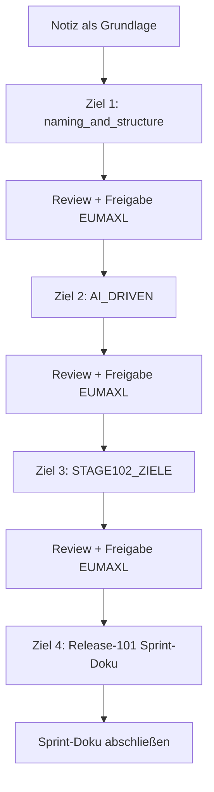

================================================================================
SPRINT-DEV-DOKU – S102-Naming-MUNI
================================================================================
Projekt             : R+MUNI Blueprint
Sprint-Bezeichnung  : Sprint-DEV-S102-Naming-MUNI
Tag                 : #dev #sprint #s102 #naming #muni #varianten
Datum               : 2026-04-05
Stage               : S102 — AKTIV
Status              : In Umsetzung
Verantwortlich      : EUMAXL
Review              : —
Jira-Sync           : NEIN
Erstellt durch      : EUMAXL + Claude (Pair-Session)
Vorgänger           : [[FREEZE_1_01]]
Nachfolger          : noch offen
================================================================================

================================================================================
1. AUSGANGSLAGE UND KONTEXT
================================================================================

1.1 Ist-Zustand vor diesem Sprint
-----------------------------------

Mit Stage 1.02 wurden die Varianten-Modelle von R+MUNI grundlegend neu bewertet.
Die Entscheide entstanden aus aktivem Beta-Betrieb und Kundenfeedback — primär
aus dem MUNI-Betakunden-Kontext (MLAT + Kundenprojekte).

Die normativen Dokumente spiegeln diesen Entscheid noch nicht vollständig wider.
Eine formlose Notiz (`NOTIZ-Varianten-Betakunden-S102.md`, 2026-04-05) dient
aktuell als vorübergehende Referenz bis die normativen Docs nachgezogen sind.

Relevante Artefakte vor dem Sprint:
  - naming_and_structure_S102.md         Status: veraltet — Begriffe noch S101-Stand
  - AI_DRIVEN_DEV_METHODE_DEV_S102.md    Status: veraltet — Begriffe noch S101-Stand
  - STAGE102_ZIELE_S102.md               Status: veraltet — Begriffe noch S101-Stand
  - NOTIZ-Varianten-Betakunden-S102.md   Status: aktiv — vorläufige Wahrheit
  - STAGE102_ZIELE_S1021.md              Status: Zwischenstand vom 2026-04-04

Bezug: [[FREEZE_1_01]]

1.2 Konkrete Diskrepanz oder Problemstellung
---------------------------------------------

  IST:  naming_and_structure_S102.md verwendet ASSOCIATE, ELITE, _ASC_ und
        beschreibt EXP als eigenes Artefakt — alles überholt.

  SOLL: Alle normativen Dokumente verwenden die neuen Begriffe:
        MUNI statt ASSOCIATE (Variante), _MUNI_ statt _ASC_ (Kürzel),
        ELITE entfällt, EXP = nur Ableger-Anleitung aus DEV.

Solange die Notiz die einzige korrekte Referenz ist, besteht Drift-Risiko
in jeder neuen Session die auf die normativen Docs zugreift.

1.3 Auslöser
-------------
Auslöser-Typ: Kundenfeedback

Kundenfeedback aus dem aktiven MUNI-Beta-Betrieb (MLAT + Kundenprojekte)
hat gezeigt dass die bisherige Begriffswelt ASSOCIATE / ELITE / EXP
nicht trennscharf genug ist und in der Außenwirkung nicht funktioniert.

Der Entscheid zur Neupositionierung wurde in einer Pair-Session
(EUMAXL + Claude, 2026-04-04) getroffen und in der Notiz festgehalten.
Dieser Sprint überführt den Entscheid in die normativen Dokumente.

================================================================================
2. ENTSCHEIDUNGEN UND GRUNDSÄTZE DIESES SPRINTS
================================================================================

2.1 MUNI ersetzt ASSOCIATE als Varianten-Bezeichnung
------------------------------------------------------
Entscheidung:
  Der Vollname "ASSOCIATE" und die Variante "Associate" werden durch
  "R+MUNI" (Vollname) bzw. "MUNI" (Variante) ersetzt.
  Das Dateinamen-Kürzel wechselt von _ASC_ zu _MUNI_.

Begründung:
  ASSOCIATE hat in der Außenwirkung keine Trennschärfe und transportiert
  nicht was die Variante ist: begleiteter R+MUNI-Betrieb im Kundenkontext.
  MUNI ist selbsterklärend, produktnah und konsistent mit dem Gesamtnamen.

Verworfene Alternativen:
  Beibehaltung von ASSOCIATE: Verworfen weil Außenwirkung nachweislich
    schwach — Kundenfeedback eindeutig.
  Eigenes neues Wort: Verworfen weil MUNI bereits im Produktnamen verankert
    und damit ohne Erklärungsbedarf.

Auswirkung:
  Alle normativen Docs erhalten neue Begriffe.
  Bestehende S8-Dokumente mit ASSOCIATE/ASC im Namen bleiben unverändert —
  organisches Renaming beim nächsten Editieren, kein Bulk-Renaming.

Sonderregel ASC-Betakunde:
  "ASC" als Kürzel für einen konkreten Betakunden (Vereins-Betakunde)
  ist nicht betroffen. ASC-Inhalte in Dokumenten sind gewollt und bleiben.
  ASC hat der Außenwirkung zugestimmt — Inhalte dürfen publiziert werden,
  Mitgliedernamen ausgenommen.

2.2 ELITE entfällt vollständig
--------------------------------
Entscheidung:
  Die Variante ELITE wird ersatzlos gestrichen.

Begründung:
  ELITE hat keine aktive Nutzerbasis entwickelt und keine klare
  Abgrenzung zu DEV/EXP. Der Begriff erzeugt falsche Erwartungen
  ohne inhaltliche Grundlage.

Verworfene Alternativen:
  Beibehaltung als Platzhalter: Verworfen — leere Platzhalter erzeugen
    Pflegeaufwand ohne Mehrwert.

Auswirkung:
  ELITE wird aus naming_and_structure entfernt.
  Keine weiteren Dokumente betroffen — ELITE hatte noch keine eigenen Artefakte.

2.3 EXP ist kein eigenes Artefakt mehr
----------------------------------------
Entscheidung:
  EXP wird nicht als eigenständiges Dokument gebaut.
  EXP ist eine Ableger-Anleitung: wer tief einsteigen will, nimmt DEV
  und extrahiert selbst mit Claude.

Begründung:
  Ein eigenes EXP-Artefakt würde Pflegeaufwand erzeugen der nicht
  durch eine aktive Nutzerbasis gedeckt ist. Die Positionierung
  "selbst kompilieren aus DEV" ist ehrlicher und wartungsärmer.

Verworfene Alternativen:
  EXP als eigenes Dokument in S102: Verworfen — kein Sprint nötig,
    kein Artefakt nötig, Beschreibung reicht.

Auswirkung:
  naming_and_structure beschreibt EXP als Ableger-Anleitung, nicht als
  vollwertige Variante mit eigenem Dateinamen-Schema.

2.4 Kein Bulk-Renaming bestehender Dateien
-------------------------------------------
Entscheidung:
  Bestehende Dateien mit ASSOCIATE, ASC oder ELITE im Namen werden
  nicht sofort umbenannt. Renaming erfolgt organisch beim nächsten Editieren.

Begründung:
  Bulk-Renaming erzeugt Risiko für Referenz-Brüche und ist nicht
  verhältnismäßig. Kontinuität vor Perfektion — GOV-konform.

Auswirkung:
  Keine unmittelbaren Dateioperationen in diesem Sprint.
  Die normativen Docs beschreiben den neuen Stand — die alten Files
  sind read-only bis zum nächsten organischen Editier-Anlass.

2.x OFFENE ENTSCHEIDUNGEN — werden im Sprint geklärt
------------------------------------------------------
  Keine offenen Entscheidungen zu Sprint-Beginn.
  Alle Kernentscheide wurden in der Pair-Session 2026-04-04 getroffen
  und in der Notiz dokumentiert.

================================================================================
3. SPRINT-ZIELE
================================================================================

3.1 Ziel 1 — naming_and_structure_S102.md aktualisieren
---------------------------------------------------------
Das Dokument ist die Single Source of Truth für Namenskonventionen.
Es muss als erstes nachgezogen werden — alle anderen Docs bauen darauf auf.

  IST                                      →  SOLL
  ASSOCIATE als Vollname                   →  R+MUNI
  Associate als Variante                   →  MUNI
  ELITE als Variante (Platzhalter)         →  entfällt
  EXP als eigenes Artefakt beschrieben     →  EXP = Ableger-Anleitung
  _ASC_ als Dateinamen-Kürzel             →  _MUNI_
  Rollenprefix _ASC_ in Kap. 1            →  _MUNI_
  Pendant-Schema _ASC_ in Kap. 3         →  _MUNI_
  Varianten-Kürzel ASC in Kap. 4         →  MUNI

Vorgehen:
  Chirurgische Eingriffe — Stelle für Stelle, kein Neugenerieren.
  EUMAXL prüft und gibt frei bevor das nächste Dokument angegangen wird.

Begründung für dieses Vorgehen:
  Neugenerierung akkumuliert Drift (GOV-Erkenntnis aus Stage 8).
  Chirurgische Eingriffe sind nachvollziehbar und rückkopplungssicher.

3.2 Ziel 2 — AI_DRIVEN_DEV_METHODE_DEV_S102.md aktualisieren
--------------------------------------------------------------
Begriffe in Kap. 1 (Varianten-Logik) und alle weiteren Vorkommen
von ASSOCIATE, ASC, ELITE nachziehen.

  IST                                      →  SOLL
  ASC als Varianten-Kürzel in Kap. 1      →  MUNI
  ASSOCIATE als Vollname (wo vorhanden)    →  R+MUNI
  EXP als eigenes Artefakt (Kap. 1)       →  EXP = Ableger-Anleitung

Vorgehen:
  Nach Freigabe von Ziel 1 — gleiche Methode: chirurgische Eingriffe.

3.3 Ziel 3 — STAGE102_ZIELE_S102.md aktualisieren
---------------------------------------------------
Begriffe nachziehen. Inhaltlich ist der aktuelle Stand bereits in
STAGE102_ZIELE_S1021.md abgebildet — dieses Dokument wird als
Referenz verwendet.

  IST                                      →  SOLL
  ASSOCIATE / ASC (wo vorhanden)           →  MUNI / R+MUNI
  ELITE (wo vorhanden)                     →  entfällt
  EXP als eigenes Artefakt (Kap. 4.2)     →  EXP = Ableger-Anleitung

Vorgehen:
  Nach Freigabe von Ziel 2 — chirurgische Eingriffe.

3.4 Ziel 4 — Sprint-DEV-S102-Release-101.md Begriffe nachziehen
----------------------------------------------------------------
Falls der Release-Sprint bereits Dokument-Verweise mit alten Begriffen
enthält, werden diese nachgezogen.

Vorgehen:
  Nach Freigabe von Ziel 3 — nur Begriffe, kein inhaltlicher Eingriff.

Hinweis: Dieses Dokument liegt nicht im aktuellen Projektfolder.
  EUMAXL stellt es bei Bedarf bereit.

================================================================================
4. ABGRENZUNG — WAS DIESER SPRINT NICHT TUT
================================================================================

Dieser Sprint tut explizit nicht:
  - Kein Bulk-Renaming bestehender Dateien (S8-Stand bleibt unberührt)
  - Kein Eingriff in Stage-3 bis S101-Artefakte
  - Kein Erstellen eines EXP-Artefakts
  - Kein Public Push — das ist ein eigener Sprint (Sprint-DEV-S102-Release-101)
  - Keine inhaltliche Überarbeitung der Varianten-Positionierung —
    die Entscheide sind bereits getroffen, dieser Sprint dokumentiert nur
  - Kein Eingriff in CARD-Welt-Dokumente
  - Kein Renaming von ASC-Betakunden-Inhalten

Begründung der wichtigsten Ausschlüsse:
  Bulk-Renaming: Rückkopplungsschutz — unverhältnismäßiges Risiko für
    Referenz-Brüche bei S8-Dokumenten die read-only bleiben sollen.
  Public Push: Eigener Sprint mit eigenem Scope — Vermischung erzeugt Drift.

================================================================================
5. BETROFFENE ARTEFAKTE
================================================================================

Neu erstellt:
  Sprint-DEV-S102-Naming-MUNI.md          Dieses Dokument

Geändert:
  naming_and_structure_S102.md            Begriffe MUNI/R+MUNI, ELITE entfernt,
                                          EXP-Positionierung, _MUNI_ Kürzel
  AI_DRIVEN_DEV_METHODE_DEV_S102.md       Begriffe Kap. 1 + alle Vorkommen
  STAGE102_ZIELE_S102.md                  Begriffe nachgezogen

Unverändert (relevant zu erwähnen):
  NOTIZ-Varianten-Betakunden-S102.md      Bleibt bis alle normativen Docs
                                          aktualisiert sind — dann obsolet
  STAGE102_ZIELE_S1021.md                 Referenz für Ziel 3 — read-only
  Alle _S8-Dokumente                      Rückkopplungsschutz — kein Eingriff
  ASC-Betakunden-Inhalte                  Gewollt, bleiben unverändert

================================================================================
6. UMSETZUNG — SCHRITT FÜR SCHRITT
================================================================================

Schritt 1 — naming_and_structure_S102.md aktualisieren
  Chirurgische Eingriffe in folgende Stellen:
    - Zweck-Abschnitt: "ASSOCIATE" → "R+MUNI", "ELITE" entfernen
    - Kap. 1 Rollenprefix: _ASC_ → _MUNI_, ELITE-Zeile entfernen,
      EXP-Beschreibung auf Ableger-Anleitung anpassen
    - Kap. 1 Beispiele: ASC-Beispieldateinamen aktualisieren
    - Kap. 3 Pendant-Schema: _ASC_ → _MUNI_
    - Kap. 4 Varianten-Kürzel: ASC-Zeile → MUNI, ELITE entfernen,
      EXP-Beschreibung anpassen, Dateinamen-Schema aktualisieren
    - Kap. 4 Übergangsregel: auf neuen Stand bringen
    - Header Letzte Änderung: Eintrag 2026-04-05 ergänzen
  Ergebnis: naming_and_structure ist normativ korrekt und aktuell.

Schritt 2 — AI_DRIVEN_DEV_METHODE_DEV_S102.md aktualisieren
  Nach Freigabe Schritt 1.
  Chirurgische Eingriffe:
    - Kap. 1 Varianten-Tabelle: ASC → MUNI, EXP-Beschreibung anpassen
    - Alle weiteren Vorkommen von ASSOCIATE, _ASC_, ELITE suchen und ersetzen
    - Header Letzte Änderung: Eintrag 2026-04-05 ergänzen
  Ergebnis: AI_DRIVEN ist begrifflich konsistent mit naming_and_structure.

Schritt 3 — STAGE102_ZIELE_S102.md aktualisieren
  Nach Freigabe Schritt 2.
  Referenz: STAGE102_ZIELE_S1021.md (Zwischenstand 2026-04-04) als Vorlage.
  Chirurgische Eingriffe:
    - Kap. 4.2: Positionierung CARD/Expert/Associate → auf S1021-Stand bringen
    - Alle Vorkommen ASSOCIATE, ASC, ELITE prüfen und nachziehen
    - Header Letzte Änderung: Eintrag 2026-04-05 ergänzen
  Ergebnis: STAGE102_ZIELE_S102 ist der aktuelle normative Stand,
            STAGE102_ZIELE_S1021 wird danach obsolet.

Schritt 4 — Sprint-DEV-S102-Release-101.md Begriffe prüfen
  Nach Freigabe Schritt 3.
  Dokument wird von EUMAXL bereitgestellt wenn noch nicht im Folder.
  Nur Begriffe prüfen — kein inhaltlicher Eingriff.
  Ergebnis: Release-Sprint-Doku ist begrifflich konsistent.

Schritt 5 — Sprint-Doku abschließen
  Kapitel 7–12 befüllen, Status auf Abgeschlossen setzen.

================================================================================
7. BEOBACHTUNGEN UND ERKENNTNISSE WÄHREND DER UMSETZUNG
================================================================================

  — wird während der Umsetzung befüllt —

================================================================================
8. ERGEBNIS
================================================================================

  — wird nach Abschluss befüllt —

================================================================================
9. TEST UND VALIDIERUNG
================================================================================

| Prüfpunkt                                              | Ergebnis   | Anmerkung                        |
|--------------------------------------------------------|------------|----------------------------------|
| naming_and_structure: kein ASSOCIATE/ASC/ELITE mehr    | —          | nach Schritt 1                   |
| AI_DRIVEN: kein ASSOCIATE/ASC/ELITE mehr               | —          | nach Schritt 2                   |
| STAGE102_ZIELE: Begriffe konsistent                    | —          | nach Schritt 3                   |
| Notiz ist durch normative Docs vollständig abgelöst    | —          | nach Schritt 3                   |
| S8-Dokumente unberührt                                 | —          | Rückkopplungsschutz              |
| ASC-Betakunden-Inhalte unverändert                     | —          | gewollt                          |
| Kein unbeabsichtigter Seiteneffekt                     | —          | EUMAXL-Review je Schritt         |

Testmethode:
  Manuelle Sichtprüfung durch EUMAXL nach jedem Schritt.
  Volltextsuche auf ASSOCIATE, _ASC_, ELITE in betroffenen Docs.

================================================================================
10. OFFENE PUNKTE NACH SPRINT-ABSCHLUSS
================================================================================

| Thema                                    | Status         | Nächste Aktion                        |
|------------------------------------------|----------------|---------------------------------------|
| STAGE102_ZIELE_S1021.md                  | Obsolet        | Archivkopie durch EUMAXL, dann löschen|
| NOTIZ-Varianten-Betakunden-S102.md       | Obsolet        | Archivkopie durch EUMAXL, dann löschen|
| Sprint-DEV-S102-Release-101              | Läuft parallel | Eigener Sprint — nicht hier           |
| Organisches Renaming S8-Dateien          | Beobachten     | Beim nächsten Editieren je File       |

================================================================================
11. GOVERNANCE-KONFORMITÄTSCHECK
================================================================================

| GOV-Kriterium                              | Status      | Anmerkung                                  |
|--------------------------------------------|-------------|--------------------------------------------|
| GOV 10.3  Auslöser zulässig               | OK          | Kundenfeedback                             |
| GOV 10.5  Fachlicher Mehrwert benennbar   | OK          | Begriffskonsistenz in allen normativen Docs|
| GOV 10.5  Keine implizite GOV-Änderung    | OK          | Nur Begriffe — keine Logikänderung         |
| GOV 10.6  Ziel explizit definiert         | OK          | Kapitel 3                                  |
| GOV 10.6  Ziel überprüfbar               | OK          | Kapitel 9                                  |
| GOV 10.7  Zwischenschritte dokumentiert   | OK          | Kapitel 6                                  |
| GOV 10.8  Dev-Doku vollständig            | IN ARBEIT   | Dieses Dokument — Kap. 7/8 noch offen      |
| GOV 10.9  Stage-Ende Doku                 | OFFEN       | Fällig bei Stage-Abschluss                 |
| GOV 10.10 Keine GOV-Regel aufgehoben      | OK          | Keine Regeländerung                        |
| Rückkopplungsschutz eingehalten           | OK          | S8 und älter unberührt                     |

================================================================================
12. LESSONS LEARNED
================================================================================

  — wird nach Abschluss befüllt —

================================================================================
13. BEZÜGE UND VERLINKUNGEN
================================================================================

Ausgangspunkt:
  [[FREEZE_1_01]]                               Baseline für diesen Sprint
  [[NOTIZ-Varianten-Betakunden-S102]]           Inhaltliche Grundlage

Entstanden:
  — kein Freeze in diesem Sprint —

Verwandte Dokumente:
  [[Global_GOV_DEV_S101]]                       normative Grundlage
  [[naming_and_structure_S102]]                 primäres Zieldokument
  [[AI_DRIVEN_DEV_METHODE_DEV_S102]]            Zieldokument
  [[STAGE102_ZIELE_S102]]                       Zieldokument
  [[STAGE102_ZIELE_S1021]]                      Referenz-Zwischenstand — wird obsolet
  [[Sprint-DEV-S102-Release-101]]               Paralleler Sprint — nicht hier

Creative-Assets:
  Keine Creative-Assets für diesen Sprint.

================================================================================
Sprint-DEV-S102-Naming-MUNI | S102 | 2026-04-05 | R+MUNI Blueprint
Erstellt durch: EUMAXL + Claude (Pair-Session)
================================================================================
