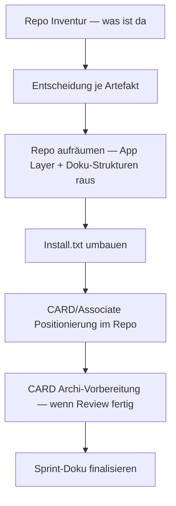

================================================================================
SPRINT-DEV-DOKU – S102-Release-101
================================================================================
Projekt             : R+MUNI Blueprint
Sprint-Bezeichnung  : Sprint-DEV-S102-Release-101
Tag                 : #dev #sprint #s102 #release #card #public #install
Datum               : 2026-04-04
Stage               : S1.02 — AKTIV
Status              : In Umsetzung
Verantwortlich      : EUMAXL
Review              : —
Jira-Sync           : NEIN
Erstellt durch      : EUMAXL + Claude (Pair-Session)
Vorgänger           : [[Sprint-DEV-S102-Naming-AIDriven]]
Nachfolger          : noch offen
================================================================================

================================================================================
1. AUSGANGSLAGE UND KONTEXT
================================================================================

1.1 Ist-Zustand vor diesem Sprint
-----------------------------------

Stage 1.02 ist aktiv. Die normativen Grundlagen (GOV, Methode, Naming)
sind auf S102-Stand gebracht. Der Public Repo enthält den Beta-1.0-Release
aber keine saubere CARD/Associate-Struktur. Die Installationsanleitung
ist funktional aber nicht CARD-optimiert — sie geht nicht von der
Erfahrung eines kompletten Newcomers aus.

Erster echter CARD-Betauser (FARM) wurde heute 2026-04-04 gewonnen.
Erste direkte Beobachtung eines Non-IT-Users mit dem Toolset.
CARD hat bisher keinen definierten Platz im Public Repo.
Associate-Inhalte sind vorhanden aber nicht explizit positioniert.
Doku-Strukturen (Templates) liegen im Repo ohne klare Trennung.
App Layer (Layer-Konzept) ist im Repo sichtbar — gehört nicht public.

Relevante Artefakte vor dem Sprint:
  - STAGE102_ZIELE_S102.md              Status: aktiv, Ziele definiert
  - Sprint-DEV-S102-Naming-AIDriven.md  Status: abgeschlossen
  - FREEZE_1.01.md                      Status: vollständige Baseline
  - Install.txt                         Status: funktional, nicht CARD-optimiert
  - Public Repo (R-MUNI)                Status: Beta 1.0 aktiv, Struktur diffus

Bezug: [[Sprint-DEV-S102-Naming-AIDriven]] | [[FREEZE_101]]

1.2 Konkrete Diskrepanz oder Problemstellung
---------------------------------------------

  IST:  Public Repo ist gewachsen ohne klare Nutzerführung.
        CARD-User sieht zu viel auf einmal — kein klarer Einstiegspunkt.
        Installationsanleitung: Downloads und Installation gemischt,
        keine logische Download-first Reihenfolge.
        Doku-Strukturen liegen direkt im Repo — unklar ob public oder intern.
        App Layer ist sichtbar obwohl DEV-only.

  SOLL: Public Repo hat eine klare Hierarchie:
        CARD = Einstieg, selbstspielbar, erste Anlaufstelle.
        Associate = nächster Schritt, mit Begleitung.
        Install = erst alles downloaden, dann alles installieren.
        Doku-Strukturen = aus dem Public Repo raus, in Install-Anleitung
        als "kopiere nach R+MUNI Repo" dokumentiert.
        App Layer = DEV-only, nicht im Public Repo sichtbar.

1.3 Auslöser
-------------
Auslöser-Typ: Kundenbedarf + direkte Beta-Beobachtung

Heute 2026-04-04: Erster echter CARD-Betauser (FARM) gewonnen.
FARM betreibt eine Farm mit Landwirtschaft und Biogas.
Use Case: Übersicht über Dieselkosten, Felder, Saatgut, Aufwände in h,
Ertrag. Stellt reale CSV-Daten bereit. GitHub Repo Sync läuft bereits.
Deal: offenes ehrliches Feedback gegen kostenlosen Support und Archi.

Direkte Beobachtung heute: FARM hat beim ersten Blick auf das vollständige
Toolset (Archi, jArchi Console, BPMN, Views, ArchiMate-Objekte) sichtbar
den Überblick verloren — ohne dass Scripts oder Logik auch nur erwähnt
wurden. Das ist der erste empirische Beleg dafür dass der CARD-Einstieg
zu viel auf einmal zeigt.

Bewusste Entscheidung EUMAXL: Gas rausnehmen. Ein Schritt.
FARM bekommt als erstes: Claude-Projekt anlegen, mit AI ein paar
Sachen besprechen, kalibrieren. Nicht mehr. Scope von FARM kommt
wenn er bereit ist, CSV folgt danach.

Warum jetzt: FARM ist da. Die Beobachtung ist frisch. Der Repo muss
stimmen bevor weitere Betauser dazukommen.

================================================================================
2. ENTSCHEIDUNGEN UND GRUNDSÄTZE DIESES SPRINTS
================================================================================

2.1 CARD als primärer Einstieg — nicht Install, nicht Toolset
--------------------------------------------------------------
Entscheidung:
  Der erste Schritt für einen CARD-User ist nicht die Installation —
  es ist das erste Gespräch mit der AI. Toolset kommt danach.

Begründung:
  FARM-Beobachtung heute: Toolset-Overload ist der erste Aussteigepunkt.
  Obsidian Graph View und AI-Outputs haben gezogen — nicht das Tool selbst.
  Der Hook ist das Ergebnis, nicht der Weg dorthin.

Verworfene Alternativen:
  Install-first: Verworfen weil FARM-Reaktion empirisch belegt dass
    das Toolset allein schon überfordert — bevor ein Mehrwert sichtbar ist.

Auswirkung:
  Repo-Struktur und Dokumentation priorisieren den AI-first Einstieg.
  Install bleibt aber wird nach hinten gestellt in der User Journey.

2.2 App Layer bleibt DEV-only — kein Public Push
-------------------------------------------------
Entscheidung:
  Der App Layer (Layer-Konzept) wird aus dem Public Repo entfernt
  und bleibt ausschließlich im DEV-Bereich.

Begründung:
  Zu heikel für unkontrollierten öffentlichen Zugriff.
  Verwirrt CARD-User mehr als es nützt.
  Kein fertiges Konzept das public kommunizierbar wäre.

Verworfene Alternativen:
  Kommentierter Platzhalter im Public Repo:
    Verworfen weil selbst ein Platzhalter Fragen erzeugt die nicht
    beantwortet werden können.

Auswirkung:
  App Layer wird aus Public Repo entfernt. DEV-Repo bleibt unverändert.
  Eigener DEV-Sprint wenn Konzept reif ist.

2.3 Doku-Strukturen aus Public Repo raus
-----------------------------------------
Entscheidung:
  Templates und Doku-Strukturen gehören nicht direkt in den Public Repo.
  Sie liegen im DEV-Bereich. Die Install-Anleitung dokumentiert den
  Schritt: "kopiere nach R+MUNI Repo".

Begründung:
  Früher war das sauber getrennt — das war besser.
  Im Public Repo verwirren sie CARD-User die keinen Blueprint-Kontext haben.
  Die Trennung ist klarer und wartbarer.

Verworfene Alternativen:
  Im Public Repo lassen mit README-Erklärung:
    Verworfen weil das mehr Komplexität erzeugt als löst.

Auswirkung:
  Install-Anleitung bekommt expliziten Schritt für Doku-Strukturen.
  Public Repo wird schlanker.

2.4 Install-Reihenfolge: erst alles downloaden, dann alles installieren
------------------------------------------------------------------------
Entscheidung:
  Die Installationsanleitung wird in zwei Phasen gegliedert:
  Phase 1 — Alles downloaden was man braucht.
  Phase 2 — Alles installieren in einem Durchgang.

Begründung:
  Logischer Ablauf für einen Newcomer: erst sammeln, dann tun.
  Verhindert dass man mitten in der Installation merkt dass ein
  Download fehlt. Weniger Kontextwechsel.

Verworfene Alternativen:
  Eigener R+MUNI-Installationsordner als Download-Paket:
    Verworfen — das ist EUMAXLs persönliche Installationsroutine
    für Support, kein öffentliches Artefakt dieses Sprints.

Auswirkung:
  Install.txt wird strukturell umgebaut.
  Download-Abschnitt kommt vor Installations-Abschnitt.

2.x OFFENE ENTSCHEIDUNGEN — werden im Sprint geklärt
------------------------------------------------------

  OFFEN A: CARD Flows & Archi-Vorbereitung
    EUMAXL hat rohes Material, Review noch ausstehend.
    Was muss entschieden werden: Welche Views werden vorbereitet,
    welche Flows, wie tief geht die Archi-Vorbereitung für CARD.
    Auswirkung: Eigener Block im Sprint oder eigener Folge-Sprint.
    → Entschieden am <YYYY-MM-DD>: <Ergebnis>

  OFFEN B: FARM — Scope und erster CSV-Inhalt
    FARM liefert seinen Scope wenn er bereit ist.
    Was muss entschieden werden: Welche Felder, welche Datenstruktur,
    welcher erste Zug in R+MUNI.
    Auswirkung: Beeinflusst CARD Archi-Vorbereitung direkt.
    → Entschieden am <YYYY-MM-DD>: <Ergebnis>

  OFFEN C: Repo-Struktur konkret
    Welche Dateien / Ordner bleiben im Public Repo, welche fliegen raus.
    Vollständige Inventur steht noch aus.
    → Entschieden am <YYYY-MM-DD>: <Ergebnis>

================================================================================
3. SPRINT-ZIELE
================================================================================

3.1 Ziel 1 — Public Repo aufräumen
------------------------------------
CARD und Associate bekommen einen sauberen, klaren Platz im Public Repo.
Alles was CARD-User verwirrt ohne Mehrwert zu liefern wird entfernt
oder in den DEV-Bereich verschoben.

  IST                                        →  SOLL
  Repo gewachsen ohne Nutzerführung          →  Klare Hierarchie: CARD → Associate
  App Layer sichtbar                         →  App Layer entfernt (DEV-only)
  Doku-Strukturen direkt im Repo             →  Aus Public Repo raus
  Kein klarer Einstiegspunkt                 →  CARD = erster Anlaufpunkt

Vorgehen:
  Vollständige Inventur des aktuellen Public Repo.
  Entscheidung je Artefakt: bleibt / raus / verschiebt sich.
  Umbau dokumentieren — was wurde entfernt und warum.

Begründung für dieses Vorgehen:
  Erst verstehen was da ist, dann entscheiden. Kein blindes Löschen.

3.2 Ziel 2 — Install-Reihenfolge umbauen
------------------------------------------
Installationsanleitung wird in Download-Phase und Installations-Phase
getrennt. Logischer Ablauf für Newcomer ohne IT-Hintergrund.

  IST                                        →  SOLL
  Downloads und Install gemischt             →  Phase 1: Downloads | Phase 2: Install
  Keine explizite Doku-Strukturen-Anweisung  →  Schritt: "kopiere nach R+MUNI Repo"

Vorgehen:
  Install.txt strukturell umbauen.
  Alle Download-Links in Phase 1 zusammenführen.
  Installations-Schritte in Phase 2 — in logischer Reihenfolge.
  Doku-Strukturen-Schritt explizit ergänzen.

Begründung für dieses Vorgehen:
  FARM-Beobachtung: Überblick verlieren passiert früh.
  Eine klare Struktur senkt die Einstiegshürde spürbar.

3.3 Ziel 3 — CARD Archi-Vorbereitung (steht noch aus)
-------------------------------------------------------
Archi so vorbereiten dass ein CARD-User nicht 3–4h ins Tool
einarbeiten muss bevor er den ersten sichtbaren Output hat.
Views vorhalten, Flows vorbereiten — einschieben statt aufbauen.

Status: OFFEN — EUMAXL reviewt rohes Material.
        Wird als eigener Block oder Folge-Sprint definiert
        wenn Review abgeschlossen.

Vorgehen: noch offen.

================================================================================
4. ABGRENZUNG — WAS DIESER SPRINT NICHT TUT
================================================================================

Dieser Sprint tut explizit nicht:
  - App Layer konzipieren oder ausbauen — DEV-only, eigener Sprint
  - CARD Flows & Archi-Vorbereitung vollständig umsetzen — Review ausstehend
  - FARM Use Case modellieren — kommt wenn Scope und CSV da sind
  - EXP-Variante erstellen — eigener Sprint, eigener Chat
  - GOV ändern — kein GOV-Eingriff in diesem Sprint
  - Scripts berühren — kein Script-Eingriff

Begründung der wichtigsten Ausschlüsse:
  App Layer: Zu heikel für diesen Scope — bewusst DEV-only gehalten.
  FARM-Modellierung: Erst kalibrieren, dann bauen. Scope kommt von FARM.
  CARD Archi: Rohes Material nicht review-fertig — kein vorzeitiger Start.

================================================================================
5. BETROFFENE ARTEFAKTE
================================================================================

Geändert (geplant):
  - Install.txt                         Struktur umbau Download → Install
  - Public Repo Struktur                Aufräumen, CARD/Associate positionieren

Entfernt aus Public Repo (geplant):
  - App Layer Artefakte                 → DEV-only
  - Doku-Strukturen / Templates         → DEV-intern, Install-Anleitung verweist

Neu erstellt (geplant):
  - <wird ergänzt wenn Archi-Vorbereitung definiert ist>

Unverändert:
  - Global_GOV_DEV_S101.md             kein GOV-Eingriff
  - AI_DRIVEN_DEV_METHODE_DEV_S102.md  kein Eingriff
  - naming_and_structure_S102.md       kein Eingriff
  - Alle Scripts                        kein Eingriff
  - Stage-3 bis Stage-101 Artefakte    Rückkopplungsschutz

================================================================================
6. UMSETZUNG — SCHRITT FÜR SCHRITT
================================================================================

Schritt 1 — Repo Inventur
  Vollständige Übersicht was aktuell im Public Repo liegt.
  Entscheidungsgrundlage für alles was folgt.
  Ergebnis: Liste mit Entscheidung je Artefakt (bleibt / raus / verschiebt)

Schritt 2 — Repo aufräumen
  App Layer entfernen. Doku-Strukturen entfernen.
  CARD und Associate klar positionieren.
  Ergebnis: Schlanker, klarer Public Repo.

Schritt 3 — Install.txt umbauen
  Phase 1 Downloads zusammenführen.
  Phase 2 Installation in Reihenfolge.
  Doku-Strukturen-Schritt ergänzen.
  Ergebnis: Newcomer-freundliche Installationsanleitung.

Schritt 4 — CARD Archi-Vorbereitung
  Steht noch aus — abhängig von EUMAXLs Review des rohen Materials.
  Ergebnis: <wird ergänzt>

<!-- Weitere Schritte werden ergänzt während der Sprint läuft -->

================================================================================
7. BEOBACHTUNGEN UND ERKENNTNISSE WÄHREND DER UMSETZUNG
================================================================================

7.1 FARM-Session — erste empirische CARD-Beobachtung
------------------------------------------------------
  Datum: 2026-04-04
  FARM (Non-IT-User, Landwirtschaft + Biogas) hat beim ersten Blick
  auf das vollständige Toolset sichtbar den Überblick verloren.
  Archi + jArchi Console + BPMN + Views + ArchiMate-Objekte — ohne
  dass Scripts oder Logik auch nur erwähnt wurden.
  Was gezogen hat: Obsidian Graph View, AI-Outputs.
  Was überfordert hat: das Toolset in Summe, bevor ein Mehrwert sichtbar war.

  Auswirkung: Bestätigt den CARD-Umbau als dringend.
              Bestätigt AI-first vor Install-first als richtige Reihenfolge.
              Bewusste Entscheidung: Gas rausnehmen, ein Schritt zuerst.
  Dokumentiert: Ja — Kapitel 1.3 und Entscheidung 2.1.

<!-- Weitere Beobachtungen werden ergänzt während der Sprint läuft -->

================================================================================
8. ERGEBNIS
================================================================================

<!-- Wird ausgefüllt wenn Sprint abgeschlossen -->

8.1 Erreichter Zustand
-----------------------
<Offen — Sprint läuft>

8.2 Abweichungen vom Plan
--------------------------
<Offen — Sprint läuft>

================================================================================
9. TEST UND VALIDIERUNG
================================================================================

| Prüfpunkt                                         | Ergebnis   | Anmerkung              |
|---------------------------------------------------|------------|------------------------|
| Public Repo: CARD klar positioniert               | OFFEN      | —                      |
| Public Repo: App Layer entfernt                   | OFFEN      | —                      |
| Public Repo: Doku-Strukturen entfernt             | OFFEN      | —                      |
| Install.txt: Download-Phase vor Install-Phase     | OFFEN      | —                      |
| Install.txt: Doku-Strukturen-Schritt vorhanden    | OFFEN      | —                      |
| Rückkopplungsschutz: Stage-3 bis S101 unberührt   | OFFEN      | —                      |
| Kein unbeabsichtigter Seiteneffekt                | OFFEN      | —                      |

Testmethode: Manuell — visuelle Prüfung Public Repo + Install.txt Durchlauf.

================================================================================
10. OFFENE PUNKTE NACH SPRINT-ABSCHLUSS
================================================================================

| Thema                              | Status        | Nächste Aktion                                    |
|------------------------------------|---------------|---------------------------------------------------|
| CARD Archi-Vorbereitung            | Offen         | Nach EUMAXLs Review — eigener Block oder Sprint   |
| FARM Scope + CSV                   | Wartet        | FARM liefert wenn bereit                          |
| App Layer Konzept                  | Zurückgestellt| Eigener DEV-Sprint wenn Konzept reif              |
| Repo Inventur konkret              | Offen         | Nächster Schritt im Sprint                        |

================================================================================
11. GOVERNANCE-KONFORMITÄTSCHECK
================================================================================

| GOV-Kriterium                              | Status  | Anmerkung                                           |
|--------------------------------------------|---------|-----------------------------------------------------|
| GOV 10.3  Auslöser zulässig               | OK      | Kundenbedarf + direkte Beta-Beobachtung             |
| GOV 10.5  Fachlicher Mehrwert benennbar   | OK      | CARD-Einstieg senkt Hürde — empirisch belegt        |
| GOV 10.5  Keine implizite GOV-Änderung    | OK      | Kein GOV-Eingriff                                   |
| GOV 10.6  Ziel explizit definiert         | OK      | Kapitel 3                                           |
| GOV 10.6  Ziel überprüfbar               | OK      | Kapitel 9                                           |
| GOV 10.7  Zwischenschritte dokumentiert   | OK      | Kapitel 6                                           |
| GOV 10.8  Dev-Doku vollständig            | OK      | Dieses Dokument — lebt bis Sprint-Ende              |
| GOV 10.9  Stage-Ende Doku                 | OFFEN   | Fällig bei Stage-Abschluss S1.02                    |
| GOV 10.10 Keine GOV-Regel aufgehoben      | OK      | Keine GOV-Regel aufgehoben                          |
| GOV 10.13 Stage-Suffix korrekt            | OK      | _S102                                               |
| Rückkopplungsschutz eingehalten           | OK      | Stage-3 bis S101 unberührt                          |
| Zwei-Welten-Prinzip GOV 14               | OK      | App Layer DEV-only, kein Public Push                |
| Zwei-Repo-Bewusstsein GOV 15.8            | OK      | Dieses Dokument DEV-intern                          |

================================================================================
12. LESSONS LEARNED
================================================================================

<!-- Wird laufend ergänzt — finale Fassung bei Sprint-Abschluss -->

12.1 Was gut funktioniert hat
------------------------------
  - Gas rausnehmen als bewusste Entscheidung — nicht jeder Betauser
    braucht sofort das volle Programm. Ein Schritt ist genug.
  - Erste direkte User-Beobachtung liefert mehr als jede Annahme.
    FARM hat in einer Session mehr gezeigt als Monate theoretischer
    CARD-Planung hätten ergeben können.

12.2 Was beim nächsten Mal anders gemacht werden sollte
--------------------------------------------------------
  - <wird ergänzt>

12.3 Erkenntnisse für das System
----------------------------------
  - AI-first vor Install-first ist nicht nur eine Präferenz —
    es ist durch Beobachtung bestätigt.
    → Konsequenz: CARD Journey muss das strukturell abbilden.
  - Toolset-Overload passiert schon vor dem ersten Script.
    → Konsequenz: Archi-Vorbereitung ist kein Nice-to-have — es ist
    die Voraussetzung damit CARD überhaupt funktioniert.

================================================================================
13. BEZÜGE UND VERLINKUNGEN
================================================================================

Ausgangspunkt:
  [[FREEZE_101]]                             Baseline für Stage 1.02
  [[Sprint-DEV-S102-Naming-AIDriven]]        Letzter abgeschlossener Sprint

Verwandte Dokumente:
  [[Global_GOV_DEV_S101]]                    normative Grundlage
  [[STAGE102_ZIELE_S102]]                    Stage-Ziele — CARD Positionierung
  [[naming_and_structure_S102]]              Naming-Referenz
  [[AI_DRIVEN_DEV_METHODE_DEV_S102]]         Methodik-Referenz
  [[Install]]                                Wird in diesem Sprint umgebaut

Creative-Assets:
  Keine für diesen Sprint — MUNIDELL SVG folgt in eigenem Sprint.

================================================================================
Sprint-DEV-S102-Release-101 | S102 | 2026-04-04 | R+MUNI Blueprint
Erstellt durch: EUMAXL + Claude (Pair-Session)
================================================================================
