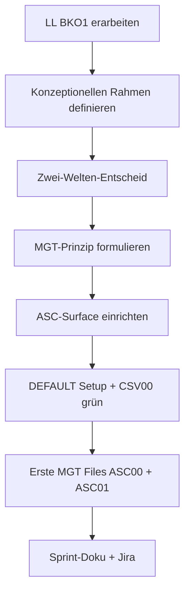

================================================================================
SPRINT-DEV-DOKU – S7-Z2 ASC-Onboarding-neuKern
================================================================================
Projekt             : R+MUNI Blueprint
Sprint-Bezeichnung  : Sprint-DEV-S7-Z2-ASC-Onboarding-neuKern
Datum               : 2026-03-22
Stage               : S7 – AKTIV
Status              : Abgeschlossen
Erstellt durch      : EUMAXL + Claude (Pair-Session)
Vorgänger           : [[FREEZE-6_konsolidiert]]
Nachfolger          : noch offen
================================================================================

================================================================================
1. AUSGANGSLAGE UND KONTEXT
================================================================================

1.1 Ist-Zustand vor diesem Sprint
-----------------------------------
Stage 7 ist logisch eröffnet. Freeze 6 ist vollständige Baseline.
ASC (Betakunde_02) ist als primärer Beta-Kontext vorbereitet aber
noch nicht ongeboardet. Betakunde_01 ist faktisch inaktiv (Status PASSIV).

Das bisherige Onboarding-Modell basiert auf dem Atlassian-Zugriffsmodell
aus Stage 4/5 — wurde für BKO1 entwickelt und hat strukturelle Schwächen
die erst im Rückblick vollständig sichtbar wurden.

ASC-Surface: nicht eingerichtet, kein R+MUNI Setup.
MGT Layout Konzept: nicht existent — Idee noch nicht formuliert.

Relevante Artefakte vor dem Sprint:
  - FREEZE-6_konsolidiert.md           Status: vollständige Baseline
  - STAGE7_ZIELE_S7.md                 Status: S7-Z2 definiert
  - BETA_ONBOARDING_Atlassian_S5.md    Status: veraltet — wird überholt
  - Sprint-DEV-BACKLOG_BKO1-Offboarding_S7.md   Status: BACKLOG offen

Bezug: [[FREEZE-6_konsolidiert]]

1.2 Konkrete Diskrepanz oder Problemstellung
---------------------------------------------
  IST:  Onboarding-Prozess aus Stage 5 — Atlassian-zentriert,
        prescriptiv, keine Tier-Entscheidung vor Setup,
        keine Zwei-Welten-Trennung, kein reproduzierbares Muster.

  SOLL: Neues Onboarding das mit IST-Situation des Kunden startet,
        MINIMAL-Tier als Pflicht-Einstieg, erste Runde spielbar
        in unter 60 Minuten, sichtbares Ergebnis ohne DEV-Begleitung.

1.3 Auslöser
-------------
Auslöser-Typ: Kundenbedarf + konzeptionelle Weiterentwicklung

Stage 7 startet — ASC muss ongeboardet werden.
Gleichzeitig hat die LL-Reflexion zu BKO1 einen konzeptionellen
Reifesprung ausgelöst der über reines Setup hinausgeht:
R+MUNI braucht eine saubere Außenwelt-Strategie.

================================================================================
2. ENTSCHEIDUNGEN UND GRUNDSÄTZE DIESES SPRINTS
================================================================================

2.1 Lessons Learned BKO1 — direkt einarbeiten statt separates Dokument
------------------------------------------------------------------------
Entscheidung:
  LL aus BKO1 fließen direkt in den Sprint-Backlog und die Konzeption ein.
  Kein separates LL-Dokument.

Begründung:
  "Noch mehr Dokumente die keiner liest" — explizit vom Betreiber
  als Anti-Pattern erkannt. LL haben nur Wert wenn sie wirken,
  nicht wenn sie abgelegt werden.

Verworfene Alternativen:
  Alternative A: Separates BETA_LL_BKO1_S7.md Dokument
    Verworfen weil: weiteres Dokument ohne direkten Nutzeffekt —
    widerspricht dem Prinzip "kein Bullshit-Bingo"

Auswirkung:
  LL sind in Sprint-DEV-BACKLOG_ASC-Onboarding-neuKern_S7 Kapitel 6
  als operative Grundlage dokumentiert — nicht als separates Artefakt.

2.2 Zwei-Welten-Entscheid
--------------------------
Entscheidung:
  R+MUNI trennt ab Stage 7 konsequent zwei Welten:
  INTERN (DEV-Umgebung) und PUBLIC (MGT Layout).
  Keine Vermischung. Keine Ausnahmen.

Begründung:
  Feedback aus Beta-Kontext: "I scroll ned a stund um an satz zu finden
  des mocht ka mensch." und "Des is ja schlimmer wie in da hockn."
  Der Blueprint ist als DEV-Werkzeug gewachsen — er kann nicht
  gleichzeitig Spielanleitung für den Erstnutzer sein.
  Trennung schützt das Werk statt es zu verwässern.

Verworfene Alternativen:
  Alternative A: User-Reihe vereinfachen und als Außenwelt nutzen
    Verworfen weil: User-Reihe ist Rulebook-Sprache — Vereinfachung
    löst das strukturelle Problem nicht, vergibt es nur.
  Alternative B: Sofortige Umsetzung der Zwei-Welten-Struktur in S7
    Verworfen weil: zu groß für parallele Sprint-Last —
    bewusst zurückgestellt auf eigenen Sprint nach Stage 7.

Auswirkung:
  Konzeptnotiz KONZEPT_MGT-Layout_Zwei-Welten-Entscheid_S7 erstellt.
  Sprint-DEV-BACKLOG_Zwei-Welten-Umsetzung_S7 als Backlog angelegt.
  MUNIEA-148 in Jira angelegt.
  User-Reihe bleibt vorerst unverändert — wird in Phase 2 behandelt.

2.3 MGT Layout — Magic: The Gathering Prinzip
----------------------------------------------
Entscheidung:
  Die Außenwelt von R+MUNI orientiert sich am MTG-Prinzip:
  Einfache erste Karten — sofort spielbar ohne Regelwerk.
  Emergent Complexity — wer tiefer will findet den Weg.
  Kein falsches Spiel — nur ein anderes.

Begründung:
  Der Betreiber hat das Konzept aus eigener MTG-Erfahrung entwickelt.
  Es löst das Problem der Adoption-Hürde ohne das Rulebook zu zerstören.
  Erste Karte = erste Runde R+MUNI: Was können wir wirklich?
  Was ist realistisch möglich? Rennen wir in die richtige Richtung?

Auswirkung:
  ASC00 und ASC01 als erste MGT-Output-Files entstanden.
  Zielgruppe ist kein Sektor — es ist ein Gefühl:
  "Was mache ich falsch — und soll ich mir das überhaupt antun?"

2.4 Atlassian ist ADDON — nicht Default
----------------------------------------
Entscheidung:
  Atlassian bleibt Abschnitt 4.1 in Install.txt — ADDON.
  Wird nicht reflexartig als Standard-Setup angenommen.

Begründung:
  BKO1-Fehler: Atlassian-Konfiguration hat reale DEV-Zeit verschluckt
  die kein R+MUNI-Problem war. IST-Situation des Kunden bestimmt
  ob Atlassian gebraucht wird — nicht der DEV-Reflex.

Auswirkung:
  ASC-Onboarding startet ohne Atlassian.
  Erste Runde R+MUNI läuft auf MINIMAL-Tier.

2.5 ASC-Surface — eigener Windows-User für Rollentrennung
----------------------------------------------------------
Entscheidung:
  Neuer lokaler Admin-Account auf dem Surface für ASC-Rolle.
  Privater Account (kreative Arbeit) bleibt unberührt.

Begründung:
  Rollentrennung GOV 13.8 — physisch sichtbar und spürbar.
  Wenn eingeloggt als ASC-User = Obmann-Rolle, nicht DEV-Rolle.

Auswirkung:
  ASC-Account eingerichtet, DEFAULT Setup installiert,
  GitHub Sync aktiv, CSV00 grün.

================================================================================
3. SPRINT-ZIELE
================================================================================

3.1 Ziel 1 — Lessons Learned BKO1 strukturiert erarbeiten
-----------------------------------------------------------
LL aus dem BKO1-Verlauf ehrlich und blueprint-relevant erfassen.
Nicht als Kundenbewertung — als Prozessreflexion.

  IST                                    →  SOLL
  LL existieren nicht formal             →  LL als operative Grundlage
  BKO1 als "organisationales Verhalten"  →  Prozesslücken klar benannt
  Keine Konsequenz für neues Onboarding  →  Direkt in Konzeption eingeflossen

Vorgehen:
  Strukturiertes Gespräch in drei Clustern:
  Was ist passiert → Was wäre anders gelaufen → Hebel für S7-Z2.

Begründung für dieses Vorgehen:
  Freies Gespräch statt strukturierter Leitfragen hat sich als
  effektiver erwiesen — Raum lassen statt Template-Zwang.

3.2 Ziel 2 — Konzeptionellen Rahmen für neues Onboarding definieren
--------------------------------------------------------------------
Zwei-Welten-Entscheid und MGT-Prinzip als konzeptionelle Grundlage
für alle weiteren Onboarding-Aktivitäten festhalten.

Vorgehen:
  Pair-Session: Betreiber denkt frei, Claude hört zu und
  destilliert — kein vorzeitiges Template-Mapping.
  Ergebnis in Konzeptnotiz ohne Bullshit-Bingo festhalten.

3.3 Ziel 3 — ASC-Surface einrichten
-------------------------------------
ASC (Betakunde_02) bekommt ein vollständig eingerichtetes
DEFAULT-Setup auf dem Surface als operative Arbeitsumgebung.

  IST                         →  SOLL
  Surface: privater Account   →  Eigener ASC Admin-Account
  Kein R+MUNI Setup           →  DEFAULT Setup komplett
  Kein GitHub Sync            →  Sync aktiv, CSV00 grün

Vorgehen:
  Schritt für Schritt Installation nach Install.txt.
  Reihenfolge: Neuer User → Windows Update → MINIMAL → DEFAULT.

3.4 Ziel 4 — Erste MGT Output Files für ASC
--------------------------------------------
ASC00 (Projektkontext Baseline) und ASC01 (Initiales Deck) als
erste produktive Anwendung des MGT-Prinzips im realen Kundenkontext.

Vorgehen:
  KI entscheidet Sprache und Format im ASC-Kontext —
  Betreiber beobachtet und bewertet das Ergebnis.
  Bewusster Test: funktioniert das Prinzip ohne Voranleitung?

================================================================================
4. ABGRENZUNG — WAS DIESER SPRINT NICHT TUT
================================================================================

Dieser Sprint tut explizit nicht:
  - Kein Aufbau des MGT Layouts (Phase 2 — nach Stage 7)
  - Keine Anpassung von Templates oder GOV (eigener Backlog)
  - Kein BKO1-Offboarding (separater Sprint S7-Z1)
  - Kein Atlassian-Setup für ASC
  - Keine Feedbackschleife ASC aktivieren (Folge-Sprint)
  - Keine inhaltliche Arbeit am EA-Modell ASC

Begründung der wichtigsten Ausschlüsse:
  MGT Layout Aufbau: zu groß, braucht eigenen Moment nach Stage 7.
  Templates/GOV: Zwei-Welten-Umsetzung ist eigener Sprint —
  bewusst zurückgestellt wegen Sprint-Last in Stage 7.

================================================================================
5. BETROFFENE ARTEFAKTE
================================================================================

Neu erstellt:
  Sprint-DEV-BACKLOG_ASC-Onboarding-neuKern_S7.md
                                   Backlog S7-Z2 mit LL BKO1 eingearbeitet
  KONZEPT_MGT-Layout_Zwei-Welten-Entscheid_S7.md
                                   Konzeptentscheid — kurz, kein Bullshit-Bingo
  Sprint-DEV-BACKLOG_Zwei-Welten-Umsetzung_S7.md
                                   Backlog — bewusst zurückgestellt post-S7
  ASC00-deck_bauen_S1.md           MGT Output — Projektkontext Baseline ASC
  ASC01-deck_mischen_S1.md         MGT Output — Initiales Deck ASC
  Sprint-DEV-S7-Z2-ASC-Onboarding-neuKern.md
                                   Dieses Dokument

Jira:
  MUNIEA-148                       Story Zwei-Welten-Umsetzung — Backlog

Unverändert (relevant zu erwähnen):
  BETA_ONBOARDING_Atlassian_S5.md  Bleibt — wird in Phase 2 konzeptionell
                                   durch MGT Layout ersetzt, nicht jetzt
  GOV_Global_S6.md                 Bleibt — Zwei-Welten-Regel kommt später
  Alle Stage 3/4/5/6 Scripts       read-only, unberührt

================================================================================
6. UMSETZUNG — SCHRITT FÜR SCHRITT
================================================================================

Schritt 1 — Lessons Learned BKO1 erarbeiten
  Strukturiertes Gespräch: Was ist passiert, vier Cluster identifiziert.
  LL-01 bis LL-05 formuliert — Prozess als Subjekt, nie Person.
  Ergebnis: LL direkt in Sprint-DEV-BACKLOG_ASC-Onboarding-neuKern_S7
  Kapitel 6 eingeflossen.

Schritt 2 — Pause und konzeptioneller Reifesprung
  Betreiber stoppt strukturierten Prozess — erkennt dass
  "mehr Prozesse" das falsche Rezept ist.
  MTG-Prinzip als konzeptioneller Rahmen eingebracht.
  Raum lassen statt Template-Zwang — Entscheidung für freies Gespräch.
  Ergebnis: Konzeptioneller Durchbruch — Zwei-Welten-Entscheid.

Schritt 3 — Zwei-Welten-Entscheid dokumentieren
  KONZEPT_MGT-Layout_Zwei-Welten-Entscheid_S7 erstellt.
  Kurz. Kein Bullshit-Bingo. Der Kern.
  Ergebnis: Entscheid gilt ab sofort — strukturelle Umsetzung zurückgestellt.

Schritt 4 — Backlogs anlegen
  Sprint-DEV-BACKLOG_ASC-Onboarding-neuKern_S7 — S7-Z2 Grundlage.
  Sprint-DEV-BACKLOG_Zwei-Welten-Umsetzung_S7 — bewusst post-S7.
  MUNIEA-148 in Jira angelegt.
  Ergebnis: Alle offenen Punkte strukturiert erfasst, nichts verloren.

Schritt 5 — ASC-Surface einrichten
  Neuer lokaler Admin-Account ASC erstellt.
  Windows Update auf privatem Account bereits erledigt — übernommen.
  MINIMAL installiert: Archi 5.8 + jArchi + Camunda + Python 3 + pip-Pakete.
  DEFAULT installiert: Notepad++, Obsidian (3 Vaults), PowerShell 7,
  Git, GitHub Desktop, OpenJDK 21, draw.io, KeePass.
  GitHub Sync eingerichtet und aktiv.
  Ergebnis: CSV00 grün — "root erfolgreich aufgelöst"

Schritt 6 — Erste MGT Output Files
  ASC00-deck_bauen_S1.md: Projektkontext Baseline ASC erstellt.
  ASC01-deck_mischen_S1.md: Initiales Deck im MTG-Stil erstellt.
  KI hat Emoji-System selbst eingebracht — nicht angewiesen.
  Betreiber hat es erst im Nachhinein bemerkt (text-trainiert).
  Ergebnis: Erstes produktives Ergebnis des MGT-Prinzips im Echtbetrieb.

================================================================================
7. BEOBACHTUNGEN UND ERKENNTNISSE WÄHREND DER UMSETZUNG
================================================================================

7.1 KI entscheidet Sprache selbst im richtigen Kontext
-------------------------------------------------------
  ASC01 wurde mit Emojis als Karten-Kategorisierung generiert —
  ohne explizite Anweisung. KI hat aus MTG-Kontext und
  ASC-Charakter selbst auf visuelle Sprache geschlossen.
  Betreiber hat es nicht bemerkt — text-trainiert durch DEV-Arbeit.
  Auswirkung: Wichtiger Beweis für MGT-Prinzip —
  KI findet selbst die richtige Außenwelt-Sprache wenn Kontext stimmt.
  Dokumentiert: Ja — in Kapitel 12 Lessons Learned.

7.2 Atlassian reflexartig als Default angenommen
-------------------------------------------------
  Claude hat in einem Moment Atlassian als selbstverständliches
  Default-Setup eingebracht — obwohl es ADDON ist.
  Betreiber hat sofort korrigiert.
  Auswirkung: Keine — sofort korrigiert. Aber symptomatisch für
  den BKO1-Fehler: Atlassian-Reflex ist im System verankert.
  Dokumentiert: Ja — Entscheidung 2.4.

7.3 "Raum lassen" produktiver als strukturierte Leitfragen
-----------------------------------------------------------
  Freies Gespräch nach Betreiber-Stopp hat mehr erzeugt als
  strukturierte Cluster-Methode. Der konzeptionelle Durchbruch
  entstand nicht durch Template — sondern durch Pause.
  Auswirkung: Verhaltensanpassung Claude dokumentiert —
  bei freiem Denken des Betreibers nicht mit Templates unterbrechen.

================================================================================
8. ERGEBNIS
================================================================================

8.1 Erreichter Zustand
-----------------------
ASC (Betakunde_02) ist operativ ongeboardet:
  - Surface mit eigenem ASC-Account und vollständigem DEFAULT Setup
  - GitHub Sync aktiv, CSV00 grün
  - Erste MGT Output Files vorhanden (ASC00 + ASC01)
  - Konzeptioneller Rahmen für neues Onboarding definiert
  - Zwei-Welten-Entscheid dokumentiert und gilt ab sofort
  - Alle offenen Punkte in strukturierten Backlogs erfasst

Entstandene Artefakte:
  - Sprint-DEV-BACKLOG_ASC-Onboarding-neuKern_S7.md
  - KONZEPT_MGT-Layout_Zwei-Welten-Entscheid_S7.md
  - Sprint-DEV-BACKLOG_Zwei-Welten-Umsetzung_S7.md
  - ASC00-deck_bauen_S1.md
  - ASC01-deck_mischen_S1.md
  - MUNIEA-148 (Jira)
  - Sprint-DEV-S7-Z2-ASC-Onboarding-neuKern.md (dieses Dokument)

Geänderter Systemzustand:
  Zwei-Welten-Entscheid gilt ab sofort normativ —
  auch ohne strukturelle Umsetzung in Templates/GOV.
  ASC ist erster aktiver Beta-Kunde mit produktivem Setup.

8.2 Abweichungen vom Plan
--------------------------
  Kein Q&A für ASC-Onboarding erstellt — ursprünglich als Ziel genannt.
  Begründung: Konzeptioneller Reifesprung hat den Scope verändert.
  Das Q&A ist Teil der ersten Karten (Artefakt C im Backlog) —
  kommt in der nächsten Pair-Session.
  Konsequenz: In Sprint-DEV-BACKLOG_ASC-Onboarding-neuKern_S7 festgehalten.

================================================================================
9. TEST UND VALIDIERUNG
================================================================================

| Prüfpunkt                                         | Ergebnis | Anmerkung                        |
|---------------------------------------------------|----------|----------------------------------|
| CSV00 grün auf ASC-Surface                        | OK       | "root erfolgreich aufgelöst"     |
| GitHub Sync aktiv                                 | OK       | Läuft                            |
| DEFAULT Setup vollständig                         | OK       | Alle Komponenten installiert     |
| Rollentrennung physisch umgesetzt                 | OK       | Eigener ASC-Account              |
| Zwei-Welten-Entscheid dokumentiert                | OK       | Konzeptnotiz vorhanden           |
| LL BKO1 operativ eingearbeitet                    | OK       | In Backlog Kapitel 6             |
| Stage 3/4/5/6 Scripts logisch unverändert         | OK       | Kein Eingriff                    |
| Kein unbeabsichtigter Seiteneffekt                | OK       | GOV-konform                      |
| Atlassian nicht als Default verwendet             | OK       | ADDON — kein Setup               |

Testmethode:
  Manuell — CSV00 Script-Aufruf auf ASC-Surface,
  GitHub Sync visuell bestätigt, Artefakte geprüft.

Log-Referenz:
  02-stages\99-logs\CSV00-root.resolved.txt (ASC-Surface)

================================================================================
10. OFFENE PUNKTE NACH SPRINT-ABSCHLUSS
================================================================================

| Thema                              | Status            | Nächste Aktion                                    |
|------------------------------------|-------------------|---------------------------------------------------|
| Q&A erste Karten ASC               | Offen             | [[Sprint-DEV-BACKLOG_ASC-Onboarding-neuKern_S7]]  |
| Zwei-Welten strukturelle Umsetzung | Zurückgestellt    | [[Sprint-DEV-BACKLOG_Zwei-Welten-Umsetzung_S7]]   |
| BKO1 Offboarding                   | Backlog offen     | [[Sprint-DEV-BACKLOG_BKO1-Offboarding_S7]]        |
| ASC Feedbackschleife aktivieren    | Folge-Sprint      | Nächste Pair-Session S7-Z3                        |
| MGT Layout Aufbau Phase 2          | Post-Stage 7      | Eigener Sprint nach Stage 7                       |

================================================================================
11. GOVERNANCE-KONFORMITÄTSCHECK
================================================================================

| GOV-Kriterium                              | Status | Anmerkung                            |
|--------------------------------------------|--------|--------------------------------------|
| GOV 10.3  Auslöser zulässig               | OK     | Kundenbedarf + Entwicklerwunsch      |
| GOV 10.5  Fachlicher Mehrwert benennbar   | OK     | Erster aktiver Beta-Betrieb          |
| GOV 10.5  Keine implizite GOV-Änderung    | OK     | Zwei-Welten explizit dokumentiert    |
| GOV 10.6  Ziel explizit definiert         | OK     | Kapitel 3                            |
| GOV 10.6  Ziel überprüfbar               | OK     | Kapitel 9                            |
| GOV 10.7  Zwischenschritte dokumentiert   | OK     | Kapitel 6                            |
| GOV 10.8  Dev-Doku vollständig            | OK     | Dieses Dokument                      |
| GOV 10.9  Stage-Ende Doku                 | OFFEN  | Fällig bei Stage-7-Gesamtabschluss   |
| GOV 10.10 Keine GOV-Regel aufgehoben      | OK     | Zwei-Welten addiert, nicht geändert  |
| Rückkopplungsschutz eingehalten           | OK     | Stage 3/4/5/6 unberührt              |
| Rollentrennung GOV 13.8                   | OK     | Eigener ASC-Account physisch         |

================================================================================
12. LESSONS LEARNED
================================================================================

12.1 Was gut funktioniert hat
------------------------------
  - Freies Gespräch statt strukturierter Leitfragen für konzeptionelle Arbeit
  - Betreiber-Stopp als Qualitätssignal — rechtzeitig erkannt und genutzt
  - KI findet im richtigen Kontext selbst die passende Sprache
  - Kleiner aber sauberer Abschluss — kein Scope-Creep
  - Backlogs für alles was nicht heute ist — Kopf frei für heute

12.2 Was beim nächsten Mal anders gemacht werden sollte
--------------------------------------------------------
  - Q&A gleich in derselben Session — nicht als offenen Punkt lassen
  - Atlassian-Reflex aktiv unterdrücken — IST-Situation zuerst
  - "Raum lassen" als bewusste Methode einsetzen bei konzeptioneller Arbeit

12.3 Erkenntnisse für das System
----------------------------------
  - Zwei-Welten-Trennung ist strukturelle Notwendigkeit, nicht Nice-to-have
    → Backlog Sprint-DEV-BACKLOG_Zwei-Welten-Umsetzung_S7
  - MGT-Prinzip funktioniert im Echtbetrieb — KI-Sprache passt sich an
    → Phase 2 MGT Layout Aufbau bestätigt
  - "Raum lassen" ist Teil der AI Driven DEV Methodik
    → AI_DRIVEN_DEV_METHODE Update als Backlog-Kandidat
  - Erste Runde IS das Onboarding — Onboarding-Overhead ist Adoptions-Feind
    → Prinzip in BETA_ONBOARDING_principles_S7 verankern

================================================================================
13. BEZÜGE UND VERLINKUNGEN
================================================================================

Ausgangspunkt:
  [[FREEZE-6_konsolidiert]]                     Baseline für diesen Sprint
  [[STAGE7_ZIELE_S7]]                           S7-Z2 Definition

Entstanden:
  [[Sprint-DEV-BACKLOG_ASC-Onboarding-neuKern_S7]]
  [[KONZEPT_MGT-Layout_Zwei-Welten-Entscheid_S7]]
  [[Sprint-DEV-BACKLOG_Zwei-Welten-Umsetzung_S7]]

Verwandte Dokumente:
  [[GOV_Global_S6]]                             normative Grundlage
  [[BETA_ONBOARDING_Atlassian_S5]]              überholt — Phase 2
  [[Sprint-DEV-BACKLOG_BKO1-Offboarding_S7]]   läuft parallel
  [[AI_DRIVEN_DEV_METHODE_S6]]                  Update-Kandidat

Creative-Assets:
  ASC00-deck_bauen_S1.md                        MGT Output — Projektkontext
  ASC01-deck_mischen_S1.md                      MGT Output — Initiales Deck

================================================================================
Sprint-DEV-S7-Z2-ASC-Onboarding-neuKern | S7 | 2026-03-22 | R+MUNI Blueprint
Erstellt durch: EUMAXL + Claude (Pair-Session)
================================================================================
