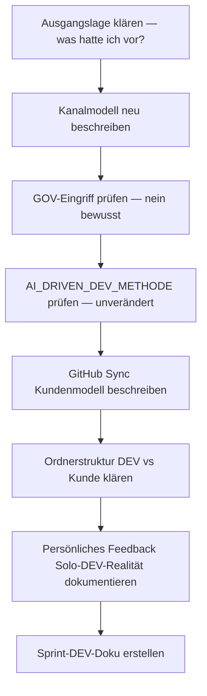

================================================================================
SPRINT-DEV-DOKU – S7-Z3-Feedbackschleifen
================================================================================
Projekt             : R+MUNI Blueprint
Sprint-Bezeichnung  : Sprint-DEV-S7-Z3-Feedbackschleifen
Datum               : 2026-03-25
Stage               : S7 – AKTIV
Status              : Abgeschlossen
Erstellt durch      : EUMAXL + Claude (Pair-Session)
Vorgänger           : [[Sprint-DEV-S7-Z2-ASC-Onboarding-neuKern_S7]]
Nachfolger          : noch offen
================================================================================

================================================================================
1. AUSGANGSLAGE UND KONTEXT
================================================================================

1.1 Ist-Zustand vor diesem Sprint
-----------------------------------
In Stage 6 wurden Feedbackschleifen strukturell aufgebaut und dokumentiert
(S6-Z1 + S6-Z2). Die How2-Dokumente für GitHub, Jira und E-Mail aus DEV-
und Kundensicht lagen vor. Der Kanal war definiert — aber nicht im realen
Beta-Betrieb erprobt.

Betakunde_01 hat den Kommunikationsweg vollständig durchlaufen ohne Adoption.
ASC (Betakunde_02) ist seit S7-Z2 aktiv ongeboardet und produktiv.

Das Kanalmodell aus Stage 6 war noch nicht auf die neue Realität angepasst:
  - Solo-DEV-Betrieb (nur EUMAXL) nicht explizit abgebildet
  - GitHub/Obsidian Sync Kundenrepo-Modell noch nicht dokumentiert
  - Unterschied DEV-Umgebung vs. Kundenumgebung (Ordnerstruktur) nicht
    formalisiert
  - Jira/Confluence Rolle in Solo-DEV nicht präzisiert

Relevante Artefakte vor dem Sprint:
  - FREEZE-6_konsolidiert.md          Status: Baseline S7
  - STAGE7_ZIELE.md                   Status: S7-Z3 offen
  - Global_GOV.md                     Status: Kapitel 11-13 aktiv, S6-Stand
  - AI_DRIVEN_DEV_METHODE_S7-final.md Status: S7-final, aktuell

Bezug: [[FREEZE-6_konsolidiert]] [[Sprint-DEV-S7-Z2-ASC-Onboarding-neuKern_S7]]

1.2 Konkrete Diskrepanz oder Problemstellung
---------------------------------------------
  IST:  Kanalmodell aus S6 beschreibt Portal als primären Kanal —
        Solo-DEV-Realität, GitHub-Sync-Modell und Kundenrepo-Logik
        sind nicht abgebildet.

  SOLL: Kanalmodell ist vollständig auf S7-Realität nachgezogen —
        jede Zielgruppe hat einen klar definierten Kanal,
        DEV-Workflow-Realität (lokal first) ist dokumentiert,
        GitHub/Obsidian Sync Kundenmodell ist beschrieben.

1.3 Auslöser
-------------
Auslöser-Typ: Strukturbereinigung + Kundenbedarf (ASC als aktiver Beta-Kontext)

S7-Z3 war als "ASC Feedbackschleife aktivieren" im offenen Punkte-Log von
S7-Z2 erfasst. ASC ist produktiv — der Moment für die Validierung und
Nachziehung des Kanalmodells ist jetzt.

================================================================================
2. ENTSCHEIDUNGEN UND GRUNDSÄTZE DIESES SPRINTS
================================================================================

2.1 Kanalmodell neu strukturiert — nach Zielgruppe
----------------------------------------------------
Entscheidung:
  Das Kanalmodell wird nicht als einzelner Kanal beschrieben sondern
  explizit nach Zielgruppe aufgeteilt. Jede Zielgruppe hat einen
  primären Kanal.

  | Zielgruppe          | Primärkanal                                    |
  |---------------------|------------------------------------------------|
  | Internes DEV Team   | Jira + Confluence                              |
  | Viewer / Ext. DEV   | GitHub Issues ODER Jira Support Portal         |
  | Kunden              | Jira Support Portal (Support Pages)            |
  | Public              | GitHub Public (read-only)                      |
  | Interne Stage Doku  | GitHub Intern (privat)                         |
  | Persönliches Feedb. | Confluence (direkt, nur wenn EUMAXL triggert)  |

Begründung:
  BKO1-Erfahrung hat gezeigt: ein einzelner Kanal für alle ist zu abstrakt.
  ASC-Betrieb hat bestätigt: GitHub Issues und Jira Support Portal
  funktionieren beide im realen Vereinskontext.

Verworfene Alternativen:
  Alternative A: E-Mail als Kanal beibehalten
    Verworfen weil: E-Mail erzeugt keinen strukturierten Rücklauf,
    keine Nachvollziehbarkeit, kein Ticketing.
  Alternative B: Einziger Kanal für alle
    Verworfen weil: Zielgruppen haben unterschiedliche Zugangswege
    und Erwartungen — ein Kanal passt nicht für alle.

Auswirkung:
  GOV 11.3 bleibt unverändert (Portal ist und bleibt der
  definierte Kundenkanal). Das neue Kanalmodell ist additiv —
  kein GOV-Eingriff, keine Revision.

2.2 GOV bleibt unangetastet — bewusste Entscheidung
-----------------------------------------------------
Entscheidung:
  Kein neues GOV-Kapitel für das Kanalmodell. GOV bleibt schlank.

Begründung:
  Das neue Kanalmodell ist eine operative Präzisierung — keine
  normative Erweiterung. GOV 11.3 ist nicht falsch, nur nicht
  vollständig für alle Zielgruppen ausgeführt. Die fehlende
  Präzisierung ist kein GOV-Defizit sondern bewusste Schlankheit.
  Ein neues GOV-Kapitel wäre erst relevant wenn ein echtes
  Multi-DEV-Team vorhanden ist.

Verworfene Alternativen:
  Alternative A: Neues GOV-Kapitel 14 anlegen
    Verworfen weil: GOV-Overhead hat in S6 bereits Probleme erzeugt.
    Schlankheit ist ein expliziter Qualitätswert. Die Session-Regel
    (EUMAXL sagt explizit wenn Jira-Story gewünscht) ersetzt
    eine dokumentierte Regel vollständig.

Auswirkung:
  GOV bleibt auf S6-Stand. Kein Eingriff. Kein neues Kapitel.
  Operative Präzisierung lebt in dieser Sprint-Doku und in
  STAGE7_ZIELE S7-Z3.

2.3 AI_DRIVEN_DEV_METHODE bleibt unverändert
---------------------------------------------
Entscheidung:
  Keine Änderung an der AI_DRIVEN_DEV_METHODE_S7-final.md

Begründung:
  Die bestehende Formulierung ist nicht falsch. Kapitel 3
  (Addon DEV-only: Atlassian Jira + Confluence) und Kapitel 4
  Schritt 8 (Ablage → Jira schließen) beschreiben den Kanal
  korrekt — ohne zu präzisieren wann Jira verwendet wird.
  Die Präzisierung erfolgt als Session-Regel:
  Jira-Story nur wenn EUMAXL es explizit sagt.
  Eine dokumentierte Regel würde den Reflex erzeugen
  "alles in Atlassian schmeißen" — genau das soll vermieden werden.

Verworfene Alternativen:
  Alternative A: Kapitel 3 + 4 in AI_DRIVEN_DEV_METHODE anpassen
    Verworfen weil: Schlankheit > Vollständigkeit. Session-Regel
    reicht. Dokumentierter Overhead schafft mehr Probleme als er löst.

Auswirkung:
  AI_DRIVEN_DEV_METHODE_S7-final.md bleibt auf aktuellem Stand.
  Keine Versionsänderung.

2.4 GitHub/Obsidian Sync — Kundenrepo-Modell definiert
-------------------------------------------------------
Entscheidung:
  Kunde erstellt eigene Repos nach seinem Bedarf und gibt diese
  EUMAXL frei. EUMAXL muss Sachen nicht einspielen — kann aber.
  Kunde bekommt seinen Bereich als Git Sync ODER manuell als ZIP
  via GitHub-Seite in einen Folder (je nach Wunsch).

Begründung:
  ASC-Betrieb hat dieses Modell als praktikabel bestätigt.
  Es ermöglicht Spin-off vom Kunden jederzeit ohne Abhängigkeit.
  Wartung und Reproduzierbarkeit bleiben möglich ohne Zwang
  zum vollständigen Sync.

Verworfene Alternativen:
  Alternative A: EUMAXL verwaltet alle Repos zentral
    Verworfen weil: Kundensouveränität geht verloren —
    Spin-off wird schwieriger, Abhängigkeit steigt.

Auswirkung:
  Onboarding-Dokumentation (künftig) muss dieses Modell
  als Standard beschreiben. Kein Eingriff in bestehende Scripts.

2.5 Ordnerstruktur DEV ≠ Kundenumgebung
-----------------------------------------
Entscheidung:
  Die Ordnerstruktur in der Kundenumgebung weicht bewusst von
  der DEV-Umgebung ab. Das Installationspaket wird entsprechend
  dem Kundensetup korrigiert ausgeliefert.

Begründung:
  Kunde hat andere Bedürfnisse als DEV. Ein einheitliches Paket
  für beide erzeugt unnötige Komplexität auf Kundenseite.

Verworfene Alternativen:
  Alternative A: Einheitliche Struktur DEV = Kunde
    Verworfen weil: Overhead auf Kundenseite zu groß,
    DEV-spezifische Ordner verwirren Kunden.

Auswirkung:
  Installationspaket-Logik muss diese Trennung abbilden.
  Kein Eingriff in bestehende Scripts oder Struktur.

2.6 Persönliches Feedback — Realität dokumentiert
--------------------------------------------------
Entscheidung:
  Persönliches Feedback wird direkt in Confluence abgelegt.
  Handlungspunkte und Entscheidungen werden abgeleitet
  (Jira oder Doku). Kanal ist abhängig vom ausführenden DEV —
  aktuell nur EUMAXL. Kommt nur wenn EUMAXL triggert,
  bisher schleppend — das ist kein Defizit, sondern
  Solo-DEV-Realität.

Auswirkung:
  Keine strukturelle Änderung. Ehrliche Dokumentation
  des Ist-Zustands.

================================================================================
3. SPRINT-ZIELE
================================================================================

3.1 Ziel — Kanalmodell S7 definieren und validieren
-----------------------------------------------------
Kanalmodell vollständig nach Zielgruppe aufgeteilt,
im realen ASC-Kontext validiert, in Sprint-Doku dokumentiert.

  IST                                    →  SOLL
  Einzelkanal (Portal) für User          →  Kanal je Zielgruppe definiert
  Solo-DEV-Realität nicht abgebildet     →  Lokal first, Jira bei Freeze
  GitHub-Sync-Modell undokumentiert      →  Kundenrepo-Modell beschrieben
  Kundenstruktur = DEV-Struktur          →  Trennung explizit dokumentiert
  Persönliches Feedback implizit         →  Solo-DEV-Abhängigkeit ehrlich

Vorgehen:
  Dialog-Session mit EUMAXL — neues Kanalmodell erarbeitet,
  Entscheidungen dokumentiert, GOV-Eingriff bewusst vermieden.

Begründung für dieses Vorgehen:
  S7-Z3 ist primär konzeptionell — kein Code, keine Scripts.
  Pair-Session als Erkenntnisformat ist der richtige Ansatz.

================================================================================
4. ABGRENZUNG — WAS DIESER SPRINT NICHT TUT
================================================================================

Dieser Sprint tut explizit nicht:
  - Kein Eingriff in GOV (bleibt schlank, S6-Stand)
  - Keine Änderung an AI_DRIVEN_DEV_METHODE_S7-final.md
  - Keine How2-Dokumentation aktualisiert (kein neuer Erkenntnisstand
    der eine How2-Revision rechtfertigt)
  - Keine Stage-3/4/5/6-Artefakte berührt
  - Keine Jira-Stories angelegt (EUMAXL hat es nicht explizit angewiesen)
  - Kein neues Installationspaket erstellt (Kundenstruktur-Trennung
    ist dokumentiert — Umsetzung folgt in eigenem Sprint)

Begründung der wichtigsten Ausschlüsse:
  GOV unangetastet: Schlankheit ist expliziter Qualitätswert.
    GOV-Overhead hat in S6 bereits Probleme erzeugt.
  AI_DRIVEN_DEV_METHODE unverändert: Session-Regel ersetzt
    dokumentierte Regel vollständig — weniger ist mehr.
  How2 nicht aktualisiert: Kanalmodell-Präzisierung ist
    operative Erkenntnis, kein How2-Trigger.

================================================================================
5. BETROFFENE ARTEFAKTE
================================================================================

Neu erstellt:
  Sprint-DEV-S7-Z3-Feedbackschleifen_S7.md    Dieses Dokument

Geändert:
  Keine Artefakte geändert.

Unverändert (relevant zu erwähnen):
  Global_GOV.md                  Bewusst unangetastet — kein Eingriff
  AI_DRIVEN_DEV_METHODE_S7-final.md  Bewusst unangetastet — Session-Regel reicht
  STAGE7_ZIELE.md                S7-Z3 Zieldefinition bleibt als historisches
                                 Artefakt — Erreichung wird in diesem Dokument
                                 festgehalten

================================================================================
6. UMSETZUNG — SCHRITT FÜR SCHRITT
================================================================================

Schritt 1 — Ausgangslage und Zielrekonstruktion
  EUMAXL fragt was S7-Z3 ursprünglich bedeutet.
  Claude rekonstruiert aus STAGE7_ZIELE.md und Freeze-6 den Plan.
  Kernaussage: Feedbackschleifen nicht nur dokumentiert sondern erprobt.
  Ergebnis: Gemeinsames Verständnis des Ziels hergestellt.

Schritt 2 — Neues Kanalmodell erarbeiten
  EUMAXL beschreibt das neue Setup in natürlicher Sprache.
  Claude strukturiert und spiegelt zurück.
  Kanalmodell nach Zielgruppe entsteht im Dialog.
  Ergebnis: Kanalmatrix vollständig und von EUMAXL bestätigt.

Schritt 3 — Solo-DEV-Präzisierung
  EUMAXL präzisiert: DEV-Arbeit bleibt lokal während Stage.
  Jira/Confluence werden spätestens beim Freeze ausgecheckt.
  Jira erst relevant bei echtem Multi-DEV-Team.
  Ergebnis: Solo-DEV-Realität klar abgegrenzt.

Schritt 4 — GOV-Eingriff bewusst geprüft und verworfen
  Claude schlägt GOV-Kapitel 14 vor.
  EUMAXL entscheidet: GOV bleibt schlank — kein neues Kapitel.
  Begründung: GOV 11.3 ist nicht falsch, nur nicht vollständig
  ausgeführt. Operative Präzisierung gehört nicht in die GOV.
  Ergebnis: GOV unangetastet. Bewusste Entscheidung dokumentiert.

Schritt 5 — AI_DRIVEN_DEV_METHODE geprüft und unverändert gelassen
  Claude schlägt Präzisierung in Kapitel 3 + 4 vor.
  EUMAXL entscheidet: Session-Regel reicht —
  "Jira-Story nur wenn EUMAXL es explizit sagt."
  Dokumentierte Regel würde Atlassian-Reflex erzeugen.
  Ergebnis: AI_DRIVEN_DEV_METHODE_S7-final.md unverändert.

Schritt 6 — GitHub/Obsidian Sync Kundenmodell beschrieben
  EUMAXL beschreibt das neue Sync-Modell:
  Kunde erstellt eigene Repos → gibt frei → Spin-off möglich.
  EUMAXL muss nicht einspielen. Kunde bekommt Git Sync oder ZIP.
  Ergebnis: Kundenrepo-Modell dokumentiert.

Schritt 7 — Ordnerstruktur DEV ≠ Kunde festgehalten
  DEV-Umgebung und Kundenumgebung haben unterschiedliche Strukturen.
  Installationspaket wird kundenspezifisch korrigiert ausgeliefert.
  Ergebnis: Trennung explizit dokumentiert.

Schritt 8 — Sprint-DEV-Doku erstellen
  Claude erstellt vollständige Sprint-DEV-Doku nach Template.
  Ergebnis: Dieses Dokument.

================================================================================
7. BEOBACHTUNGEN UND ERKENNTNISSE WÄHREND DER UMSETZUNG
================================================================================

7.1 Claude-Reflex: Vollständigkeit > Schlankheit
--------------------------------------------------
  Claude hat mehrfach den Reflex gezeigt "lass uns das dokumentieren /
  präzisieren / in ein Kapitel packen". EUMAXL hat jedes Mal korrigiert.
  Muster: Claude behandelt Vollständigkeit als Qualitätsmerkmal —
  EUMAXL behandelt Schlankheit als Qualitätsmerkmal.
  Auswirkung: Bewusste Verhaltensanpassung Claude —
  bei Kanalmodellen und Workflow-Fragen aktiv nachfragen wer
  der primäre Nutzer ist, bevor Gleichwertigkeit angenommen wird.
  Dokumentiert: Ja — Entscheidungen 2.2, 2.3

7.2 GOV-Overhead aus S6 als explizite Warnung
----------------------------------------------
  EUMAXL hat rückblickend beschrieben dass GOV + Skills in S6
  sowohl EUMAXL als auch Claude erschlagen haben — Claude wurde
  zu starr, Ergebnisqualität sank.
  Aktuelle schlanke GOV funktioniert besser — ab und an
  Nachschärfen wenn Claude zu offen wird, aber Grundbetrieb stabil.
  Auswirkung: GOV-Schlankheit ist nicht verhandelbar.
  Kein neues Kapitel ohne echten normativen Bedarf.
  Dokumentiert: Ja — Entscheidung 2.2

7.3 Kanalmodell in Schichten erklärt — nicht auf einmal
---------------------------------------------------------
  EUMAXL hat das Kanalmodell über mehrere Nachrichten in Schichten
  aufgebaut: erst Grobmodell, dann Solo-DEV-Präzisierung.
  Claude hat in der ersten Antwort Jira/Confluence als gleichwertigen
  DEV-Kanal behandelt — zu früh, ohne Rückfrage.
  Auswirkung: Bei Kanalmodellen künftig aktiv nach primärem
  Nutzer fragen bevor Gleichwertigkeit angenommen wird.
  Dokumentiert: Ja — Methodenbeobachtung in Session.

7.4 ASC GitHub Issues und Jira Support Portal — beide erprobt
--------------------------------------------------------------
  EUMAXL bestätigt: GitHub Issues und Jira Support Portal
  funktionieren beide gut im realen ASC-Vereinskontext.
  Beide Kanäle können für externe DEV und Kunden verwendet werden.
  Auswirkung: Keine offene Evaluierung mehr — beide sind validiert.
  Dokumentiert: Ja — Kanalmatrix Entscheidung 2.1

================================================================================
8. ERGEBNIS
================================================================================

8.1 Erreichter Zustand
-----------------------
S7-Z3 Feedbackschleifen ausbauen ist inhaltlich abgeschlossen.

Das Kanalmodell ist vollständig auf S7-Realität nachgezogen:
  - Zielgruppenspezifische Kanalmatrix definiert und validiert
  - Solo-DEV-Realität (lokal first, Jira bei Freeze) dokumentiert
  - GitHub/Obsidian Sync Kundenrepo-Modell beschrieben
  - Ordnerstruktur DEV ≠ Kundenumgebung festgehalten
  - GOV bewusst unangetastet — Schlankheit als Qualitätswert
  - AI_DRIVEN_DEV_METHODE bewusst unverändert — Session-Regel reicht
  - Persönliches Feedback Solo-DEV-Abhängigkeit ehrlich dokumentiert
  - ASC: GitHub Issues + Jira Support Portal beide erprobt und validiert

Entstandene Artefakte:
  - Sprint-DEV-S7-Z3-Feedbackschleifen_S7.md    Dieses Dokument

Geänderter Systemzustand:
  Kanalmodell S7 ist definiert — nicht als GOV-Regel sondern als
  dokumentierte operative Realität in dieser Sprint-Doku.

8.2 Abweichungen vom Plan
--------------------------
  STAGE7_ZIELE.md S7-Z3 nennt "How2-Dokumentation aktualisieren
  wenn neue Erkenntnisse entstehen" als Teilziel.
  Begründung: Keine How2-Revision durchgeführt — das Kanalmodell
  ist eine operative Präzisierung, kein How2-Trigger.
  Die bestehenden How2-Dokumente sind nicht falsch.
  Konsequenz: How2-Update bleibt als optionaler Folgeschritt offen
  wenn konkrete Nutzungserfahrungen aus dem ASC-Betrieb
  How2-relevante Lücken zeigen.

================================================================================
9. TEST UND VALIDIERUNG
================================================================================

| Prüfpunkt                                         | Ergebnis | Anmerkung                              |
|---------------------------------------------------|----------|----------------------------------------|
| Kanalmatrix vollständig nach Zielgruppe           | OK       | 6 Zielgruppen definiert                |
| ASC GitHub Issues erprobt                         | OK       | Funktioniert gut — bestätigt           |
| ASC Jira Support Portal erprobt                   | OK       | Funktioniert gut — bestätigt           |
| Solo-DEV-Realität dokumentiert                    | OK       | Lokal first, Jira bei Freeze           |
| Kundenrepo-Modell beschrieben                     | OK       | Spin-off + ZIP/Sync Option             |
| GOV unangetastet                                  | OK       | Bewusste Entscheidung dokumentiert     |
| AI_DRIVEN_DEV_METHODE unangetastet                | OK       | Session-Regel reicht                   |
| Stage-3/4/5/6-Scripts logisch unverändert         | OK       | Kein Eingriff                          |
| Kein unbeabsichtigter Seiteneffekt                | OK       | GOV-konform                            |

Testmethode:
  Konzeptioneller Sprint — kein Script-Test.
  Validierung durch Dialog und Bestätigung EUMAXL in der Session.

Log-Referenz:
  Keine Log-Dateien — konzeptioneller Sprint ohne Script-Ausführung.

================================================================================
10. OFFENE PUNKTE NACH SPRINT-ABSCHLUSS
================================================================================

| Thema                                    | Status          | Nächste Aktion                                  |
|------------------------------------------|-----------------|-------------------------------------------------|
| How2-Update Kanalmodell                  | Optional offen  | Wenn ASC-Betrieb konkrete How2-Lücken zeigt     |
| Installationspaket Kundenstruktur        | Backlog offen   | Eigener Sprint — DEV ≠ Kunde strukturell        |
| Persönliches Feedback Confluence         | Beobachten      | Solo-DEV-Realität — kein Handlungsbedarf jetzt  |
| Multi-DEV GOV-Erweiterung Kanalmodell    | Post-Stage 7    | Erst relevant wenn echtes Multi-DEV-Team        |

================================================================================
11. GOVERNANCE-KONFORMITÄTSCHECK
================================================================================

| GOV-Kriterium                              | Status | Anmerkung                                    |
|--------------------------------------------|--------|----------------------------------------------|
| GOV 10.3  Auslöser zulässig               | OK     | Strukturbereinigung + Kundenbedarf           |
| GOV 10.5  Fachlicher Mehrwert benennbar   | OK     | Kanalmodell S7 validiert und dokumentiert    |
| GOV 10.5  Keine implizite GOV-Änderung    | OK     | GOV bewusst unangetastet                     |
| GOV 10.6  Ziel explizit definiert         | OK     | Kapitel 3                                    |
| GOV 10.6  Ziel überprüfbar               | OK     | Kapitel 9                                    |
| GOV 10.7  Zwischenschritte dokumentiert   | OK     | Kapitel 6                                    |
| GOV 10.8  Dev-Doku vollständig            | OK     | Dieses Dokument                              |
| GOV 10.9  Stage-Ende Doku                 | OFFEN  | Fällig bei Stage-7-Gesamtabschluss           |
| GOV 10.10 Keine GOV-Regel aufgehoben      | OK     | Keine GOV-Regel berührt                      |
| Rückkopplungsschutz eingehalten           | OK     | Stage-3/4/5/6 unberührt                      |
| Rollentrennung GOV 13.8                   | OK     | EUMAXL als DEV — keine Rollenvermischung     |

================================================================================
12. LESSONS LEARNED
================================================================================

12.1 Was gut funktioniert hat
------------------------------
  - Schichtweiser Aufbau des Kanalmodells im Dialog — erst Bild,
    dann Präzisierung, dann Korrektur. Kein Template nötig.
  - EUMAXL korrigiert Reflex-Vorschläge sofort und klar —
    das hält die Qualität hoch ohne Overhead.
  - "Weniger ist mehr" als aktiv gelebtes Prinzip —
    drei potenzielle Dokumente wurden bewusst nicht erstellt.
  - ASC als realer Prüfkontext ist wertvoller als jede Simulation —
    beide Kanäle sind jetzt erprobt, nicht nur geplant.

12.2 Was beim nächsten Mal anders gemacht werden sollte
--------------------------------------------------------
  - Bei Kanalmodellen sofort nach primärem Nutzer fragen —
    nicht Gleichwertigkeit annehmen.
  - GOV-Vorschlag erst nach expliziter Prüfung machen —
    nicht reflexartig "das braucht ein Kapitel".
  - Schichtweise Erklärungen des Betreibers abwarten bevor
    strukturiert wird — Geduld vor Vollständigkeit.

12.3 Erkenntnisse für das System
----------------------------------
  - Schlankheit ist ein aktiver Qualitätswert in R+MUNI —
    nicht Abwesenheit von Dokumentation sondern bewusste Entscheidung
    dagegen. → AI_DRIVEN_DEV_METHODE Kapitel 9 (Grenzen) bestätigt
  - Session-Regel ersetzt dokumentierte Regel wenn der Auslöser
    klar und der Kontext stabil ist. → Kein Backlog-Eintrag nötig
  - GOV-Overhead erzeugt Starrheit bei Claude — schlanke GOV
    ermöglicht bessere Ergebnisqualität. → GOV bleibt schlank
  - Kundenrepo-Modell (Kunde erstellt, gibt frei) ist neues
    Architekturmuster für Onboarding → In künftige Onboarding-
    Dokumentation übernehmen

================================================================================
13. BEZÜGE UND VERLINKUNGEN
================================================================================

Ausgangspunkt:
  [[FREEZE-6_konsolidiert]]                      Baseline S7
  [[Sprint-DEV-S7-Z2-ASC-Onboarding-neuKern_S7]] Vorgänger-Sprint
  [[STAGE7_ZIELE_S7]]                            S7-Z3 Definition

Entstanden:
  Dieses Dokument — kein Freeze, kein weiteres Artefakt

Verwandte Dokumente:
  [[GOV_Global_S6]]                    normative Grundlage — unangetastet
  [[AI_DRIVEN_DEV_METHODE_S7-final]]   Methodik — unangetastet
  [[BETA_ONBOARDING_Atlassian_S5]]     Zugriffsmodell — als Hintergrund
  [[Sprint-DEV-BACKLOG_BKO1-Offboarding_S7]]  läuft parallel

Creative-Assets:
  Keine Creative-Assets für diesen Sprint.

================================================================================
Sprint-DEV-S7-Z3-Feedbackschleifen | S7 | 2026-03-25 | R+MUNI Blueprint
Erstellt durch: EUMAXL + Claude (Pair-Session)
================================================================================
