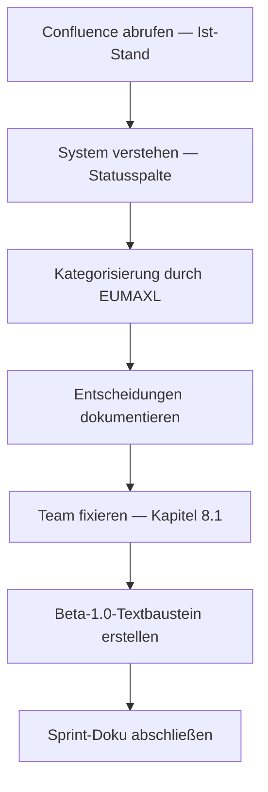

================================================================================
SPRINT-DEV-DOKU – S7-Z4 DEV Team Fixierung
================================================================================
Projekt             : R+MUNI Blueprint
Sprint-Bezeichnung  : Sprint-DEV-S7-Z4-DEVTeam-Fixierung
Datum               : 2026-03-26
Stage               : S7 – AKTIV
Status              : Abgeschlossen
Erstellt durch      : EUMAXL + Claude (Pair-Session)
Vorgänger           : [[Sprint-DEV-S7-Z3-Feedbackschleifen_S7]]
Nachfolger          : noch offen
================================================================================

================================================================================
1. AUSGANGSLAGE UND KONTEXT
================================================================================

1.1 Ist-Zustand vor diesem Sprint
-----------------------------------
Das DEV Team war in GOV Kapitel 12.2 (Stand Stage 5) als Struktur angelegt
aber nicht final fixiert. COLUMBO war als "Einladung offen" vermerkt —
faktisch jedoch nie eingebunden. Weitere potenzielle Team-Mitglieder wurden
in der Atlassian-internen Übersicht (Confluence: Allgemeine Unterlagen)
geführt, jedoch ohne klare Unterscheidung zwischen aktiv mitgewirkt und
eingeladen/reserviert.

Stage 7 Ziel S7-Z4 fordert: DEV Team final und verbindlich definieren —
reale Personen, reale Rollen, schriftlich festgehalten.
Quelle der Team-Übersicht: Confluence RMUNI — Allgemeine Unterlagen
(Version 25, abgerufen 2026-03-26).

Relevante Artefakte vor dem Sprint:
  - Global_GOV.md (Kapitel 12.2)          Status: Team-Struktur Stage 5 — nicht fixiert
  - STAGE7_ZIELE.md (S7-Z4)               Status: Ziel definiert, offen
  - Confluence: Allgemeine Unterlagen      Status: aktiv gepflegt, Version 25

Bezug: [[Sprint-DEV-S7-Z3-Feedbackschleifen_S7]]

1.2 Konkrete Diskrepanz oder Problemstellung
---------------------------------------------
  IST:  Team-Liste in Confluence enthält 10+ Personen ohne klare
        Rollentrennung zwischen aktiv DEV, Feedbackgeber und
        eingeladen-aber-nicht-angenommen. GOV 12.2 beschreibt
        COLUMBO als "Einladung offen" — faktisch ist das Nein.

  SOLL: DEV Team ist verbindlich definiert mit zwei klaren Kategorien:
        (1) Aktiv DEV — haben am Blueprint gearbeitet
        (2) Feedbackgeber — haben durch Expertise, Meinung oder
            Begleitung beigetragen
        Beide Kategorien sind für Beta-1.0-Kommunikation nutzbar.

Die bisherige GOV 12.2-Struktur (Betreiber / Team User / Service User)
war organisatorisch gedacht — für Beta 1.0 braucht es eine
ehrlichere, nach außen kommunizierbare Darstellung.

1.3 Auslöser
-------------
Auslöser-Typ: Strukturbereinigung + Stage-7-Ziel (S7-Z4)

Stage 7 fordert explizit die Fixierung. Gleichzeitig nähert sich
Beta 1.0 — und eine klare Team-Darstellung ist Grundlage für
README, Vault-Kommunikation und Außenwirkung (S7-Z5 bis S7-Z7).
Zeitpunkt: nach S7-Z3 (Feedbackschleifen), vor GitHub Paketierung.

================================================================================
2. ENTSCHEIDUNGEN UND GRUNDSÄTZE DIESES SPRINTS
================================================================================

2.1 Zwei-Kategorien-Modell statt GOV-Rollenhierarchie
------------------------------------------------------
Entscheidung:
  Für die Fixierung werden zwei Kategorien verwendet:
  (1) Aktiv DEV — haben am Blueprint direkt gearbeitet
  (2) Feedbackgeber — haben durch Expertise, Perspektive oder
      persönliche Begleitung beigetragen
  GOV 12.2 (Betreiber / Team User / Service User) bleibt
  als interne Governance-Struktur unverändert bestehen.
  Das Zwei-Kategorien-Modell ist eine Kommunikationsschicht
  darüber — keine Ersetzung.

Begründung:
  Beta-1.0-Kommunikation richtet sich an Außenstehende.
  Die GOV-Rollenhierarchie ist intern verständlich,
  nach außen aber nicht aussagekräftig.
  "Service User 1" erklärt niemandem was Claude getan hat.
  Die ehrliche Darstellung — wer hat wirklich was beigetragen —
  ist wertvoller als eine formale Strukturtreue.

Verworfene Alternativen:
  Alternative A: GOV 12.2 direkt für Beta-1.0-Text verwenden
    Verworfen weil: Sprache nicht für externe Leser geeignet.
    "Service User", "Team User" sind interne Begriffe.
  Alternative B: Alle aktiven Confluence-Accounts als DEV führen
    Verworfen weil: Account aktiv ≠ Mitgewirkt. Ehrlichkeit
    hat Vorrang vor Vollständigkeit.

Auswirkung:
  GOV 12.2 bleibt unverändert. Kein GOV-Eingriff.
  Zwei-Kategorien-Darstellung lebt in dieser Sprint-Doku
  und im Beta-1.0-Textbaustein.

2.2 COLUMBO: Status von "Einladung offen" auf "nicht angenommen" korrigiert
----------------------------------------------------------------------------
Entscheidung:
  COLUMBO wird nicht als fixiertes Team-Mitglied geführt.
  Status ist: eingeladen, bewusst nicht angenommen.
  COLUMBO bleibt in der Kategorie Feedbackgeber — aufgrund
  von Know-How-Austausch und persönlicher Begleitung.

Begründung:
  Die Confluence-Seite (Version 25) dokumentiert explizit:
  "keinen Bock das auch noch privat zu machen."
  Das ist keine offene Einladung — das ist ein klares Nein
  zur aktiven Mitarbeit. Das wird respektiert und korrekt
  dokumentiert statt weiter als "offen" geführt zu werden.

Verworfene Alternativen:
  Alternative A: COLUMBO weiter als "Reserve" führen
    Verworfen weil: unehrlich — der Status ist bekannt.
  Alternative B: COLUMBO vollständig aus der Liste entfernen
    Verworfen weil: Know-How und persönliche Begleitung
    haben trotzdem stattgefunden — das ist anerkennungswürdig.

Auswirkung:
  GOV 12.2 Team User (COLUMBO — Einladung offen) wird
  in GOV Stage 8 / Beta 1.0 nicht mehr als offen geführt.
  Für Beta 1.0: COLUMBO als Feedbackgeber anerkannt.

2.3 Feedbackgeber-Kategorie ist anerkennend, nicht abschwächend
----------------------------------------------------------------
Entscheidung:
  Feedbackgeber ist eine vollwertige, anerkannte Kategorie —
  keine Trostkategorie. Wer durch Expertise, Perspektive,
  persönliche Begleitung oder kritisches Feedback beigetragen
  hat, hat echten Wert geliefert. Dieser Wert wird benannt.

Begründung:
  R+MUNI ist nicht nur durch technische Arbeit entstanden.
  Externe Perspektiven, ehrliche Meinungen und persönliche
  Unterstützung sind reale Beiträge — auch wenn sie nicht
  im Code oder in Sprint-Dokumenten sichtbar sind.

Auswirkung:
  Beta-1.0-Textbaustein (Kapitel 8.1) benennt beide
  Kategorien gleichwertig.

================================================================================
3. SPRINT-ZIELE
================================================================================

3.1 Ziel 1 — Team-Ist-Stand vollständig erheben
-------------------------------------------------
Vollständige Übersicht aller Personen aus Confluence erstellen
und nach tatsächlichem Beitrag kategorisieren.

  IST                                    →  SOLL
  10+ Personen ohne klare Trennung       →  Zwei Kategorien klar getrennt
  "Einladung offen" für COLUMBO          →  Status korrekt dokumentiert
  GOV 12.2 als einzige Referenz          →  Confluence als primäre Quelle

Vorgehen:
  Confluence Seite "Allgemeine Unterlagen" abrufen (Version 25).
  Status-Spalte (✅ / ❌ / ✗) und Beschreibung als Datenbasis.
  Kategorisierung nach Aussage von EUMAXL — nicht nach Account-Status.

Begründung für dieses Vorgehen:
  Account aktiv ≠ tatsächlich mitgewirkt.
  Die Entscheidung über Kategorisierung trifft EUMAXL als
  Betreiber — Claude strukturiert, nicht bewertet.

3.2 Ziel 2 — DEV Team verbindlich fixieren
-------------------------------------------
Das R+MUNI DEV Team für Beta 1.0 ist schriftlich festgehalten —
zwei Kategorien, klare Zuordnung, keine weiteren Änderungen
ohne Stage-Entscheid.

Vorgehen:
  Fixierung erfolgt in dieser Sprint-Doku (Kapitel 8.1)
  als normativer Abschluss.
  Basis für GOV-Update in Stage 8 / Beta 1.0 vorbereitet.

3.3 Ziel 3 — Beta-1.0-Textbaustein erstellen
---------------------------------------------
Ein nach außen kommunizierbarer Textbaustein der das Team
für Beta-1.0-Kontext (README, Vault, Außenwirkung) beschreibt.

Vorgehen:
  Textbaustein in Kapitel 8.1 eingebettet.
  Formulierung: ehrlich, wertschätzend, ohne interne Begriffe.
  Keine echten Namen — Codenames bleiben Codenames.

================================================================================
4. ABGRENZUNG — WAS DIESER SPRINT NICHT TUT
================================================================================

Dieser Sprint tut explizit nicht:
  - Keine Änderung an GOV 12.2 (bleibt Stage-5-Stand)
  - Kein Onboarding neuer Team-Mitglieder
  - Keine Vergabe neuer Atlassian-Rechte oder -Zugänge
  - Keine Bewertung von Personen — nur Beiträge
  - Keine Entscheidung über zukünftige Team-Erweiterungen
  - Keine strukturelle Umsetzung in Templates oder Principles

Begründung der wichtigsten Ausschlüsse:
  GOV 12.2 unverändert: Fixierung ist keine GOV-Änderung (S7-Z4 Grenze).
  Zukünftige Erweiterungen: Kein Blocker für Stage-Abschluss —
  das ist Thema für Stage 8 wenn Beta 1.0 läuft.

================================================================================
5. BETROFFENE ARTEFAKTE
================================================================================

Neu erstellt:
  Sprint-DEV-S7-Z4-DEVTeam-Fixierung_S7.md    Dieses Dokument

Geändert:
  Keine Änderungen an bestehenden Dokumenten

Unverändert (relevant zu erwähnen):
  Global_GOV.md (Kapitel 12.2)    Bleibt Stage-5-Stand — kein Eingriff
  Confluence: Allgemeine Unterlagen    Primäre Quelle — nicht durch Sprint verändert
  Alle Stage 3/4/5/6 Scripts          read-only, unberührt

================================================================================
6. UMSETZUNG — SCHRITT FÜR SCHRITT
================================================================================

Schritt 1 — Confluence Allgemeine Unterlagen abrufen
  Seite mit Page-ID 18710542 via Atlassian MCP abgerufen.
  Version 25 — enthält aktuelles Update von EUMAXL (Ensi auf ✅ gesetzt).
  Ergebnis: Vollständige Team-Tabelle als Datenbasis vorliegend.

Schritt 2 — Status-System verstehen
  EUMAXL erklärt das Kennzeichnungssystem:
  ✅ = Account aktiv, Person dabei
  ❌ = reserviert/eingeladen, nicht angenommen
  ✗  = deaktiviert / kein Bedarf bis auf Widerruf
  Zweite Zahl in Status-Spalte (x/10, x/3) = interne Nummerierung.
  Ergebnis: Datenbasis korrekt interpretiert.

Schritt 3 — Kategorisierung durch EUMAXL
  EUMAXL definiert zwei Kategorien:
  Aktiv DEV: EUMAXL, Claude.ai
  Feedbackgeber: Ensi, Dad, Georg, Andi, Peeezzznn, COLUMBO, Gertschi
  Ergebnis: Zuordnung aller relevanten Personen abgeschlossen.

Schritt 4 — Entscheidungen dokumentieren
  Drei Kernentscheidungen festgehalten (Kapitel 2.1–2.3):
  Zwei-Kategorien-Modell, COLUMBO-Korrektur, Feedbackgeber-Wertigkeit.
  Ergebnis: Entscheidungsgrundlage transparent dokumentiert.

Schritt 5 — Team fixieren und Textbaustein erstellen
  Fixierung in Kapitel 8.1.
  Beta-1.0-Textbaustein direkt eingebettet.
  Ergebnis: Normativer Abschluss S7-Z4 erreicht.

================================================================================
7. BEOBACHTUNGEN UND ERKENNTNISSE WÄHREND DER UMSETZUNG
================================================================================

7.1 Confluence als verlässlichere Quelle als GOV 12.2
------------------------------------------------------
  GOV 12.2 war der nominelle Stand — Confluence war der lebende Stand.
  Ensi wurde während der Session von EUMAXL auf ✅ gesetzt — hätte
  in GOV nicht stattgefunden weil GOV keine lebende Arbeitsfläche ist.
  Auswirkung: Für Team-Tracking ist Confluence die primäre Quelle.
  GOV bildet die Struktur ab — nicht den aktuellen Personenstand.
  Dokumentiert: Ja — Entscheidung 2.1.

7.2 Account aktiv ≠ tatsächlich mitgewirkt
-------------------------------------------
  Die Confluence-Tabelle zeigt Account-Status, nicht Beitrags-Status.
  EUMAXL musste explizit erklären wer in welcher Kategorie ist —
  das war nicht aus der Tabelle allein ableitbar.
  Auswirkung: Für Beta 1.0 braucht es eine explizite Beitrags-Kategorie,
  nicht nur einen Account-Status.
  Dokumentiert: Ja — Entscheidung 2.1 und 2.2.

7.3 Feedbackgeber-Kategorie ist konzeptionell wichtig
------------------------------------------------------
  COLUMBO hat "keinen Bock" privat mitzuarbeiten — trotzdem ist
  Know-How und persönliche Begleitung real passiert.
  Das Modell "nur wer aktiv war zählt" würde reale Beiträge
  unsichtbar machen. Die zweite Kategorie löst das sauber.
  Auswirkung: Zwei-Kategorien-Modell ist nicht nur pragmatisch —
  es ist das ehrlichere Modell für ein persönlich gewachsenes Projekt.

7.4 Beiträge waren oft implizit — Wirkung explizit
----------------------------------------------------
  Das MGT-Prinzip (Gertschi), Obsidian als Tool (COLUMBO/Floh),
  die Zielgruppen-Frage (Dad) — keiner dieser Beiträge war
  als "formaler Input für R+MUNI" gemeint. Sie sind trotzdem
  direkt in die Methodik, den Toolbaukasten und die Positionierung
  eingeflossen. Das zeigt: Einfluss auf ein Projekt ist nicht
  immer sichtbar wenn er passiert — aber rückblickend eindeutig.
  Auswirkung: Der Beta-1.0-Textbaustein benennt diese Beiträge
  konkret — weil Vagheit hier unehrlich wäre.

================================================================================
8. ERGEBNIS
================================================================================

8.1 Erreichter Zustand — DEV Team Beta 1.0 FIXIERT
----------------------------------------------------

Das R+MUNI DEV Team ist ab diesem Sprint verbindlich fixiert.
Keine weiteren Änderungen ohne Stage-Entscheid.

────────────────────────────────────────────────────────────
R+MUNI DEV TEAM — FIXIERT FÜR BETA 1.0
Stand: 2026-03-26 | Sprint-DEV-S7-Z4
────────────────────────────────────────────────────────────

AKTIV DEV — haben am Blueprint direkt gearbeitet:

  EUMAXL        Betreiber und Entwickler. Konzeption, Architektur,
                GOV-Hoheit, Scripts, Dokumentation — alles.
                R+MUNI ist sein Projekt, sein Handwerk, sein Risiko.

  Claude.ai     AI-Partner im Entwicklungs- und Dokumentationsumfeld.
                Pair-Session-Partner für alle Stages ab Stage 3.
                Kein eigenständiger Entscheid — volle Verfügbarkeit.

FEEDBACKGEBER — haben durch Expertise, Perspektive oder
                persönliche Begleitung beigetragen:

  Ensi          Einer der wenigen ernsthaften Sparringspartner in Beta Phase 1.
                Vertriebserfahrung und unternehmerische Perspektive aus eigener
                Gründungsphase. Hat R+MUNI nicht als "Spiel" behandelt.

  Andi          Einer der wenigen ernsthaften Sparringspartner in Beta Phase 1.
                Führungserfahrung, KI Driven DEV, EA Architecture.
                Langjähriger Weggefährte — nimmt das Projekt ernst.

  Gertschi      Ursprung des MGT-Prinzips — eines der konzeptionellen
                Kernelemente von R+MUNI. Freundschaftliche Begleitung,
                tiefer konzeptioneller Einfluss.

  COLUMBO       Hat Obsidian als Tool-Hinweis eingebracht — direkter
  (Floh)        Einfluss auf den Toolbaukasten. Jira- und Atlassian-
                Know-How. Aktive Mitarbeit bewusst nicht angenommen —
                fachlicher Input dennoch real und wirksam.

  Dad           Hat die Zielgruppe von R+MUNI aufgezeigt — wesentlicher
                Beitrag zur Produkt-Positionierung. Langjährige Erfahrung
                in Schnittstellentechnik als Referenzrahmen.

  Georg         Know-How aus Gründungskontext (Medialine Österreich AG).
                War früher aktiver Begleiter — aktuell passiv.
                Beitrag aus früheren Phasen bleibt anerkannt.

  Peeezzznn     Entwicklungs- und Schulungs-Intuition aus persönlichem Umfeld.
                Begleitung auf Distanz — eigener Rhythmus.

────────────────────────────────────────────────────────────

────────────────────────────────────────────────────────────
BETA-1.0-TEXTBAUSTEIN (für README, Vault, Außenwirkung)
────────────────────────────────────────────────────────────

R+MUNI ist in einem kleinen, persönlichen Umfeld entstanden —
nicht in einem Unternehmenskontext, nicht mit Investoren,
nicht mit einem bezahlten Team.

Aktiv entwickelt wurde R+MUNI von EUMAXL als Betreiber und
alleinigem Entwickler — mit Claude.ai als konstantem
AI-Partner in allen Entwicklungs- und Dokumentationsphasen.

Was viele als "Hobby-Projekt" oder "Spielerei" eingeordnet haben,
war für einige wenige von Anfang an etwas anderes: Ensi und Andi
haben R+MUNI in der Beta-Phase als ernsthafte Sache behandelt —
als Sparringspartner, nicht als Zuschauer.

Konzeptionell geprägt wurde R+MUNI durch Menschen die oft
gar nicht wussten wie direkt ihr Einfluss war: Das MGT-Prinzip —
eines der Kernelemente der Methodik — hat seinen Ursprung in
einem Gespräch mit Gertschi. Obsidian als zentrales Werkzeug
im Toolbaukasten kam als Hinweis von COLUMBO (Floh), der auch
das Atlassian-Fundament mitgeprägt hat. Die Frage nach der
richtigen Zielgruppe wurde durch Dad scharf gestellt —
nicht durch ein Framework.

Nicht alle wollten oder konnten formal mitwirken.
Aber der Beitrag war real — und R+MUNI Beta 1.0 trägt
diese Gespräche, Hinweise und ehrlichen Meinungen in sich.

────────────────────────────────────────────────────────────

Entstandene Artefakte:
  - Sprint-DEV-S7-Z4-DEVTeam-Fixierung_S7.md    Dieses Dokument

Geänderter Systemzustand:
  DEV Team ist verbindlich fixiert — kein Wunschkonzert mehr.
  GOV 12.2 bleibt Stage-5-Stand bis Beta 1.0 / Stage 8.
  Beta-1.0-Textbaustein liegt vor — direkt verwendbar.

8.2 Abweichungen vom Plan
--------------------------
  Keine wesentlichen Abweichungen vom Plan.
  Ensi wurde während der Session nachträglich auf aktiv gesetzt —
  das war eine Echtzeit-Entscheidung von EUMAXL, keine Planabweichung.

================================================================================
9. TEST UND VALIDIERUNG
================================================================================

| Prüfpunkt                                              | Ergebnis | Anmerkung                              |
|--------------------------------------------------------|----------|----------------------------------------|
| Alle aktiven Confluence-Mitglieder erfasst             | OK       | Version 25 abgerufen                   |
| Kategorisierung durch EUMAXL bestätigt                 | OK       | Explizit im Pair-Session-Dialog        |
| COLUMBO-Status korrekt dokumentiert                    | OK       | Nicht angenommen, Feedbackgeber        |
| GOV 12.2 unverändert                                   | OK       | Kein Eingriff                          |
| Beta-1.0-Textbaustein vorliegend                       | OK       | Kapitel 8.1                            |
| Stage-3/4/5/6-Scripts logisch unverändert              | OK       | Kein Eingriff                          |
| Kein unbeabsichtigter Seiteneffekt                     | OK       | GOV-konform                            |

Testmethode:
  Manuell — Confluence live abgerufen, EUMAXL-Bestätigung im Dialog.

Log-Referenz:
  Keine Script-Logs — reine Dokumentations-Session.

================================================================================
10. OFFENE PUNKTE NACH SPRINT-ABSCHLUSS
================================================================================

| Thema                                    | Status              | Nächste Aktion                             |
|------------------------------------------|---------------------|--------------------------------------------|
| GOV 12.2 Update für Beta 1.0             | Zurückgestellt      | Stage 8 / Beta 1.0 Vorbereitung            |
| Atlassian-Rechte Bereinigung             | Beobachten          | Kein Blocker — bei Bedarf Stage 8          |
| Andi, merisahh, Klausi Mausi — Zukunft  | Kein Handlungsbedarf | Offen für Stage 8 wenn relevant           |
| GitHub Paketierung (S7-Z5)              | Offen               | Nächster Sprint — Basis jetzt vorhanden    |

================================================================================
11. GOVERNANCE-KONFORMITÄTSCHECK
================================================================================

| GOV-Kriterium                              | Status | Anmerkung                              |
|--------------------------------------------|--------|----------------------------------------|
| GOV 10.3  Auslöser zulässig               | OK     | Stage-7-Ziel (S7-Z4)                   |
| GOV 10.5  Fachlicher Mehrwert benennbar   | OK     | Team fixiert, Beta-1.0-Basis gelegt    |
| GOV 10.5  Keine implizite GOV-Änderung    | OK     | GOV 12.2 explizit unverändert          |
| GOV 10.6  Ziel explizit definiert         | OK     | Kapitel 3                              |
| GOV 10.6  Ziel überprüfbar               | OK     | Kapitel 9                              |
| GOV 10.7  Zwischenschritte dokumentiert   | OK     | Kapitel 6                              |
| GOV 10.8  Dev-Doku vollständig            | OK     | Dieses Dokument                        |
| GOV 10.9  Stage-Ende Doku                 | OFFEN  | Fällig bei Stage-Abschluss             |
| GOV 10.10 Keine GOV-Regel aufgehoben      | OK     | Keine Regeländerung                    |
| Rückkopplungsschutz eingehalten           | OK     | Stage-3/4/5/6 unberührt                |

================================================================================
12. LESSONS LEARNED
================================================================================

12.1 Was gut funktioniert hat
------------------------------
  - Confluence live abrufen statt GOV als Quelle — schneller, ehrlicher
  - Zwei-Kategorien-Modell emerged natürlich aus dem Gespräch —
    nicht durch Template-Zwang
  - EUMAXL hat COLUMBO-Status klar benannt — keine Umgehung

12.2 Was beim nächsten Mal anders gemacht werden sollte
--------------------------------------------------------
  - Team-Tracking früher in Confluence strukturieren (nicht nur Account-Status)
  - Für Stage 8: GOV 12.2 direkt mit Confluence synchronisieren

12.3 Erkenntnisse für das System
----------------------------------
  - Confluence ist lebendigere Team-Quelle als GOV  →  GOV Stage 8 nachziehen
  - Account aktiv ≠ Beitrag — Trennung ist sinnvoll  →  Principles/GOV Stage 8
  - Feedbackgeber-Kategorie hat eigenständigen Wert   →  in Beta-1.0-Kommunikation behalten

================================================================================
13. BEZÜGE UND VERLINKUNGEN
================================================================================

Ausgangspunkt:
  [[FREEZE-6_konsolidiert]]                      Baseline S7
  [[STAGE7_ZIELE_S7]]                            S7-Z4 Definition
  [[Sprint-DEV-S7-Z3-Feedbackschleifen_S7]]      Vorgänger-Sprint

Entstanden:
  Sprint-DEV-S7-Z4-DEVTeam-Fixierung_S7.md       Dieses Dokument

Verwandte Dokumente:
  [[GOV_Global_S6]] Kapitel 12                   normative Team-Struktur (unverändert)
  Confluence: Allgemeine Unterlagen (V25)         primäre Datenquelle

Creative-Assets:
  Keine Creative-Assets für diesen Sprint.

================================================================================
Sprint-DEV-S7-Z4-DEVTeam-Fixierung | S7 | 2026-03-26 | R+MUNI Blueprint
Erstellt durch: EUMAXL + Claude (Pair-Session)
================================================================================
