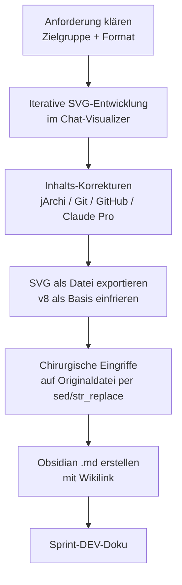

================================================================================
SPRINT-DEV-DOKU – S7-Z8 Visuelle Aufbereitung Toolbaukasten
================================================================================
Projekt             : R+MUNI Blueprint
Sprint-Bezeichnung  : Sprint-DEV-S7-Z8-Toolbaukasten-Visual
Datum               : 2026-03-26
Stage               : S7 – AKTIV
Status              : Abgeschlossen
Erstellt durch      : EUMAXL + Claude (Pair-Session)
Vorgänger           : [[FREEZE-6_konsolidiert]]
Nachfolger          : noch offen
================================================================================

================================================================================
1. AUSGANGSLAGE UND KONTEXT
================================================================================

1.1 Ist-Zustand vor diesem Sprint
-----------------------------------
Der Toolbaukasten war vollständig in Textform dokumentiert — drei Ebenen
(TOOLBAUKASTEN_principles_S6, How2_DEV_S6, How2_USER_S6) mit klarer
Tier-Struktur MINIMAL / DEFAULT / ADDON. Für nicht-technische Leser,
Sales-Kontext und Team-Onboarding fehlte jedoch eine visuelle Aufbereitung
die den Toolbaukasten auf einen Blick verständlich macht — ohne Doku-Lektüre.

Relevante Artefakte vor dem Sprint:
  - TOOLBAUKASTEN_principles_S6.md      Status: ALPHA, vollständig
  - TOOLBAUKASTEN_How2_DEV_S6.md        Status: ALPHA, vollständig
  - TOOLBAUKASTEN_How2_USER_S6.md       Status: ALPHA, vollständig
  - STAGE7_ZIELE.md                     Status: S7-Z8 als offen markiert

Bezug: [[FREEZE-6_konsolidiert]]

1.2 Konkrete Diskrepanz oder Problemstellung
---------------------------------------------
  IST:  Toolbaukasten nur als Textdokumentation vorhanden — für
        nicht-technische Leser und Sales-Kontext ungeeignet
  SOLL: Toolbaukasten auf einen Blick verständlich — ohne Doku-Lektüre,
        als SVG-Grafik einbettbar in Obsidian via .md

Zielgruppe war Team-Onboarding mit etwas technischem Kontext.

1.3 Auslöser
-------------
Auslöser-Typ: Feature / Stage-Ziel

S7-Z8 war als offenes Ziel in STAGE7_ZIELE.md definiert.
Format war bewusst offen gelassen — "Diagramm, Infografik, interaktive
Darstellung". Die Entscheidung für SVG + Obsidian-Einbettung fiel im Sprint.

================================================================================
2. ENTSCHEIDUNGEN UND GRUNDSÄTZE DIESES SPRINTS
================================================================================

2.1 Karten-Metapher statt Pyramide oder Swim-Lanes
----------------------------------------------------
Entscheidung:
  Visualisierung als Kartendeck-Konzept: MINIMAL DECK / CORE / SIDEBOARD —
  angelehnt an MTG-Deckbuilding-Logik.

Begründung:
  Vorschlag kam vom Betreiber. Die Analogie transportiert die Kernaussage
  präzise: es gibt Pflichtkarten (MINIMAL), ein Standarddeck (CORE) und
  optionale Ergänzungen (SIDEBOARD). Intuitiv auch für nicht-technische Leser.
  Pyramid und Swim-Lanes wurden als Alternativen angeboten aber verworfen.

Verworfene Alternativen:
  Alternative A: Layered Pyramid (Ebenen von unten nach oben)
    Verworfen weil: Impliziert Hierarchie/Wichtigkeit statt Skalierung —
    falsches mentales Modell für den Toolbaukasten
  Alternative B: Horizontale Swim-Lanes
    Verworfen weil: Weniger intuitiv, Kartendeck-Metapher war klarer

Auswirkung:
  Drei klar abgegrenzte Sektionen mit eigenem visuellen Charakter —
  Sideboard mit gestrichelter Border als "optional einsetzbar" Signal.

2.2 SVG als eigenständige Datei + Obsidian-Link
------------------------------------------------
Entscheidung:
  SVG als eigene Datei (toolbaukasten_kartendeck_S7_final.svg) +
  Einbettung via ![[toolbaukasten_kartendeck_S7_final.svg]] in .md.

Begründung:
  SVG direkt in .md als Inline-Code wurde als Option geprüft — in Obsidian
  wird SVG-Code aber nicht gerendert. Eigenständige SVG-Datei mit
  Obsidian-Wikilink ist der einzig zuverlässig funktionierende Weg.

Verworfene Alternativen:
  Alternative A: SVG direkt als Inline-Code in .md
    Verworfen weil: Obsidian rendert SVG-Code nicht inline
  Alternative B: PNG-Export
    Verworfen weil: Nicht vektorbasiert, keine Nachbearbeitbarkeit

Auswirkung:
  Beide Dateien müssen im selben Obsidian-Vault-Verzeichnis liegen
  damit der Link korrekt auflöst.

2.3 jArchi aus MINIMAL in CORE, Patron-Modell transparent
----------------------------------------------------------
Entscheidung:
  jArchi gehört nicht in MINIMAL sondern in CORE — mit explizitem
  Hinweis auf das Archi Patron-Modell: "1 Kaffee einmalig".

Begründung:
  MINIMAL = was R+MUNI zum Laufen braucht, ohne jegliche Kosten.
  jArchi ist nicht zwingend für den MINIMAL-Betrieb. Die Patron-Story
  (1 Kaffee → Binary + GitHub Updates) ist ein positives Kommunikationsmittel
  und gehört sichtbar in CORE — nicht versteckt.

Verworfene Alternativen:
  Alternative: jArchi in MINIMAL belassen
    Verworfen weil: MINIMAL muss 0 EUR und 0 Entscheidungsaufwand sein —
    auch eine Kaffee-Entscheidung ist eine Entscheidung

Auswirkung:
  MINIMAL = 4 Karten, 0 EUR, keine Ausnahmen.
  CORE = 1 Kaffee einmalig → deutlich stärkere Botschaft für Sales-Kontext.

2.4 GitHub Karte entfernt — GitHub Desktop übernimmt
-----------------------------------------------------
Entscheidung:
  GitHub als eigenständige Karte entfällt. GitHub Desktop übernimmt
  die Funktion mit "Externe Schnittstelle" als einziger Beschreibung.

Begründung:
  GitHub Desktop ist eigenständig und deckt den Anwendungsfall vollständig ab.
  Eine separate GitHub-Karte erzeugt Redundanz und suggeriert falsch,
  dass beide Tools parallel installiert werden müssen.

Verworfene Alternativen:
  Alternative: GitHub als eigene Karte mit "via GitHub Desktop" Hinweis
    Verworfen weil: Redundant — GitHub Desktop ist bereits die GUI dafür

Auswirkung:
  Core Row 1 hat 4 statt 5 Karten. Übersichtlicher.

2.5 Claude Pro ins Sideboard — kein Core
-----------------------------------------
Entscheidung:
  Claude Pro (20 USD/Monat) ist Sideboard-Karte mit "DEV only" Flag —
  nicht im Core. Core-Badge zeigt nur "1 Kaffee einmalig".

Begründung:
  Core ist für alle User — Claude Pro ist ausschließlich für den
  DEV-Betrieb (EUMAXL). Ein User der R+MUNI nutzt braucht kein
  Claude Pro. Die Trennung ist inhaltlich korrekt und kommunikativ
  wichtig: "Core kostet einen Kaffee" ist die Botschaft.

Auswirkung:
  Sideboard enthält Claude Pro mit explizitem "DEV only" Hinweis.
  jArchi Addons (Excel, Lightbox) ebenfalls im Sideboard — 4,50 EUR/Monat.

2.6 Chirurgische SVG-Änderungen — Lektion aus dem Sprint
----------------------------------------------------------
Entscheidung:
  Nach mehreren fehlgeschlagenen Versuchen bei denen der gesamte SVG
  neu generiert wurde (mit akkumuliertem Drift), wurde die Methodik
  auf chirurgische Eingriffe umgestellt: Originaldatei als unveränderliche
  Basis, nur betroffene Elemente per str_replace / sed ändern.

Begründung:
  Jede Neugenerierung des gesamten SVG erzeugt unbeabsichtigte Abweichungen
  in Farben, Positionen, Styles und Inhalten. Bei SVG-Dateien die vom
  Browser gerendert wurden (mit inline styles) ist die Ausgangsdatei
  die einzig verlässliche Wahrheit.

Auswirkung:
  → Methodisch dokumentiert in AI_DRIVEN_DEV_METHODE_S7 (Kandidat).
  → Bei SVG-Arbeit: erst Originaldatei einfrieren, dann nur
    betroffene Blöcke identifizieren und gezielt ersetzen.

================================================================================
3. SPRINT-ZIELE
================================================================================

3.1 Ziel 1 — SVG Kartendeck erstellen
---------------------------------------
Visuelle Darstellung des Toolbaukastens als SVG-Kartendeck mit drei
klar abgegrenzten Sektionen: MINIMAL DECK / CORE / SIDEBOARD.

  IST                              →  SOLL
  Keine visuelle Aufbereitung      →  SVG-Grafik, Obsidian-tauglich
  Nur Textdokumentation            →  Auf einen Blick verständlich
  Sales/Onboarding ungeeignet      →  Für nicht-technische Leser geeignet

Vorgehen:
  Iterative Entwicklung im Chat-Visualizer, anschließend Export als
  eigenständige SVG-Datei. Basis: TOOLBAUKASTEN_principles_S6 für
  Inhalt und Struktur.

Begründung für dieses Vorgehen:
  Iterativer Ansatz ermöglicht direktes visuelles Feedback ohne
  Datei-Roundtrip. Export erst wenn Inhalt und Layout freigegeben.

3.2 Ziel 2 — Obsidian .md mit eingebettetem Link
--------------------------------------------------
Obsidian-konforme .md Datei die die SVG via Wikilink einbettet und
eine Lesehilfe sowie Verweise auf bestehende Doku enthält.

Vorgehen:
  .md nach SVG-Freigabe erstellen. Link-Syntax: ![[dateiname.svg]].
  Beide Dateien ins selbe Vault-Verzeichnis ablegen.

================================================================================
4. ABGRENZUNG — WAS DIESER SPRINT NICHT TUT
================================================================================

Dieser Sprint tut explizit nicht:
  - Keine Änderung an TOOLBAUKASTEN_principles_S6 oder den How2-Docs
  - Keine neue normative Dokumentationsebene — Grafik ist Kommunikationsmittel
  - Kein interaktives HTML-Widget — SVG für Obsidian-Kompatibilität
  - Keine Vollständigkeit bezüglich aller denkbaren Tools — nur Blueprint-Stand

Begründung der wichtigsten Ausschlüsse:
  Normative Wirkung: GOV S7-Z8 Grenze — "Visuelle Aufbereitung ist
  Kommunikationsmittel, keine neue Dokumentationsebene."

================================================================================
5. BETROFFENE ARTEFAKTE
================================================================================

Neu erstellt:
  toolbaukasten_kartendeck_S7_final.svg    SVG-Kartendeck, Ablage: public/visuals
  TOOLBAUKASTEN_Visual_S7.md              Obsidian-Einbettungsdatei, Ablage: public

Unverändert (relevant zu erwähnen):
  TOOLBAUKASTEN_principles_S6.md          Inhaltliche Basis — nicht angefasst
  TOOLBAUKASTEN_How2_DEV_S6.md            Nicht angefasst
  TOOLBAUKASTEN_How2_USER_S6.md           Nicht angefasst

================================================================================
6. UMSETZUNG — SCHRITT FÜR SCHRITT
================================================================================

Schritt 1 — Anforderungsklärung
  Zielgruppe (Team-Onboarding), Format (SVG + Obsidian-Link) und
  visueller Stil (Kartendeck) wurden per strukturierter Abfrage geklärt.
  Ergebnis: Klare Vorgaben für Visualisierung.

Schritt 2 — Iterative SVG-Entwicklung
  Mehrere Iterationen im Chat-Visualizer. Inhalte aus
  TOOLBAUKASTEN_principles_S6 direkt übernommen.
  Korrekturen: jArchi-Platzierung, Git-Beschreibung, GitHub Desktop,
  Claude Pro ins Sideboard, jArchi Addons ins Sideboard.
  Ergebnis: v8 als erster freigegebener Stand.

Schritt 3 — SVG einfrieren und exportieren
  v8 vom Betreiber als Basis bestätigt. Datei heruntergeladen und
  als Upload zurück in die Session gebracht nach versehentlichem
  Löschen der Temp-Datei.
  Ergebnis: toolbaukasten_kartendeck_v8.svg als unveränderliche Basis.

Schritt 4 — Chirurgische Eingriffe per sed/str_replace
  Auf Basis der eingefrorenen v8:
  - GitHub Karte (Zeilen 77-82) per sed gelöscht
  - GitHub Desktop Texte ersetzt: GUI für Git → Externe Schnittstelle
  - Header "R+MUNI Toolbaukasten" mit ArchiMate-Farben per tspan buchstabenweise
  Ergebnis: toolbaukasten_kartendeck_S7_final.svg

Schritt 5 — Obsidian .md erstellen
  TOOLBAUKASTEN_Visual_S7.md mit ![[toolbaukasten_kartendeck_S7_final.svg]],
  Lesehilfe-Tabelle und Verlinkungen auf bestehende Doku.
  Ergebnis: Beide Dateien deployment-bereit.

================================================================================
7. BEOBACHTUNGEN UND ERKENNTNISSE WÄHREND DER UMSETZUNG
================================================================================

7.1 SVG Neugenerierung akkumuliert Drift
-----------------------------------------
  Mehrfache Versuche den SVG komplett neu zu generieren führten zu
  akkumulierten Abweichungen in Farben, Positionen und Inhalten —
  obwohl nur kleine Änderungen gewünscht waren.
  Auswirkung: Methodenwechsel auf chirurgische Eingriffe.
  Dokumentiert: Ja — Entscheidung 2.6, Kandidat für AI_DRIVEN_DEV_METHODE_S7.

7.2 Temp-Datei-Verlust durch vorzeitiges Löschen
--------------------------------------------------
  Die SVG-Temp-Datei wurde während des Sprints gelöscht bevor sie
  finalisiert war. Betreiber hat v8 selbst aus dem Chat heruntergeladen
  und zurück eingespielt — was den richtigen Weg aufgezeigt hat.
  Auswirkung: Kein Datenverlust, aber Zeitverlust.
  Dokumentiert: Ja — Lektion für zukünftige SVG-Sprints.

7.3 Obsidian SVG-Rendering nur als externe Datei
-------------------------------------------------
  SVG inline in .md wird von Obsidian nicht gerendert —
  nur als externe Datei via ![[datei.svg]] funktioniert.
  Auswirkung: Ablageentscheidung (beide Dateien ins selbe Verzeichnis).
  Dokumentiert: Ja — Entscheidung 2.2.

7.4 Balken-Text Zentrierung in SVG
------------------------------------
  dominant-baseline="central" funktioniert in SVG-Klassen zuverlässig,
  bei freistehendem Text in Balken jedoch nicht konsistent.
  Lösung: Section-Header als vollständige Kacheln (gleiche Technik
  wie Tool-Karten) statt Text-in-Balken.
  Auswirkung: Konsistentes Rendering, keine Sonderfälle.

================================================================================
8. ERGEBNIS
================================================================================

8.1 Erreichter Zustand
-----------------------
Der Toolbaukasten ist visuell als Kartendeck aufbereitet und in Obsidian
einbettbar. Die Grafik transportiert die Kernbotschaft ohne Doku-Lektüre:
MINIMAL = 0 EUR, CORE = 1 Kaffee einmalig, SIDEBOARD = bewusste Entscheidung.

Entstandene Artefakte:
  - toolbaukasten_kartendeck_S7_final.svg    SVG-Kartendeck, final
  - TOOLBAUKASTEN_Visual_S7.md              Obsidian-Einbettungsdatei

Geänderter Systemzustand:
  S7-Z8 von OFFEN auf DONE. Toolbaukasten hat erstmals eine
  visuelle Repräsentation die für Sales und Onboarding einsetzbar ist.

8.2 Abweichungen vom Plan
--------------------------
  Mehrere SVG-Iterationen mehr als geplant durch Drift-Problematik.
  Begründung: Methodisches Problem erkannt und gelöst — kein inhaltlicher Defekt.
  Konsequenz: Methodik dokumentiert für zukünftige SVG-Sprints.

================================================================================
9. TEST UND VALIDIERUNG
================================================================================

| Prüfpunkt                                         | Ergebnis  | Anmerkung                         |
|---------------------------------------------------|-----------|-----------------------------------|
| SVG rendert korrekt in Browser                    | OK        | Visuell geprüft im Chat-Visualizer|
| Obsidian-Link ![[...svg]] funktioniert            | OK        | Syntax korrekt, selbes Verzeichnis|
| MINIMAL enthält nur 0-EUR Tools                   | OK        | 4 Karten, keine Kosten            |
| CORE zeigt 1 Kaffee einmalig korrekt              | OK        | jArchi Patron-Hinweis vorhanden   |
| Sideboard enthält Claude Pro + jArchi Addons      | OK        | DEV only Flag vorhanden           |
| GitHub Karte entfernt                             | OK        | Per sed chirurgisch gelöscht      |
| GitHub Desktop zeigt Externe Schnittstelle        | OK        | Texte korrekt ersetzt             |
| Header mit ArchiMate-Farben buchstabenweise       | OK        | tspan pro Buchstabe               |
| TOOLBAUKASTEN_principles_S6 unverändert           | OK        | Nicht angefasst                   |
| Stage-3/4-Scripts logisch unverändert             | OK        | Sprint berührt keine Scripts      |

Testmethode:
  Visuelle Prüfung im Chat-Visualizer + Betreiber-Freigabe je Iteration.
  Datei-Inspektion per grep/sed zur Verifikation der Änderungen.

================================================================================
10. OFFENE PUNKTE NACH SPRINT-ABSCHLUSS
================================================================================

| Thema                              | Status            | Nächste Aktion                          |
|------------------------------------|-------------------|-----------------------------------------|
| SVG Drift-Methodik dokumentieren   | Zurückgestellt    | Kandidat AI_DRIVEN_DEV_METHODE_S7       |
| Ablage in Vault verifizieren       | Offen             | EUMAXL legt Dateien in Vault ab         |
| Farboptimierung Header             | Kein Handlungsbedarf | Betreiber: "nehmen wir so"           |

================================================================================
11. GOVERNANCE-KONFORMITÄTSCHECK
================================================================================

| GOV-Kriterium                              | Status  | Anmerkung                              |
|--------------------------------------------|---------|----------------------------------------|
| GOV 10.3  Auslöser zulässig               | OK      | Stage-Ziel S7-Z8                       |
| GOV 10.5  Fachlicher Mehrwert benennbar   | OK      | Visuelle Kommunikation für Sales/Onboarding |
| GOV 10.5  Keine implizite GOV-Änderung    | OK      | Grafik = Kommunikationsmittel, nicht normativ |
| GOV 10.6  Ziel explizit definiert         | OK      | Kapitel 3                              |
| GOV 10.6  Ziel überprüfbar               | OK      | Kapitel 9                              |
| GOV 10.7  Zwischenschritte dokumentiert   | OK      | Kapitel 6                              |
| GOV 10.8  Dev-Doku vollständig            | OK      | Dieses Dokument                        |
| GOV 10.9  Stage-Ende Doku                 | OFFEN   | Fällig bei Stage-Abschluss             |
| GOV 10.10 Keine GOV-Regel aufgehoben      | OK      | Geprüft                                |
| Rückkopplungsschutz eingehalten           | OK      | Stage-3/4 unberührt                    |
| S7-Z8 Grenze eingehalten                  | OK      | Keine neue normative Ebene             |

================================================================================
12. LESSONS LEARNED
================================================================================

12.1 Was gut funktioniert hat
------------------------------
  - Kartendeck-Metapher war sofort klar und intuitiv — kein Erklärungsbedarf
  - Kachel-Pattern für Section-Header löst Zentrierung zuverlässig
  - Chirurgische Eingriffe per sed/str_replace auf eingefrorener Basis
    funktionieren zuverlässig und ohne Drift
  - Betreiber-getriebene Korrekturen (jArchi, Git, Claude Pro) haben
    die inhaltliche Qualität deutlich verbessert

12.2 Was beim nächsten Mal anders gemacht werden sollte
--------------------------------------------------------
  - SVG sofort nach erster Freigabe als Datei einfrieren —
    nicht im Chat-Temp belassen
  - Chirurgischen Ansatz von Anfang an wählen statt nach Drift
  - Vor jeder SVG-Änderung: exakt benennen welche Zeilen/Blöcke
    betroffen sind — Betreiber bestätigt, dann erst ausführen

12.3 Erkenntnisse für das System
----------------------------------
  - SVG-Drift durch Neugenerierung ist ein bekanntes Muster →
    Kandidat für AI_DRIVEN_DEV_METHODE_S7 Kapitel
  - "Chirurgische Änderung" als Arbeitsmodell für alle Datei-Eingriffe
    im Blueprint generalisierbar → Kandidat Principles-Update
  - Obsidian SVG-Rendering: nur externe Datei via ![[]] →
    Dokumentiert in TOOLBAUKASTEN_Visual_S7.md

================================================================================
13. BEZÜGE UND VERLINKUNGEN
================================================================================

Ausgangspunkt:
  [[FREEZE-6_konsolidiert]]              Baseline für diesen Sprint
  [[STAGE7_ZIELE]]                       S7-Z8 als Auslöser

Entstanden:
  [[TOOLBAUKASTEN_Visual_S7]]            Obsidian-Einbettungsdatei
  toolbaukasten_kartendeck_S7_final.svg  SVG-Grafik

Verwandte Dokumente:
  [[GOV_Global_S6]]                      normative Grundlage
  [[TOOLBAUKASTEN_principles_S6]]        inhaltliche Basis
  [[TOOLBAUKASTEN_How2_DEV_S6]]          Developer-Anleitung
  [[TOOLBAUKASTEN_How2_USER_S6]]         User-Anleitung
  [[AI_DRIVEN_DEV_METHODE_S7]]           Kandidat für SVG-Drift-Erkenntnis

Creative-Assets:
  toolbaukasten_kartendeck_S7_final.svg  Ablage: R+MUNI Doku-public/visuals

================================================================================
Sprint-DEV-S7-Z8-Toolbaukasten-Visual | S7 | 2026-03-26 | R+MUNI Blueprint
Erstellt durch: EUMAXL + Claude (Pair-Session)
================================================================================
