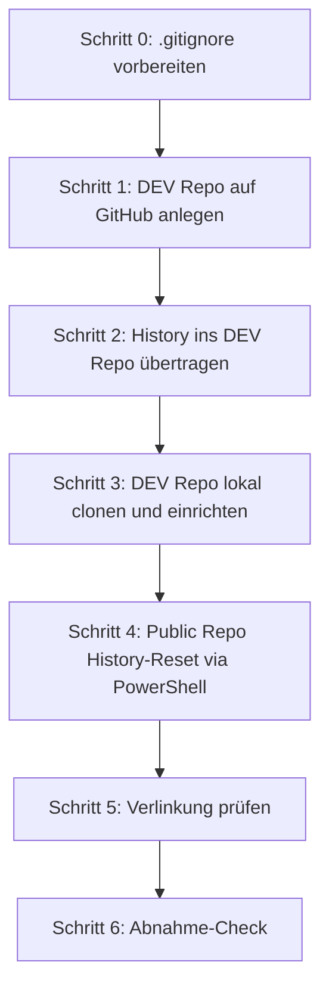

================================================================================
SPRINT-DEV-DOKU – Z1-BlockC-Repo-Aufspaltung
================================================================================
Projekt             : R+MUNI Blueprint
Sprint-Bezeichnung  : Sprint-DEV-Z1-BlockC-Repo-Aufspaltung
Tag                 : #dev #sprint #s8 #beta10 #repo #github
Datum               : 2026-03-28
Stage               : S8 — AKTIV
Status              : In Umsetzung
Verantwortlich      : EUMAXL
Review              : —
Jira-Sync           : NEIN
Erstellt durch      : EUMAXL + Claude (Pair-Session)
Vorgänger           : [[Sprint-DEV-Z1-Beta-1-Release-Besprechung_S8]]
Nachfolger          : [[Sprint-DEV-Z1-BlockD-GitHub-Release_S8]]
================================================================================

================================================================================
1. AUSGANGSLAGE UND KONTEXT
================================================================================

1.1 Ist-Zustand vor diesem Sprint
-----------------------------------

Ein einziges Public Repo enthält DEV-Inhalte und Release-Inhalte gemischt.
Die Git-History des Public Repo enthält versehentlich veröffentlichte Inhalte
aus früheren Commits (Modell-Dateien, Example Scripts, MLAT-Inhalte) die
ohne Review rausgegangen sind. Ein separates DEV Repo existiert noch nicht.
Die .gitignore ist organisch gewachsen und generisch — keine klare Steuerung
welche Inhalte ein- oder ausgeblendet werden.

Relevante Artefakte vor dem Sprint:
  - Public Repo (GitHub)           Status: aktiv, History problematisch
  - .gitignore (Public Repo)       Status: gewachsen, generisch, nicht Blueprint-spezifisch
  - DEV Repo                       Status: existiert nicht

Bezug: [[Sprint-DEV-Z1-Beta-1-Release-Besprechung_S8]]

1.2 Konkrete Diskrepanz oder Problemstellung
---------------------------------------------

  IST:  Ein Repo, gemischte Inhalte, problematische History, generische .gitignore
  SOLL: Zwei Repos (Public = Release, DEV = Entwicklung), saubere History im
        Public Repo, bewusst gebaute .gitignore für beide Repos

Die alte Git-History im Public Repo enthält Commits mit Inhalten die nicht
hätten veröffentlicht werden sollen. Diese sind technisch gesehen weiterhin
abrufbar auch wenn die Dateien längst entfernt wurden.

1.3 Auslöser
-------------
Auslöser-Typ: Strukturbereinigung

Block A und Block B des Sprint-DEV-Z1 sind abgeschlossen und freigegeben.
Block C ist die logische Folge — Repo-Aufspaltung als Voraussetzung für
Block D (GitHub Release v1.0-beta). Der Zeitpunkt ist jetzt da der
dokumentarische Stand Beta-1.0-tauglich ist.

================================================================================
2. ENTSCHEIDUNGEN UND GRUNDSÄTZE DIESES SPRINTS
================================================================================

2.1 Zwei-Repo-Modell ab Beta 1.0
----------------------------------
Entscheidung:
  Ab Beta 1.0 existieren zwei Repos — Public (Release) und DEV (privat).
  Im DEV Repo findet die gesamte aktive Entwicklung statt.
  Fertige Stände werden manuell von DEV in Public übertragen.

Begründung:
  Klare Trennung DEV-Welt vs. Außenwelt. Public zeigt nur fertige,
  kommunizierbare Stände. DEV enthält die volle Entwicklungsrealität
  inkl. History und Arbeitsständen.

Verworfene Alternativen:
  Alternative A: Weiterarbeiten im Public Repo mit strikten Branch-Regeln
    Verworfen weil: History-Problem bleibt bestehen, DEV-Overhead
                    bleibt öffentlich sichtbar
  Alternative B: Fork des Public Repo als DEV
    Verworfen weil: Fork behält die problematische History und ist
                    auf GitHub öffentlich als Fork sichtbar

Auswirkung:
  Ab sofort wird nur noch im DEV Repo aktiv entwickelt.
  Public Repo erhält nur noch saubere, freigegebene Stände.

2.2 History-Behandlung
------------------------
Entscheidung:
  Public Repo → History-Reset via orphan branch → sauberer Initialcommit
  DEV Repo → vollständige bisherige History mitnehmen

Begründung:
  Public Repo muss sauber sein — alte problematische Commits dürfen nicht
  mehr abrufbar sein. DEV Repo braucht die History für interne
  Nachvollziehbarkeit. GitHub-URL und Repo-Name des Public Repo bleiben
  gleich — externe Links bleiben damit gültig.

Verworfene Alternativen:
  Alternative A: Neues Public Repo anlegen mit neuer URL
    Verworfen weil: Externe Links würden brechen — nicht akzeptabel
  Alternative B: History im Public Repo belassen
    Verworfen weil: Problematische Inhalte bleiben abrufbar

Auswirkung:
  Externe Links und GitHub-URLs bleiben unverändert gültig.
  DEV Repo hat die alte History als vollständige interne Sicherung.

2.3 .gitignore Neuaufbau
--------------------------
Entscheidung:
  Beide Repos erhalten eine neue, bewusst gebaute .gitignore
  die der Blueprint-Ordnerstruktur (structure.txt) folgt.
  Zwei Varianten: PUBLIC (strikt) und DEV (Modelle erlaubt).

Begründung:
  Bisherige .gitignore ist organisch gewachsen — kein klares Bild
  welche Inhalte wirklich ein- oder ausgeblendet sind. Ein bewusst
  gebauter Ersatz schafft Transparenz und Kontrolle.

Verworfene Alternativen:
  Keine — direkter Neuaufbau war die einzig sinnvolle Option.

Auswirkung:
  Modelle, Laufzeit-Artefakte, Logs und Temp-Daten werden zuverlässig
  ausgeschlossen. Im DEV Repo sind Archi-Modelle (.archimate) explizit
  erlaubt — im Public Repo nicht.

================================================================================
3. SPRINT-ZIELE
================================================================================

3.1 Ziel 1 — .gitignore für beide Repos
-----------------------------------------
Beide Repos erhalten eine neue, bewusst gebaute .gitignore.

  IST                              →  SOLL
  Gewachsene generische .gitignore →  Blueprint-spezifische .gitignore (PUBLIC)
  Keine DEV .gitignore             →  Blueprint-spezifische .gitignore (DEV)

Vorgehen:
  .gitignore PUBLIC und .gitignore DEV aus Anhang A/B dieses Sprints
  entnehmen, lokal ablegen und vor dem ersten Commit einsetzen.

Begründung für dieses Vorgehen:
  .gitignore muss vor dem ersten Commit aktiv sein — sonst werden
  unerwünschte Inhalte in den Initialcommit aufgenommen.

3.2 Ziel 2 — DEV Repo anlegen und befüllen
--------------------------------------------
Neues privates DEV Repo auf GitHub anlegen und mit der vollständigen
History des bisherigen Public Repo befüllen.

  IST                    →  SOLL
  Kein DEV Repo          →  Privates DEV Repo mit vollständiger History
  Entwicklung im Public  →  Entwicklung im DEV Repo

Vorgehen:
  Neues privates Repo auf GitHub.com anlegen. In GitHub Desktop die
  Remote URL des lokalen Public Repo temporär auf das neue DEV Repo
  umzeigen und pushen — History wird vollständig übertragen.
  Danach Remote URL zurücksetzen und DEV Repo separat lokal clonen.

Begründung für dieses Vorgehen:
  GUI-first — kein CLI nötig für diesen Schritt. History-Transfer
  über Remote-URL-Wechsel ist der sauberste GUI-Weg in GitHub Desktop.

3.3 Ziel 3 — Public Repo History-Reset
----------------------------------------
Public Repo erhält einen sauberen Initialcommit = Beta 1.0 Stand.
Alte History wird vollständig entfernt.

  IST                              →  SOLL
  History mit problematischen      →  Ein sauberer Initialcommit
  Commits                             Beta 1.0 Stand
  Gemischte DEV/Release-Inhalte   →  Nur Release-Inhalte

Vorgehen:
  Via PowerShell 7 — vier Befehle (orphan branch erstellen, stagen,
  main ersetzen, force push). Vollständige Anleitung in Kapitel 6.

Begründung für dieses Vorgehen:
  Der orphan-branch-Weg ist der etablierte Standard für History-Reset
  ohne Repo-URL zu ändern. Force Push ist notwendig und korrekt —
  DEV Repo hat die alte History als Sicherung.

================================================================================
4. ABGRENZUNG — WAS DIESER SPRINT NICHT TUT
================================================================================

Dieser Sprint tut explizit nicht:
  - GitHub Release v1.0-beta erstellen (→ Block D)
  - Inhaltliche Änderungen an Dokumenten (→ Block A + B abgeschlossen)
  - .gitignore inhaltlich weiterentwickeln (→ laufender Betrieb)
  - Obsidian Vault Anpassungen
  - Jira Sync

Begründung der wichtigsten Ausschlüsse:
  GitHub Release: Setzt sauberes Public Repo voraus — das ist das
                  Ergebnis dieses Sprints, nicht der Inhalt.

================================================================================
5. BETROFFENE ARTEFAKTE
================================================================================

Neu erstellt:
  .gitignore (DEV Repo)            Blueprint-spezifisch, Modelle erlaubt
  DEV Repo auf GitHub              Privates Entwicklungs-Repository

Geändert:
  .gitignore (Public Repo)         Ersetzt durch Blueprint-spezifische Variante
  Public Repo Git-History          History-Reset → ein Initialcommit

Unverändert (relevant zu erwähnen):
  Public Repo URL / Name           Bleibt identisch — externe Links gültig
  Alle Dokumente / Scripts         Inhaltlich unverändert — nur Repo-Struktur

================================================================================
6. UMSETZUNG — SCHRITT FÜR SCHRITT
================================================================================

Schritt 0 — .gitignore vorbereiten
  .gitignore PUBLIC aus Anhang A lokal als .gitignore im Public Repo
  Root ablegen — bestehende .gitignore ersetzen.
  .gitignore DEV aus Anhang B bereithalten für Schritt 3.
  HINWEIS: Vor jedem ersten Commit erledigen — sonst landen unerwünschte
           Inhalte im Commit.
  Ergebnis: Neue .gitignore liegt im lokalen Public Repo bereit.

Schritt 1 — DEV Repo auf GitHub anlegen  [GitHub.com — Browser]
  GitHub.com → Neues Repository anlegen.
  Name: R+MUNI-DEV (oder nach eigener Konvention — vor diesem Schritt festlegen)
  Sichtbarkeit: Private
  README / .gitignore / Lizenz: alle NEIN
  Repository anlegen → URL notieren.
  Ergebnis: Leeres privates DEV Repo auf GitHub vorhanden.

Schritt 2 — History ins DEV Repo übertragen  [GitHub Desktop — GUI]
  GitHub Desktop → lokales Public Repo auswählen.
  Repository → Repository Settings → Remote URL temporär auf DEV Repo URL ändern.
  Push to origin → vollständige History überträgt sich ins DEV Repo.
  Prüfen: DEV Repo auf GitHub.com → alle Commits sichtbar?
  Remote URL wieder auf Original Public Repo URL zurücksetzen.
  HINWEIS: Überträgt bewusst die gesamte alte History ins private DEV Repo.
  Ergebnis: DEV Repo hat vollständige History.

Schritt 3 — DEV Repo lokal einrichten  [GitHub Desktop — GUI]
  GitHub Desktop → File → Clone Repository → DEV Repo auswählen.
  Lokalen Pfad wählen: z.B. C:\Prototyping\R+MUNI-DEV\
  Clone durchführen.
  .gitignore DEV (Anhang B) als .gitignore einlegen.
  Ersten Commit erstellen: "DEV Repo eingerichtet — S8 Start"
  Push to origin.
  Ergebnis: DEV Repo lokal eingerichtet, .gitignore aktiv, erster Commit gepusht.

Schritt 4 — Public Repo History-Reset  [PowerShell 7]
  VORAUSSETZUNG: Schritt 3 vollständig abgeschlossen.
                 .gitignore PUBLIC bereits eingelegt (Schritt 0).

  PowerShell 7 öffnen → ins lokale Public Repo Verzeichnis wechseln:

    cd C:\Prototyping\R+MUNI <KUERZEL>

  Befehl 1 — Neuen verwaisten Branch ohne History erstellen:

    git checkout --orphan beta-release

    Erklärung: Neuer Branch ohne Eltern-Commit. Alle Dateien vorhanden,
               History wird nicht mitgenommen.

  Befehl 2 — Alle Dateien stagen und Initialcommit erstellen:

    git add -A && git commit -m "Beta 1.0 Release — sauberer Initialcommit"

    Erklärung: Alle aktuellen Dateien (gefiltert durch .gitignore) in
               genau einem Commit zusammengefasst — das ist der neue Start.

  Befehl 3 — Alten main Branch ersetzen:

    git branch -D main
    git branch -m main

    Erklärung: Alten main lokal löschen, neuen Branch in main umbenennen.

  Befehl 4 — Sauberen Stand auf GitHub pushen:

    git push origin main --force

    Erklärung: Überschreibt die alte History im Public Repo.
               --force ist notwendig und korrekt.
               ACHTUNG: Nicht umkehrbar im Public Repo —
                        DEV Repo hat die Sicherung.

  Ergebnis: Public Repo hat genau einen Commit — Beta 1.0 Initialcommit.

Schritt 5 — Verlinkung prüfen
  README Public Repo: Hinweis auf DEV Repo ergänzen (optional).
  README DEV Repo: Link auf Public Repo ergänzen.
  Externe Links auf Public Repo: noch gültig?
  Ergebnis: Verlinkung geprüft und bestätigt.

Schritt 6 — Abnahme-Check
  Vollständige Prüfliste siehe Kapitel 9.
  Ergebnis: Block C freigegeben → Block D kann starten.

================================================================================
7. BEOBACHTUNGEN UND ERKENNTNISSE WÄHREND DER UMSETZUNG
================================================================================

7.1 Platzhalter — wird während Umsetzung befüllt
--------------------------------------------------
  <Was wurde entdeckt>
  Auswirkung: <Was wurde deswegen angepasst oder zurückgestellt>
  Dokumentiert: <Ja — in Kapitel X / Backlog-Eintrag>

================================================================================
8. ERGEBNIS
================================================================================

8.1 Erreichter Zustand
-----------------------
— wird nach Umsetzung befüllt —

Entstandene Artefakte:
  - DEV Repo (GitHub, privat)     vollständige History, aktives Entwicklungs-Repo
  - .gitignore PUBLIC             Blueprint-spezifisch, abgelöst in Public Repo
  - .gitignore DEV                Blueprint-spezifisch, Modelle erlaubt

Geänderter Systemzustand:
  Public Repo = sauberer Beta 1.0 Stand, ein Initialcommit, keine alte History.
  DEV Repo = neue Heimat der Entwicklung, vollständige History intern gesichert.

8.2 Abweichungen vom Plan
--------------------------
  — wird nach Umsetzung befüllt —

================================================================================
9. TEST UND VALIDIERUNG
================================================================================

| Prüfpunkt                                      | Ergebnis   | Anmerkung |
|------------------------------------------------|------------|-----------|
| Public Repo: nur ein Initialcommit sichtbar    | <OK / NOK> |           |
| Public Repo: keine Modelle enthalten           | <OK / NOK> |           |
| Public Repo: keine MLAT / Example-Inhalte      | <OK / NOK> |           |
| Public Repo: .gitignore Blueprint-spezifisch   | <OK / NOK> |           |
| Public Repo: README, Scripts, Doku vorhanden   | <OK / NOK> |           |
| Externe Links auf Public Repo noch gültig      | <OK / NOK> |           |
| DEV Repo: vollständige History vorhanden       | <OK / NOK> |           |
| DEV Repo: Sichtbarkeit = privat               | <OK / NOK> |           |
| DEV Repo: .gitignore Blueprint-spezifisch      | <OK / NOK> |           |
| Stage-3/4/5/6/7-Scripts logisch unverändert    | <OK / NOK> |           |
| Kein unbeabsichtigter Seiteneffekt             | <OK / NOK> |           |

Testmethode:
  Manuell — GitHub.com Prüfung beider Repos, Commit-Anzahl, Dateiinhalt.
  Lokaler Test: CSV00-validate_environment.py im DEV Repo ausführen.

Log-Referenz:
  02-stages\99-logs\CSV00-root.resolved.txt

================================================================================
10. OFFENE PUNKTE NACH SPRINT-ABSCHLUSS
================================================================================

| Thema                              | Status | Nächste Aktion                             |
|------------------------------------|--------|--------------------------------------------|
| DEV Repo Name final festlegen      | offen  | EUMAXL vor Schritt 1                       |
| .gitignore nach erstem Push prüfen | offen  | nach Block D                               |
| Block D GitHub Release             | offen  | [[Sprint-DEV-Z1-BlockD-GitHub-Release_S8]] |

================================================================================
11. GOVERNANCE-KONFORMITÄTSCHECK
================================================================================

| GOV-Kriterium                              | Status | Anmerkung                         |
|--------------------------------------------|--------|-----------------------------------|
| GOV 10.3  Auslöser zulässig               | OK     | Strukturbereinigung               |
| GOV 10.5  Fachlicher Mehrwert benennbar   | OK     | Saubere Repo-Trennung DEV/Release |
| GOV 10.5  Keine implizite GOV-Änderung    | OK     | Nur Repo-Struktur betroffen       |
| GOV 10.6  Ziel explizit definiert         | OK     | Kapitel 3                         |
| GOV 10.6  Ziel überprüfbar               | OK     | Kapitel 9                         |
| GOV 10.7  Zwischenschritte dokumentiert   | OK     | Kapitel 6                         |
| GOV 10.8  Dev-Doku vollständig            | OK     | Dieses Dokument                   |
| GOV 10.9  Stage-Ende Doku                 | OFFEN  | Fällig bei Stage-Abschluss        |
| GOV 10.10 Keine GOV-Regel aufgehoben      | OK     | Keine GOV-Regel berührt           |
| Rückkopplungsschutz eingehalten           | OK     | Stage-3/4/5/6/7 unberührt        |

================================================================================
12. LESSONS LEARNED
================================================================================

12.1 Was gut funktioniert hat
------------------------------
  — wird nach Umsetzung befüllt —

12.2 Was beim nächsten Mal anders gemacht werden sollte
--------------------------------------------------------
  — wird nach Umsetzung befüllt —

12.3 Erkenntnisse für das System
----------------------------------
  - .gitignore gehört von Anfang an bewusst gebaut, nicht organisch wachsen lassen
    → Konsequenz: .gitignore als versioniertes Blueprint-Artefakt behandeln

================================================================================
ANHANG A — .gitignore PUBLIC REPO
================================================================================

# =============================================================
# .gitignore — R+MUNI Public Repo (Beta 1.0)
# Bewusst gebaut nach Blueprint-Ordnerstruktur (structure.txt)
# S8 | 2026-03-28
# =============================================================

# --- Betriebssystem & Editor --------------------------------
.DS_Store
Thumbs.db
desktop.ini
*.tmp
*.temp

# --- Obsidian -----------------------------------------------
.obsidian/

# --- Archi Modelle (niemals public) -------------------------
00-model/
*.archimate
*.archimate.bak

# --- Laufzeit-Artefakte & Logs ------------------------------
02-stages/99-logs/
*.log
*.lck
*.resolved.txt

# --- Laufzeit-Scopes (werden lokal generiert) ---------------
02-stages/model-scope.txt
02-stages/run-scope.txt

# --- Archive (Laufzeit) -------------------------------------
02-stages/00-archimatearchive/
02-stages/01-bpmnarchive/
02-stages/02-xyarchive/

# --- Abgeleitete Artefakte (werden lokal generiert) ---------
01-artifacts/00-xml/00-master/
01-artifacts/00-xml/03-child/00-archimatechild/*.xml
01-artifacts/00-xml/99-exports/
01-artifacts/02-csv/00-master/
01-artifacts/02-csv/03-child/
01-artifacts/02-csv/99-exports/
01-artifacts/03-XLSX/00-master/
01-artifacts/03-XLSX/03-child/
01-artifacts/03-XLSX/99-exports/
01-artifacts/04-flow/00-archimateFLW/
01-artifacts/04-flow/01-bpmnFLW/
01-artifacts/05-reports/

# --- Python Cache -------------------------------------------
__pycache__/
*.pyc
*.pyo

# --- Backup-Dateien -----------------------------------------
*.bak

# =============================================================
# Mapping-Dateien (.txt in 01-mapping, 02-sync): NICHT ausgeschlossen
# Scripts in 01-scripts: NICHT ausgeschlossen
# root.cfg: NICHT ausgeschlossen (Pfade relativ/generisch)
# =============================================================

================================================================================
ANHANG B — .gitignore DEV REPO
================================================================================

# =============================================================
# .gitignore — R+MUNI DEV Repo (privat)
# Bewusst gebaut nach Blueprint-Ordnerstruktur (structure.txt)
# S8 | 2026-03-28
# =============================================================

# --- Betriebssystem & Editor --------------------------------
.DS_Store
Thumbs.db
desktop.ini
*.tmp
*.temp

# --- Obsidian -----------------------------------------------
.obsidian/

# --- Archi Backup-Dateien (Modelle selbst sind erlaubt) -----
*.archimate.bak

# --- Laufzeit-Artefakte & Logs ------------------------------
02-stages/99-logs/
*.log
*.lck
*.resolved.txt

# --- Laufzeit-Scopes (werden lokal generiert) ---------------
02-stages/model-scope.txt
02-stages/run-scope.txt

# --- Archive (Laufzeit) -------------------------------------
02-stages/00-archimatearchive/
02-stages/01-bpmnarchive/
02-stages/02-xyarchive/

# --- Abgeleitete Artefakte (werden lokal generiert) ---------
01-artifacts/00-xml/00-master/
01-artifacts/00-xml/99-exports/
01-artifacts/02-csv/00-master/
01-artifacts/02-csv/03-child/
01-artifacts/02-csv/99-exports/
01-artifacts/03-XLSX/00-master/
01-artifacts/03-XLSX/03-child/
01-artifacts/03-XLSX/99-exports/
01-artifacts/04-flow/00-archimateFLW/
01-artifacts/04-flow/01-bpmnFLW/
01-artifacts/05-reports/

# --- Python Cache -------------------------------------------
__pycache__/
*.pyc
*.pyo

# --- Backup-Dateien -----------------------------------------
*.bak

# =============================================================
# DEV REPO: Archi Modelle (.archimate) NICHT ausgeschlossen —
# im privaten DEV Repo explizit erlaubt.
# Backup-Dateien (.archimate.bak) bleiben ausgeschlossen.
# =============================================================

================================================================================
13. BEZÜGE UND VERLINKUNGEN
================================================================================

Ausgangspunkt:
  [[FREEZE_7]]                                     Baseline Stage 8
  [[Sprint-DEV-Z1-Beta-1-Release-Besprechung_S8]]  Übergeordneter Sprint

Entstanden:
  — kein Freeze — Block D folgt

Verwandte Dokumente:
  [[STAGE8_ZIELE_S8]]                              S8-Z1 Zieldefinition
  [[GOV_Global_S8]]                                normative Grundlage

Creative-Assets:
  Keine Creative-Assets für diesen Sprint.

================================================================================
Sprint-DEV-Z1-BlockC-Repo-Aufspaltung | S8 | 2026-03-28 | R+MUNI Blueprint
Erstellt durch: EUMAXL + Claude (Pair-Session)
================================================================================
