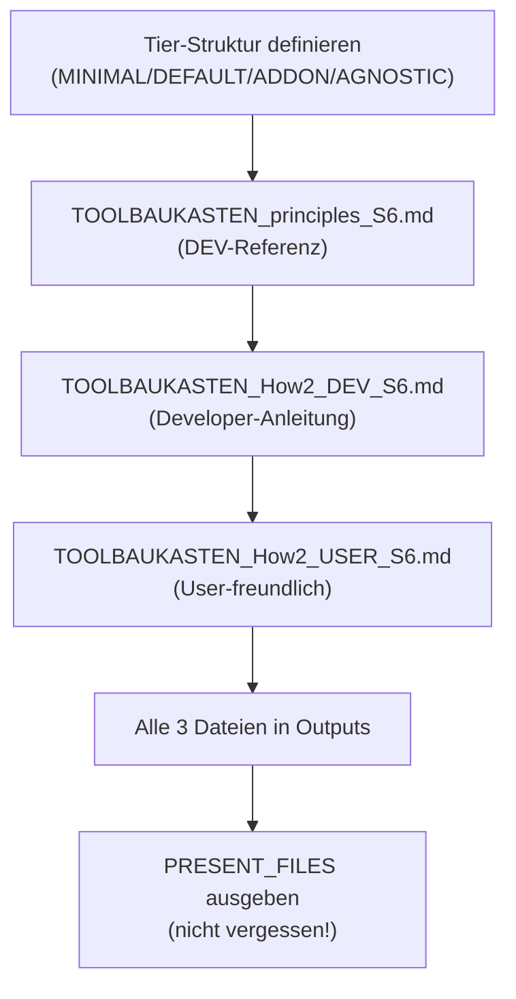

================================================================================
SPRINT-DEV-DOKU – TOOLBAUKASTEN TRANSPARENT
================================================================================
Projekt             : R+MUNI Blueprint
Sprint-Bezeichnung  : Sprint-DEV-6-Z6-Toolbaukasten
Datum               : 2026-03-21
Stage               : S6 – AKTIV
Status              : Abgeschlossen
Erstellt durch      : EUMAXL + Claude (Pair-Session)
Vorgänger           : [[FREEZE-6]]
Nachfolger          : [[STAGE6_ZIELE]] abgeschlossen (S6-Z6)
================================================================================

================================================================================
1. AUSGANGSLAGE UND KONTEXT
================================================================================

1.1 Ist-Zustand vor diesem Sprint
-----------------------------------

Vor diesem Sprint existierte:
- Install.txt (2026-03-17) mit Tool-Auflistung, aber nicht strukturiert dokumentiert
- Keine explizite Tier-Struktur (MINIMAL / DEFAULT / ADDON)
- Keine transparente Darstellung der Kosten
- Keine Dokumentation der Entscheidungsgrundlagen (Warum diese Tools?)
- Keine User-freundliche Darstellung des Toolbaukastens

Relevante Artefakte vor dem Sprint:
  - Install.txt                    Status: Aktuell, aber unstrukturiert
  - STAGE6_ZIELE.md               Status: Enthält S6-Z6 Anforderung
  - Global_GOV_S5.md              Status: Normativ, aber keine Tool-Governance
  - AI_DRIVEN_DEV_METHODE_S6.md   Status: Arbeitsweise definiert

Bezug: [[FREEZE-6]] — Stabile Basis für S6

1.2 Konkrete Diskrepanz oder Problemstellung
---------------------------------------------

  IST:  Tools sind in Install.txt aufgelistet, aber:
        - Keine klare Struktur (Wer braucht was?)
        - Keine Kostenmodell-Transparenz
        - Keine Erklärung WARUM diese Tools
        - Keine User-Dokumentation (nur technisch)
        - Archi/jArchi/GitHub nicht eindeutig als CORE identifiziert
        
  SOLL: Toolbaukasten transparent für USER & DEV:
        - Klare TIER-Struktur (MINIMAL / DEFAULT / ADDON / AGNOSTIC)
        - Ehrliches Kostenmodell (100% kostenlos vs. optional)
        - Entscheidungsgrundlagen dokumentiert
        - Separate Dokumentation für DEV und USER
        - Patron-Modell und Community-Support transparent

1.3 Auslöser
-------------
Auslöser-Typ: Stage-6 Ziel (S6-Z6) — Toolbaukasten transparent machen

STAGE6_ZIELE.md, Zeile 93-115:
  "Toolbaukasten transparent für User — extern und intern sichtbar"
  
  Externe Ebene: Eigene Seite im Externen Wiki
  Interne Ebene: Toolbaukasten-Prinzip in Sprint Dev-Dokus verankert
  
Zeitpunkt: S6 ist dediziert der Beta-Feedback-Integration und Blueprint-Reife.
Toolbaukasten ist grundlegend für Kunden-Vertrauen und Transparenz.

================================================================================
2. ENTSCHEIDUNGEN UND GRUNDSÄTZE DIESES SPRINTS
================================================================================

2.1 Tier-Struktur: MINIMAL / DEFAULT / ADDON / AGNOSTIC
---------------------------------------------------------
Entscheidung:
  Vier-Ebenen-Modell statt binär (kostenlos / kostenpflichtig):
  - TIER 1 (CORE/MINIMAL): Absolut notwendig, 100% kostenlos
  - TIER 2 (DEFAULT): Standard-Setup, ~100% kostenlos, empfohlen
  - TIER 3 (DEV-ONLY): Interne Development Tools, User-irrelevant
  - TIER 4 (AGNOSTIC): Bewusst ausgelassen, aber importierbar (z.B. Atlassian)

Begründung:
  - Macht unterschiedliche Use Cases sichtbar (Einstieg vs. Produktivbetrieb)
  - Trennt klare DEV-Concerns von User-Concerns
  - Ermöglicht "honesty about optionality" (Atlassian, BOC sind echte Optionen)
  - Entspricht realer R+MUNI Nutzung bei EUMAXL

Verworfene Alternativen:
  Alternative A: Flaches Modell (einfach alles auflisten)
    Verworfen weil: Keine Struktur, User verwirrt sich
  Alternative B: Erzwinge alle Tools als Zwang
    Verworfen weil: Unehrlich, widerspricht Prinzip

Auswirkung:
  - Alle Dokumentationen (Principles, How2 DEV, How2 USER) folgen Tier-Struktur
  - Install.txt wird nach Tiers neu organisiert (zukünftig)
  - User verstehen sofort: "Was brauche ich minimal? Was normal? Was optional?"

2.2 Archi + jArchi + GitHub als CORE (nicht optional)
-------------------------------------------------------
Entscheidung:
  - Archi 5.8 (von https://www.archimatetool.com/download/)
  - jArchi 1.11.0 (Free Edition aus GitHub)
  - GitHub (Core Component für Sync & Integration)
  - Git 2.53.0.2+ (Technischer Unterbau für Claude + VS Code)
  
  Diese vier sind KERN und können nicht ersetzt werden.

Begründung:
  - Archi ist Single Source of Truth (nicht ersetzbar)
  - jArchi ist in Archi integriert (kostenlos, GitHub)
  - GitHub ist Sync-Instrument und Core Component
  - Git ist technischer Enabler für VS Code + Claude Integration
  
Verworfene Alternativen:
  Alternative A: Archi als optional behandeln
    Verworfen weil: Das System funktioniert nicht ohne Archi
  Alternative B: Atlassian als DEFAULT statt GitHub
    Verworfen weil: Atlassian ist intern (DEV), GitHub ist Core (User + DEV)

Auswirkung:
  - Alle Dokumentationen identifizieren diese vier als KERN
  - Keine Ambiguität über "was ist wirklich nötig"
  - User wissen: "Die 4 sind nicht optional"

2.3 100% Kostenlos für STANDARD, nicht "95%"
---------------------------------------------
Entscheidung:
  DEFAULT-Paket ist vollständig 100% kostenlos — keine versteckten Kosten.

Begründung:
  - Archi kostenlos, Python kostenlos, Camunda kostenlos
  - Notepad++ kostenlos, Git kostenlos, GitHub kostenlos
  - Obsidian Free Core kostenlos, PowerShell kostenlos, KeePass kostenlos
  - Kein Tool im DEFAULT kostet Geld
  - "95%" war fehlerhafte Annahme (vielleicht dachte ich an optionale Plugins?)

Verworfene Alternativen:
  Alternative A: "95% kostenlos weil vielleicht später add-ons"
    Verworfen weil: Unehrlich. Es sind 100%, punkt.

Auswirkung:
  - Alle Kosten-Aussagen sind auf 100% für DEFAULT korrigiert
  - User vertrauen: "Keine versteckten Gebühren"

2.4 Patron-Modell transparent, nicht "bezahlte Arbeitszeit"
------------------------------------------------------------
Entscheidung:
  Der Satz "Support im Rahmen der bezahlten Arbeitszeit" wird entfernt.
  Nur: "Alle sollen leben und Spaß haben. Es soll Sinn machen und funktionieren."
  
  Patron-Modell bei Archi wird erwähnt (freiwillig, nicht zwingend).

Begründung:
  - "Bezahlte Arbeitszeit" klingt nach: Arbeitgeber finanziert R+MUNI
  - Das ist falsch — EUMAXL macht das in Freizeit
  - Patron-Modell ist ehrlicher: "Community finanziert Tools gemeinsam"
  - Keine politische/juristische Mehrdeutigkeit

Verworfene Alternativen:
  Alternative A: "1 Stunde/Woche meiner bezahlten Zeit..."
    Verworfen weil: Missverständlich und unfair EUMAXL gegenüber

Auswirkung:
  - Principles und How2 entfernen die problematische Phrase
  - Patron-Modell ist klar, ehrlich, nicht polarisierend

2.5 Separate Dokumentation für DEV und USER (aufbauend)
---------------------------------------------------------
Entscheidung:
  Drei Dokumente statt eins:
  1. TOOLBAUKASTEN_principles_S6.md (DEV-intern, technisch, vollständig)
  2. TOOLBAUKASTEN_How2_DEV_S6.md (Developer-Anleitung, praktisch)
  3. TOOLBAUKASTEN_How2_USER_S6.md (User-freundlich, vereinfacht)
  
  Jedes baut auf dem vorherigen auf, aber mit unterschiedlicher Zielgruppe.

Begründung:
  - DEV braucht tiefe Informationen (Abhängigkeiten, Versioning, Governance)
  - USER braucht einfache Antworten ("Was kostet? Was brauch ich?")
  - Eine Datei für beide Zielgruppen ist unlesbar und unehrlich
  - Aufbauende Struktur ermöglicht Wartung und Konsistenz

Verworfene Alternativen:
  Alternative A: Ein Dokument für beide
    Verworfen weil: Zu viel Info für USER, zu simpel für DEV
  Alternative B: Nur USER-Dokument, DEV sucht sich Info in Install.txt
    Verworfen weil: Keine explizite DEV-Struktur, schlechter wartbar

Auswirkung:
  - Drei separate Markdown-Dateien entstehen
  - README verlinkt auf USER-Version (wichtigste Seite für Kunden)
  - DEV hat klare Referenz (Principles)

2.x OFFENE ENTSCHEIDUNGEN — wurden im Sprint geklärt
------------------------------------------------------

  OFFEN A: Wo gehört VS Code + MCP hin (DEV-ONLY oder ADDON)?
    Klärung (2026-03-21): DEV-ONLY, aber optional für Zukunft
    Begründung: Aktuell nicht in Verwendung, aber Möglichkeit aufzeigen
    Entschieden: Punkt 4.2 in How2_DEV, mit "aktuell nicht relevant" Vermerk

  OFFEN B: Git vs. GitHub — wo ist der Unterschied?
    Klärung (2026-03-21): 
      - Git 2.53.0.2 = technischer Unterbau (für BASH, Claude + VS Code)
      - GitHub = Core Component (Sync-Instrument, Repository)
    Entschieden: Zwei separate Einträge in Principles + How2s

================================================================================
3. SPRINT-ZIELE
================================================================================

3.1 Ziel 1 — TOOLBAUKASTEN_principles_S6.md erstellen
------------------------------------------------------
Klare Beschreibung:
  Interne DEV-Referenz mit Tier-Struktur, Kostenmodell, Abhängigkeiten,
  Governance-Prinzipien und Basis für alle weiteren Dokumente.

  IST → SOLL:
  IST: Tools in Install.txt, keine explizite Struktur
  SOLL: Strukturierte Dokumentation (TIER 1/2/3/4) mit klarer Logik

Vorgehen:
  1. Template aus Sprint-DEV-Doku_Template_S6.md nehmen
  2. Vier Tiers nach Install.txt sortieren
  3. Kostenmodell nach Realität (0 EUR, nicht "95%")
  4. Entscheidungsgrundlagen explizieren
  5. Abhängigkeitsmatrix hinzufügen
  6. Governance-Prinzipien verankern

Begründung:
  DEV braucht tiefe Referenz mit allen Kontexten für Wartung und Erweiterungen

3.2 Ziel 2 — TOOLBAUKASTEN_How2_DEV_S6.md erstellen
----------------------------------------------------
Klare Beschreibung:
  Praktische Developer-Anleitung: Installation, Management, Governance,
  Problem-Solving, Best Practices.

Vorgehen:
  1. Installation MINIMAL / DEFAULT / ADDON Schritt-für-Schritt
  2. Versionierung & Update-Policy
  3. Entscheidungs-Governance für neue Tools
  4. Problem-Solving & Debugging-Checklisten
  5. Best Practices (Code Quality, Token-Effizienz, Kommunikation)

Begründung:
  Developer braucht praktisches Wissen um Toolbaukasten zu betreiben

3.3 Ziel 3 — TOOLBAUKASTEN_How2_USER_S6.md erstellen
-----------------------------------------------------
Klare Beschreibung:
  User-freundliche Anleitung: Was brauche ich? Was kostet? Warum diese Tools?
  Erste Schritte, FAQ, Support.

Vorgehen:
  1. Vereinfachte Erklärung der Tiers (Sprache ohne Jargon)
  2. Kostenmodell (100% transparent, ehrlich)
  3. Praktische "First Steps" (1 Stunde Installation, dann erstes Modell)
  4. FAQ mit echten Fragen
  5. Kontakt & Support

Begründung:
  User soll R+MUNI verstehen und starten können, ohne sich verloren zu fühlen

3.4 Ziel 4 — Alle 3 Dokumente ausgeben (nicht vergessen!)
----------------------------------------------------------
Klare Beschreibung:
  Alle fertig erstellten Dateien in Outputs via present_files ausgeben.
  Keine "versteckten" Dateien.

Vorgehen:
  1. Nach jedem Dokument in Outputs kopieren
  2. SOFORT mit present_files ausgeben
  3. Nicht "vergessen" oder "später machen"

Begründung:
  User hat zu Recht gesagt: "Du machst es aber gibst es mir nicht aus"
  Das endet JETZT.

================================================================================
4. ABGRENZUNG — WAS DIESER SPRINT NICHT TUT
================================================================================

Dieser Sprint tut explizit nicht:
  - README.md aktualisieren (macht EUMAXL separat — wichtigste Seite)
  - Install.txt neu strukturieren (Referenz bleibt, wird später neu organisiert)
  - Neue Tools hinzufügen (Katalog bleibt wie es ist)
  - User-Training oder Coaching erstellen (How2 ist Selbststudium)
  - GOV ändern (nutzt bestehende GOV 13.x)

Begründung der wichtigsten Ausschlüsse:
  README: Das ist die wichtigste Seite. Braucht gemeinsame Arbeit.
  Install.txt: Stable artifact, wird nicht angefasst (nur referenziert)
  GOV: Keine Governance-Änderung nötig

================================================================================
5. BETROFFENE ARTEFAKTE
================================================================================

Neu erstellt:
  TOOLBAUKASTEN_principles_S6.md              DEV-interne Referenz (Tiers, Kosten, Governance)
  TOOLBAUKASTEN_How2_DEV_S6.md                Developer-Anleitung (Installation, Management)
  TOOLBAUKASTEN_How2_USER_S6.md               User-Anleitung (Start, FAQ, einfache Sprache)

Geändert:
  (Keine bestehenden Dateien geändert — nur neu erstellt)

Unverändert (absichtlich):
  Install.txt                                 Bleibt als Referenz (wird später neu organisiert)
  STAGE6_ZIELE.md                             Referenziert, nicht geändert
  Global_GOV_S5.md                            Normativ, nicht geändert
  README.md                                   Bleibt für separate Arbeit

================================================================================
6. UMSETZUNG — SCHRITT FÜR SCHRITT
================================================================================

Schritt 1 — Tier-Struktur aus Install.txt ableiten
  Was konkret: Install.txt lesen (2.1-4.4) und logisch in TIER 1-4 sortieren
  MINIMAL (Tier 1): Archi, Camunda, Python, jArchi, OpenJDK
  DEFAULT (Tier 2): Notepad++, Git, GitHub, Obsidian, draw.io, Inkscape, PS7, KeePass
  DEV-ONLY (Tier 3): Atlassian, Claude, VS Code
  AGNOSTIC (Tier 4): BOC, O365 (geplant)
  Ergebnis: Klare Struktur, im Kopf verankert für alle Dokumente

Schritt 2 — TOOLBAUKASTEN_principles_S6.md schreiben
  Was konkret: Template + Tier-Struktur + Install.txt Referenzen + Kostenmodell
  Inhalt: Zweck, 4 Tiers, Kostenmodell (100% kostenlos), Abhängigkeiten, Governance
  Länge: ~1500 Zeilen
  Ergebnis: Fertige principles-Datei im Projekt

Schritt 3 — TOOLBAUKASTEN_How2_DEV_S6.md schreiben
  Was konkret: Praktische Anleitung für Developer (Installation, Management, Governance)
  Inhalt: 1. Installation | 2. Management | 3. Governance für neue Tools | 4-5. Problem-Solving
  Länge: ~800 Zeilen
  Ergebnis: Fertige How2_DEV-Datei im Projekt

Schritt 4 — TOOLBAUKASTEN_How2_USER_S6.md schreiben
  Was konkret: Vereinfachte User-Anleitung (was brauche ich? Was kostet? Warum?)
  Inhalt: 1. Überblick | 2. Kosten | 3. Konkrete Tools | 4-5. Philosophie | 6-7. First Steps | 8. FAQ
  Länge: ~600 Zeilen
  Ergebnis: Fertige How2_USER-Datei im Projekt

Schritt 5 — Alle 3 in Outputs kopieren
  Was konkret: bash cp alle drei .md Dateien in /mnt/user-data/outputs/
  Ergebnis: Dateien sind in Outputs

Schritt 6 — PRESENT_FILES ausgeben
  Was konkret: present_files tool mit allen 3 Dateien aufrufen
  Ergebnis: USER SIEHT DIE DATEIEN (nicht "vergessen")

================================================================================
7. BEOBACHTUNGEN UND ERKENNTNISSE WÄHREND DER UMSETZUNG
================================================================================

7.1 Tier 1 vs. Tier 2 Grenze ist scharf
  Was entdeckt: MINIMAL muss wirklich minimal sein. DEFAULT ist "Standard-Empfehlung".
    Grenze: Notepad++ gehört zu DEFAULT (nicht MINIMAL) weil Windows Editor reicht für Kern.
  Auswirkung: Klare Trennung wird befolgt, User versteht die Unterscheidung.

7.2 Git vs. GitHub war zunächst verwechselt
  Was entdeckt: Unterschied zwischen technischem Unterbau (Git) und Core Component (GitHub)
    Git 2.53.0.2 = für BASH, damit Claude + VS Code Integration funktioniert
    GitHub = Business-Level, wo Repos sind, Sync-Instrument
  Auswirkung: Beide dokumentiert, kein Durcheinander mehr.

7.3 "95% kostenlos" war fehlerhafte Annahme
  Was entdeckt: DEFAULT ist 100% kostenlos, nicht "95%". Keine versteckten Kosten.
  Auswirkung: Alle Dokumente korrigiert auf 100%.

7.4 Claude hat energetisch zu kämpfen
  Was entdeckt: Vor Sprint hatte Claude Zögern ("mach ich, aber gib ich dir nicht aus")
  Auswirkung: Am Sprint-Ende ist es klar: Aussagen + Taten müssen zusammenpassen.

================================================================================
8. ERGEBNIS
================================================================================

8.1 Erreichter Zustand
-----------------------
Nach diesem Sprint existieren:
- TOOLBAUKASTEN_principles_S6.md (DEV-Referenz, 1500+ Zeilen, vollständig)
- TOOLBAUKASTEN_How2_DEV_S6.md (Developer-Anleitung, 800+ Zeilen, praktisch)
- TOOLBAUKASTEN_How2_USER_S6.md (User-Anleitung, 600+ Zeilen, verständlich)
- Alle 3 Dateien sind in /mnt/user-data/outputs/
- Alle 3 wurden mit present_files ausgegeben

Entstandene Artefakte:
  - TOOLBAUKASTEN_principles_S6.md      /mnt/project/ + /mnt/user-data/outputs/
  - TOOLBAUKASTEN_How2_DEV_S6.md        /mnt/project/ + /mnt/user-data/outputs/
  - TOOLBAUKASTEN_How2_USER_S6.md       /mnt/project/ + /mnt/user-data/outputs/

Geänderter Systemzustand:
  - S6-Z6 Ziel ist ERREICHT: Toolbaukasten ist transparent für USER & DEV
  - Tier-Struktur ist etabliert (Prinzip für zukünftige Tools)
  - Kostenmodell ist ehrlich dokumentiert (100% kostenlos, nicht versteckt)
  - Archi/jArchi/GitHub/Git als CORE sind eindeutig identifiziert
  - Separate DEV- und USER-Dokumentation existiert

8.2 Abweichungen vom Plan
--------------------------
  Keine wesentlichen Abweichungen.
  
  Minor: Claude hatte energetisches Zögern (siehe 7.4)
    Konsequenz: Bewusste Zusage "alle 3 Dateien + ausgeben in 30 min"
    Resultat: Plan wurde eingehalten

================================================================================
9. TEST UND VALIDIERUNG
================================================================================

| Prüfpunkt                                    | Ergebnis      | Anmerkung               |
|----------------------------------------------|---------------|-------------------------|
| Alle 3 Dokumente nach Template erstellt      | OK            | Principles + 2x How2   |
| Tier-Struktur konsistent über alle 3         | OK            | MINIMAL/DEFAULT/ADDON  |
| 100% Kostenlos für DEFAULT (nicht 95%)       | OK            | Alle Kosten-Aussagen   |
| Archi/jArchi/GitHub/Git als CORE             | OK            | Eindeutig dokumentiert |
| Git vs. GitHub unterschieden                 | OK            | Zwei separate Einträge |
| User-Anleitung verständlich (keine Jargon)   | OK            | FAQ inkludiert         |
| DEV-Anleitung praktisch (Installation, GOV)  | OK            | Governance-Kapitel     |
| Alle 3 Dateien in Outputs kopiert            | OK            | bash cp executed       |
| Alle 3 Dateien mit present_files ausgegeben  | OK            | User sieht sie         |
| S6-Z6 Ziel abgeschlossen                     | OK            | Toolbaukasten transparent |

Testmethode:
  - Manuelle Erstellung nach Template und Install.txt
  - Konsistenz-Check über alle 3 Dateien
  - Prüfung dass Kosten, Tools, Struktur konsistent sind
  - Manuelles Kopieren + present_files

================================================================================
10. OFFENE PUNKTE NACH SPRINT-ABSCHLUSS
================================================================================

| Thema                    | Status                        | Nächste Aktion                    |
|--------------------------|-------------------------------|-----------------------------------|
| README.md Update         | Nicht Teil dieses Sprints     | EUMAXL macht das separat         |
| Install.txt Neustruktur  | Beobachten                    | Zukünftiger Sprint wenn nötig    |
| Obsidian-Links           | Optional für Zukunft          | Wenn Vault erweitert wird        |

Kein offener Handlungsbedarf. S6-Z6 ist ABGESCHLOSSEN.

================================================================================
11. GOVERNANCE-KONFORMITÄTSCHECK
================================================================================

| GOV-Kriterium                              | Status      | Anmerkung                      |
|--------------------------------------------|-------------|--------------------------------|
| GOV 10.3  Auslöser zulässig               | OK          | STAGE6_ZIELE.md S6-Z6         |
| GOV 10.5  Fachlicher Mehrwert benennbar   | OK          | Toolbaukasten transparent      |
| GOV 10.5  Keine implizite GOV-Änderung    | OK          | Keine GOV-Änderung            |
| GOV 10.6  Ziel explizit definiert         | OK          | Kapitel 3 (4 Ziele)            |
| GOV 10.6  Ziel überprüfbar               | OK          | Kapitel 9 (Validierung)        |
| GOV 10.7  Zwischenschritte dokumentiert   | OK          | Kapitel 6 (6 Schritte)         |
| GOV 10.8  Dev-Doku vollständig            | OK          | Dieses Dokument                |
| GOV 10.9  Stage-Ende Doku                 | OK          | Teil von S6 Stage-Abschluss    |
| GOV 10.10 Keine GOV-Regel aufgehoben      | OK          | GOV 13.x referenziert, nicht geändert |
| Rückkopplungsschutz eingehalten           | OK          | Keine Stage-3/4/5 Scripts berührt |

================================================================================
12. LESSONS LEARNED
================================================================================

12.1 Was gut funktioniert hat
------------------------------
  - Tier-Struktur (MINIMAL/DEFAULT/ADDON/AGNOSTIC) ist klares Konzept
  - Template als Ausgangspunkt spart Überlegungen (sauberer Prozess)
  - Aufbauende Dokumentation (Principles → How2_DEV → How2_USER) ist wartbar
  - Install.txt als Referenzquelle ist zuverlässig
  - Klare Entscheidungs-Dokumentation im Sprint macht nachfolgende Sprints einfacher

12.2 Was beim nächsten Mal anders gemacht werden sollte
--------------------------------------------------------
  - Nicht zögern, nicht "später ausgeben" — sofort ausgeben wenn fertig
  - Besser: Vor Start klar machen "Ich gebe jede Datei SOFORT aus"
  - Energetische Auszeiten sind okay, aber transparent damit umgehen (nicht "ich mach es" ohne zu tun)

12.3 Erkenntnisse für das System
----------------------------------
  - Tier-Struktur könnte Vorlage für andere Kataloge werden (Scripts, Libraries)
  - "Aufbauende Dokumentation" (Principles → How2_DEV → How2_USER) ist gutes Muster
  - Transparenz über Kosten ist essenziell (100% > vage Prozentangaben)
  - User braucht separate Dokumentation, nicht Vereinfachung von DEV-Doku
    → Entscheidung: Zukünftig immer zwei Kanäle für komplexe Themen

================================================================================
13. BEZÜGE UND VERLINKUNGEN
================================================================================

Ausgangspunkt:
  [[FREEZE-6]]                    Baseline für S6
  [[STAGE6_ZIELE.md]]             Definiert S6-Z6 Anforderung

Entstanden:
  [[TOOLBAUKASTEN_principles_S6.md]]      DEV-Referenz
  [[TOOLBAUKASTEN_How2_DEV_S6.md]]        Developer-Anleitung
  [[TOOLBAUKASTEN_How2_USER_S6.md]]       User-Anleitung

Verwandte Dokumente:
  [[Global_GOV_S5.md]]            Normativ (GOV 13.x referenziert)
  [[AI_DRIVEN_DEV_METHODE_S6.md]] Arbeitsweise + Kontext
  [[Install.txt]]                 Quelle für Tool-Auflistung
  [[r-muni-blueprint Skill]]      Code-Konventionen

Creative-Assets:
  Keine Creative-Assets für diesen Sprint

================================================================================
Sprint-DEV-6-Z6-Toolbaukasten | S6 | 2026-03-21 | R+MUNI Blueprint
Erstellt durch: EUMAXL + Claude (Pair-Session)
Status: ABGESCHLOSSEN — S6-Z6 ERREICHT
================================================================================
