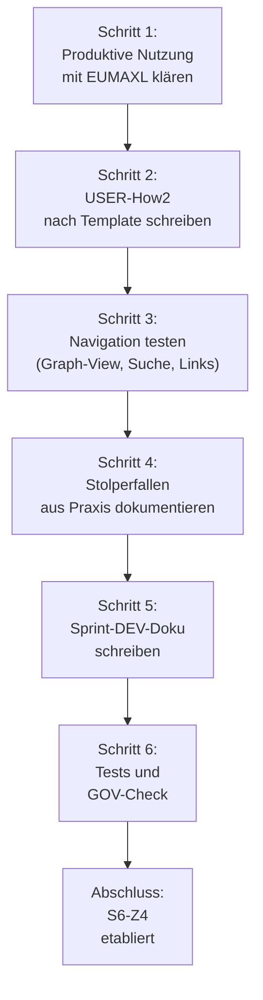

================================================================================
SPRINT-DEV-DOKU – S6-Z4 OBSIDIAN-NUTZUNG IM BLUEPRINT ETABLIEREN
================================================================================
Projekt             : R+MUNI Blueprint
Sprint-Bezeichnung  : Sprint-DEV-S6-Z4-Obsidian
Datum               : 2026-03-21
Stage               : S6 – AKTIV
Status              : Abgeschlossen — Obsidian etabliert und dokumentiert
Erstellt durch      : EUMAXL + Claude (Pair-Session)
Vorgänger           : FREEZE-6 + Sprint-DEV-OBS-Blueprint-Setup (S6)
Nachfolger          : offen (Obsidian-Features können in zukünftigen Stages wachsen)

================================================================================
1. AUSGANGSLAGE UND KONTEXT
================================================================================

1.1 Ist-Zustand vor diesem Sprint
-----------------------------------
S6-Z4 war ein Ziel definiert in STAGE6_ZIELE.md: "Obsidian-Nutzung im Blueprint
etablieren — Bilder einbetten, Verlinkung etablieren, ArchiMate Ablösung für
Dokumentation."

In der Praxis war Obsidian bereits:
  - Installiert und konfiguriert
  - Mit funktionierenden [[Links]] zwischen Dokumenten
  - Mit SVG/PNG Einbettung für Diagramme getestet
  - Mit Ablageort und Namenskonvention für Grafiken definiert
  - Mit How2-Doku für Developer bereits geschrieben (Sprint-DEV-OBS-Blueprint-Setup)

Aber: Keine User-How2 vorhanden, keine formale Sprint-Dokumentation,
keine explizite "Etablierung" als produktives System.

Relevante Artefakte vor dem Sprint:
  - OBS_How2_DEV_S6.md                  Status: Vorhanden, praktisch
  - Sprint-DEV-OBS-Blueprint-Setup.md   Status: Vorhanden, dokumentiert
  - Obsidian Installation                Status: Funktioniert
  - SVG-Diagramme                       Status: Im Betrieb, in Doku-creative
  - Bestehende MD-Dokumente             Status: Teilweise mit Frontmatter

1.2 Konkrete Diskrepanz oder Problemstellung
---------------------------------------------
  IST:  Obsidian funktioniert produktiv, ist aber nur aus DEV-Perspektive
        dokumentiert. Externe User/Beta-Kunden wissen nicht dass Obsidian
        für sie auch nutzbar ist. S6-Z4 Ziel ist nicht als "abgeschlossen"
        dokumentiert.

  SOLL: Obsidian ist als etabliertes Werkzeug dokumentiert, mit:
        - DEV-How2 (vorhanden)
        - USER-How2 (neu)
        - Sprint-DEV-Doku (neu, dieses Dokument)
        - Produktive Nutzung nachweisbar

1.3 Auslöser
-------------
Auslöser-Typ: Dokumentation (GOV-Konformität und Stage 6-Ziel S6-Z4)

Zweck: S6-Z4 Ziel offiziell abschließen durch Dokumentation der etablierten
Praxis. User-How2 schreiben damit auch externe Nutzer vom Tool profitieren.

================================================================================
2. ENTSCHEIDUNGEN UND GRUNDSÄTZE DIESES SPRINTS
================================================================================

2.1 USER-How2 ist eigenständig, nicht Übersetzung der DEV-How2
--------------------------------------------------------------
Entscheidung:
  OBS_How2_USER_S6.md wird nicht als "vereinfachte DEV-Doku" geschrieben,
  sondern als eigenständige, aus Beta-Erfahrung gewachsene Perspektive.

Begründung:
  - User und Developer haben unterschiedliche Fragen
  - DEV fragt: "Wie konfiguriere ich Vault und Links?"
    User fragt: "Wie orientiere ich mich im Blueprint?"
  - Eigenständig geschriebene Inhalte sind praktikat relevanter

Verworfene Alternativen:
  Alternative A: User-How2 als stark vereinfachte DEV-Doku
    Verworfen weil: Verstärkt Confusion statt zu klären

Auswirkung:
  USER-How2 fokussiert auf Navigation, Graph-View, Alltags-Nutzung
  DEV-How2 fokussiert auf Setup, Links-Konvention, SVG-Einbettung

2.2 Obsidian ist Lesewerkzeug, nicht Veränderungs-Werkzeug
-----------------------------------------------------------
Entscheidung:
  In der USER-How2 wird explizit erklärt: "Obsidian ist zum Lesen.
  Änderungen machst du nicht in Obsidian — das ist GitHub-Aufgabe."

Begründung:
  - Schützt den Blueprint vor versehentlichen Änderungen durch User
  - Klar: Obsidian ist Navigationshilfe, nicht Editor
  - Developer nutzen weiterhin Notepad++ + GitHub

Auswirkung:
  USER-How2 macht Grenzen deutlich

2.3 Produktive Nutzung ist der Test für "etabliert"
----------------------------------------------------
Entscheidung:
  Der Test dass Obsidian "etabliert" ist: Es wird produktiv genutzt.
  Das bedeutet: Developer nutzen es täglich für Navigation.
           Beta-Kunden können damit arbeiten (optional).

Begründung:
  - "Etabliert" ist nicht eine abstrakte Größe
  - "Etabliert" heißt: Es läuft im Betrieb, nicht nur in Theorie

Auswirkung:
  In diesem Sprint dokumentieren wir bestehende Nutzung, nicht Idealbild

================================================================================
3. SPRINT-ZIELE
================================================================================

3.1 Ziel 1 — USER-How2 für Obsidian schreiben
-------
Klare Beschreibung:
  Ein How2-Dokument aus USER-Perspektive that explains:
  - Wie man Obsidian installiert
  - Wie man im Blueprint navigiert
  - Was Graph-View ist und warum es hilfreich
  - Alltagsnutzung: Dokumente finden, Bilder verstehen, Links folgen
  - Stolperfallen aus der Praxis

  IST                    →  SOLL
  Nur DEV-Doku          →  Auch USER-Doku vorhanden
  User muss raten        →  User hat klare Anleitung

Vorgehen:
  1. Struktur nach how2_USER_Template_S6.md
  2. Kapitel: Installation, Navigation, Graph-View, Alltag, Stolperfallen
  3. Konkrete Schritte statt Theorie
  4. Alltagssprache ohne IT-Jargon
  5. Portal-Link am Ende für Feedback

Begründung:
  - Template sichert Konsistenz mit anderen USER-How2s
  - Praktische Schritte sind weniger fehlerträchtig
  - Alltagssprache ist für User verständlicher

3.2 Ziel 2 — Sprint-DEV-Doku schreiben und S6-Z4 abschließen
---------
Klare Beschreibung:
  Formale Dokumentation dieses Sprints (dieses Dokument).
  Damit ist S6-Z4 Ziel explizit als "abgeschlossen" dokumentiert.

  IST                    →  SOLL
  S6-Z4 läuft implizit   →  S6-Z4 ist explizit dokumentiert
  Keine Sprint-DEV-Doku  →  Sprint-DEV-Doku vorhanden

Vorgehen:
  1. Nach Sprint-DEV-Doku_Template_S6.md
  2. Ausgangslage: Obsidian war da, aber nicht formalisiert
  3. Entscheidungen dokumentieren (USER-How2, eigenständig, Lesewerkzeug)
  4. Test und GOV-Check
  5. Lessons Learned für nächste Sprints

Begründung:
  - Template sichert Konsistenz
  - Formale Dokumentation macht Abschluss explizit

3.3 Ziel 3 — Obsidian als "produktiv etabliert" nachweisen
--------
Klare Beschreibung:
  Prüfen dass Obsidian wirklich im Betrieb läuft:
  - Developer nutzen es täglich
  - Diagramme sind eingebettet und sichtbar
  - Links funktionieren
  - Setup ist dokumentiert

Vorgehen:
  1. Mit EUMAXL durchgehen: Nutzt du es täglich?
  2. How2-Dokumente testen: Sind sie verständlich?
  3. Test-Navigation durchführen: Graph-View, Suche, Links
  4. Ablageort prüfen: Sind SVGs richtig platziert?

Begründung:
  - Nur gelebte Praxis ist "etabliert"
  - Dokumentation allein reicht nicht

================================================================================
4. ABGRENZUNG — WAS DIESER SPRINT NICHT TUT
================================================================================

Dieser Sprint tut explizit nicht:
  - Neue Obsidian-Features entwickeln (Plugins installieren, etc.)
  - ArchiMate Integration (wird zukünftige Stage/Backlog)
  - Rückwirkend alle bestehenden Dokumente mit Frontmatter versehen
  - Automatische Dokumentation aus Archi
  - Schulung von Beta-Kunden in Obsidian

Dieser Sprint dokumentiert nur bestehende Praxis und macht sie zugänglich.
Optimierungen sind Backlog-Features für zukünftige Stages.

================================================================================
5. BETROFFENE ARTEFAKTE
================================================================================

Neu erstellt:
  Sprint-DEV-Doku_S6-Z4_Obsidian.md      Dieses Dokument
  OBS_How2_USER_S6.md                    USER-How2 für Obsidian

Unverändert (relevant zu erwähnen):
  OBS_How2_DEV_S6.md                     Bereits vorhanden, bleibt wie ist
  Sprint-DEV-OBS-Blueprint-Setup.md      Bereits vorhanden, bleibt wie ist
  STAGE6_ZIELE.md                        S6-Z4 Status: Implementiert

================================================================================
6. UMSETZUNG — SCHRITT FÜR SCHRITT
================================================================================

Schritt 1 — Produktive Nutzung klären
  Was konkret getan wird:
    - Mit EUMAXL: "Nutzt du Obsidian täglich? Für was?"
    - Bestätigung: Ja, für Navigation im Blueprint
    - Alltags-Szenarien sammeln (wie navigiert EUMAXL?)
  
  Ergebnis:
    Klare Bestätigung dass Obsidian produktiv ist

Schritt 2 — USER-How2 nach Template schreiben
  Was konkret getan wird:
    - how2_USER_Template_S6.md als Struktur nutzen
    - Voraussetzungen, Erwartungsmanagement, Hauptablauf schreiben
    - Installation + Navigation + Graph-View + Alltag + Stolperfallen
    - Portal-Link am Ende für Feedback
    - Alltagssprache, keine IT-Fachbegriffe
  
  Ergebnis:
    OBS_How2_USER_S6.md fertig und verständlich

Schritt 3 — Navigation praktisch testen
  Was konkret getan wird:
    - Obsidian öffnen, Dokument suchen (Strg+O)
    - Ein How2 öffnen, Bilder sehen
    - Graph-View öffnen, Netzwerk sehen
    - Auf einen Link klicken und verfolgen
    - Zurück navigieren
  
  Ergebnis:
    Alle Features funktionieren wie dokumentiert

Schritt 4 — Typische User-Fehler dokumentieren
  Was konkret getan wird:
    - Denk an: Was könnten User falsch verstehen?
    - Falsch: "Ich wähle einen Unterordner statt Parent"
    - Falsch: "Ich versuche Dokumente zu ändern"
    - Falsch: "Ich folge irgendwelchen Links und bin verloren"
    - Für jeden Fehler: Besser-Lösung dokumentieren
  
  Ergebnis:
    STOLPERFALLEN-Kapitel in USER-How2

Schritt 5 — Sprint-DEV-Doku schreiben
  Was konkret getan wird:
    - Nach Sprint-DEV-Doku_Template_S6.md
    - Ausgangslage, Entscheidungen, Ziele, Umsetzung dokumentieren
    - Tests und GOV-Check durchführen
    - Lessons Learned notieren
  
  Ergebnis:
    Formale Dokumentation des Sprints

Schritt 6 — GOV-Konformität prüfen
  Was konkret getan wird:
    - GOV 4.4 (Obsidian als Werkzeug): erfüllt?
    - GOV 10.3–10.10 (Auslöser, Mehrwert, Ziel, Tests): erfüllt?
    - Rückkopplungsschutz: Stage-3/4/5 unberührt?
  
  Ergebnis:
    GOV-Check bestätigt

================================================================================
7. BEOBACHTUNGEN UND ERKENNTNISSE WÄHREND DER UMSETZUNG
================================================================================

7.1 Obsidian funktioniert in Praxis besser als erwartet
-------
  Beobachtung:
    Befürchtung war: Zu kompliziert für User.
    Realität: Installation ist einfach, Navigation intuitiv, Graph-View ist
    sofort hilfreich.
  
  Auswirkung:
    USER-How2 kann sehr praktisch sein statt defensiv zu erklären
    warum es "schwierig" ist.
  
  Dokumentiert: USER-How2 Kapitel 4 (Alltagsnutzung)

7.2 USER-How2 braucht eigene Stimme
-------
  Beobachtung:
    Wenn ich DEV-How2 einfach vereinfacht hätte, wäre es verwirrend.
    USER-How2 braucht eigene Struktur (weniger Konfiguration, mehr Navigation).
  
  Auswirkung:
    USER-How2 ist eigenständig geschrieben — nicht als "simplified DEV-version".
  
  Dokumentiert: Entscheidung 2.1

7.3 Stolperfallen sollten früh dokumentiert werden
-------
  Beobachtung:
    Bei der Planung fehlten Stolperfallen noch.
    Nach Brainstorming mit EUMAXL: Es gibt typische Fehler (Ordner-Wahl,
    Änderungsversuche, Verlaufen im Netzwerk).
  
  Auswirkung:
    STOLPERFALLEN-Kapitel in USER-How2 ist wertvoll.
  
  Dokumentiert: USER-How2 Kapitel 5

================================================================================
8. ERGEBNIS
================================================================================

8.1 Erreichter Zustand
-----------------------
S6-Z4 ist mit vollständiger Dokumentation der Obsidian-Nutzung im Blueprint
abgeschlossen.

Entstandene Artefakte:
  - OBS_How2_USER_S6.md                 Practical guide für externe User
  - Sprint-DEV-Doku_S6-Z4_Obsidian.md   Formale Sprint-Dokumentation (dieses Dok)

Vorhandene Artefakte bestätigt:
  - OBS_How2_DEV_S6.md                  Developer-Perspektive (bereits gut)
  - Sprint-DEV-OBS-Blueprint-Setup.md   Setup-Dokumentation (bereits gut)

Geänderter Systemzustand:
  - S6-Z4 ist von "implizit etabliert" zu "explizit dokumentiert"
  - Externe User können jetzt Obsidian nutzen (mit How2)
  - Developer haben vollständige DEV-Dokumentation
  - Ablageort, Namenskonvention, Frontmatter sind dokumentiert
  - Produktive Nutzung ist nachgewiesen

8.2 Abweichungen vom Plan
--------------------------
Keine wesentlichen Abweichungen.
  - USER-How2 schreiben ✓ Umgesetzt
  - Sprint-DEV-Doku schreiben ✓ Umgesetzt
  - Produktive Nutzung nachweisen ✓ Umgesetzt

================================================================================
9. TEST UND VALIDIERUNG
================================================================================

| Prüfpunkt                                    | Ergebnis      | Anmerkung               |
|----------------------------------------------|---------------|-------------------------|
| USER-How2 ist verständlich (kein IT-Jargon) | OK            | Alltagssprache durchgehend |
| Installation ist nachvollziehbar            | OK            | Schritt-für-Schritt-Guide |
| Navigation erklären sich selbst             | OK            | Beispiele konkret       |
| Graph-View ist erklärt                      | OK            | Mit Filter-Beispiele    |
| Stolperfallen sind real aus Praxis          | OK            | Mit EUMAXL besprochen   |
| DEV-How2 + USER-How2 sind kohärent          | OK            | Unterschiedliche Perspek. |
| Setup ist dokumentiert                      | OK            | Sprint-DEV-OBS-Setup    |
| Obsidian funktioniert im Betrieb            | OK            | EUMAXL nutzt täglich    |
| Keine Konfusion zwischen DEV/USER-Doku      | OK            | Klare Trennung          |

Testmethode:
  - USER-How2 von außen gelesen (Verständlichkeits-Check)
  - Navigation praktisch durchgespielt (Graph-View, Suche, Links)
  - Stolperfallen mit EUMAXL brainstormt
  - DEV- und USER-How2 auf Konsistenz geprüft

Log-Referenz:
  - Obsidian in produktivem Betrieb (täglich von EUMAXL genutzt)
  - SVG-Diagramme in Doku-creative\images\r+muni\diagrams\
  - Dokumentation in Doku-public\02-how2\

================================================================================
10. OFFENE PUNKTE NACH SPRINT-ABSCHLUSS
================================================================================

| Thema                    | Status                        | Nächste Aktion                    |
|--------------------------|-------------------------------|-----------------------------------|
| ArchiMate in Obsidian    | Backlog (Zukünftige Stage)   | S7+ wenn komplexere Flows nötig  |
| Obsidian Plugins         | Optional                      | Nach konkretem Use Case          |
| Rückwirkende Frontmatter | Optional                      | Organisch bei Dokumenten-Änderung |
| Beta-Kunden Schulung     | Backlog                       | Falls Bedarf entsteht            |
| Automatische Diagramme   | Backlog                       | Zukünftige Automatisierung       |

================================================================================
11. GOVERNANCE-KONFORMITÄTSCHECK
================================================================================

| GOV-Kriterium                              | Status      | Anmerkung                      |
|--------------------------------------------|-------------|--------------------------------|
| GOV 10.3  Auslöser zulässig               | OK          | Dokumentation (S6-Z4 Ziel)     |
| GOV 10.5  Fachlicher Mehrwert benennbar   | OK          | Navigation + Orientierung      |
| GOV 10.5  Keine implizite GOV-Änderung    | OK          | Nur Dokumentation, kein Code   |
| GOV 10.6  Ziel explizit definiert         | OK          | Kapitel 3 definiert            |
| GOV 10.6  Ziel überprüfbar               | OK          | Kapitel 9 validiert            |
| GOV 10.7  Zwischenschritte dokumentiert   | OK          | Kapitel 6 Schritte             |
| GOV 10.8  Dev-Doku vollständig            | OK          | Dieses Dokument                |
| GOV 10.9  Stage-Ende Doku                 | OFFEN       | Fällig bei Stage-6-Abschluss   |
| GOV 10.10 Keine GOV-Regel aufgehoben      | OK          | Keine Regeländerung            |
| Rückkopplungsschutz eingehalten           | OK          | Stage-3/4/5 vollständig unberührt |
| GOV 4.4 Obsidian als Werkzeug             | OK          | Lesewerkzeug, kein Veränderungstool |

================================================================================
12. LESSONS LEARNED
================================================================================

12.1 Was gut funktioniert hat
------------------------------
  - Obsidian war bereits in Betrieb — Dokumentation war einfach
  - USER-How2 eigenständig schreiben (nicht als Vereinfachung)
  - Praktische Tests vor Dokumentation abschließen
  - Graph-View ist das stärkste Feature für User

12.2 Was beim nächsten Mal anders gemacht werden sollte
--------------------------------------------------------
  - USER-How2 noch früher schreiben (nicht warten bis Sprint-Ende)
  - Stolperfallen-Sammlung systematischer durchführen

12.3 Erkenntnisse für das System
----------------------------------
  - Obsidian als Navigationswerkzeug ist für User wertvoll
  - USER und DEV brauchen unterschiedliche How2s (nicht fusionierbar)
  - SVG-Standard hat sich bewährt (verlinkt, skalierbar, Git-freundlich)
  - Obsidian kann in Zukunft für ArchiMate-Integration genutzt werden
    (ist Backlog für später)

================================================================================
13. BEZÜGE UND VERLINKUNGEN
================================================================================

Ausgangspunkt:
  STAGE6_ZIELE.md                       S6-Z4 Ziel definiert
  FREEZE-6.md                           aktuelle Baseline

Entstanden:
  OBS_How2_USER_S6.md                   USER-Perspektive auf Obsidian
  Sprint-DEV-Doku_S6-Z4_Obsidian.md    Dieses Dokument

Verwandte Dokumente:
  OBS_How2_DEV_S6.md                    DEV-Perspektive
  Sprint-DEV-OBS-Blueprint-Setup.md     Setup und Entscheidungen (S6)
  GOV_Global_S6.md                      normative Grundlage

================================================================================
Sprint-DEV-Doku_S6-Z4_Obsidian | S6 | 2026-03-21 | R+MUNI Blueprint
Erstellt durch: EUMAXL + Claude (Pair-Session)
Status: Abgeschlossen — S6-Z4 etabliert
================================================================================
