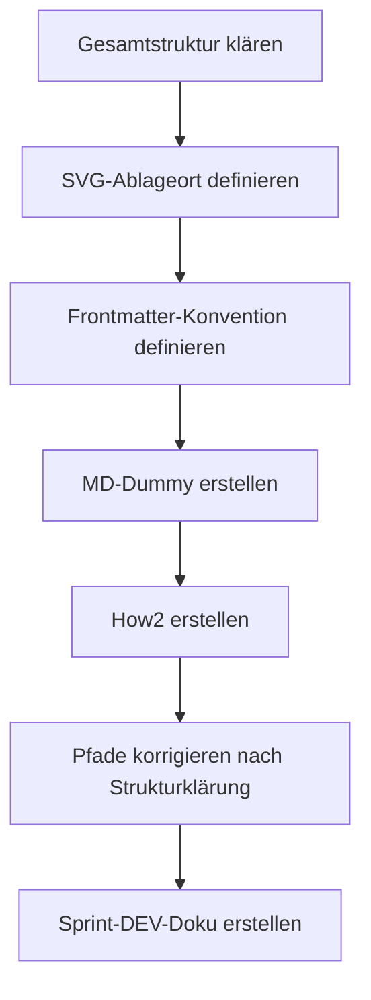

================================================================================
SPRINT-DEV-DOKU – OBS-Blueprint-Setup
================================================================================
Projekt             : R+MUNI Blueprint
Sprint-Bezeichnung  : Sprint-DEV-OBS-Blueprint-Setup
Datum               : 2026-03-19
Stage               : S6 – AKTIV
Status              : Abgeschlossen
Erstellt durch      : EUMAXL + Claude (Pair-Session)
Vorgänger           : [[FREEZE-6]]
Nachfolger          : noch offen
================================================================================

================================================================================
1. AUSGANGSLAGE UND KONTEXT
================================================================================

1.1 Ist-Zustand vor diesem Sprint
-----------------------------------
Obsidian war installiert und erste [[Link]]-Versuche waren gemacht.
Eine Verbindung zwischen Dokumenten und Visualisierungsabhängigkeiten
war punktuell hergestellt – aber ohne Konvention, ohne Ablageregeln
für Diagramme und ohne definiertes Arbeitsmodell für den Blueprint-Alltag.

Relevante Artefakte vor dem Sprint:
  - Obsidian Installation          Status: vorhanden, kaum genutzt
  - Blueprint MD-Dokumente         Status: vorhanden, keine Frontmatter-Konvention
  - SVG/PNG Diagramme              Status: kein definierter Ablageort
  - How2-Dokumente                 Status: vorhanden, ohne Obsidian-Links

Bezug: [[FREEZE-6]]

1.2 Konkrete Diskrepanz oder Problemstellung
---------------------------------------------
  IST:  Diagramme aus Claude-Sessions gehen verloren – kein Ablageort,
        keine Einbettung in MD-Dokumente, keine Konvention
  SOLL: Diagramme (SVG aus Archi + SVG von Claude) landen dauerhaft im
        Blueprint und sind in Obsidian sichtbar und navigierbar

  IST:  Obsidian läuft neben dem Blueprint – kein definiertes Arbeitsmodell
  SOLL: Obsidian ist zentrales DEV-Werkzeug mit klaren Konventionen für
        Vault-Setup, Links, Frontmatter und Diagramm-Einbettung

  IST:  Neue MD-Dokumente entstehen ohne Vorlage – Frontmatter fehlt,
        [[Links]] fehlen, keine Strukturvorgabe
  SOLL: Ein Dummy-Dokument dient als Vorlage für alle Blueprint-Dokumenttypen

1.3 Auslöser
-------------
Auslöser-Typ: Entwicklerwunsch / Strukturbereinigung

Erkenntnisse aus der heutigen Design-Session haben gezeigt dass
Diagramme aus Claude-Sessions immer wieder verloren gehen und
Obsidian zwar vorhanden ist aber kein definiertes Arbeitsmodell hat.
Der Zeitpunkt wurde durch die parallele Arbeit an der Appliance-VM
und dem Obsidian-Thema S6-Z4 bestimmt.

================================================================================
2. ENTSCHEIDUNGEN UND GRUNDSÄTZE DIESES SPRINTS
================================================================================

2.1 SVG als primäres Diagrammformat
-------------------------------------
Entscheidung:
  SVG ist das bevorzugte Format für alle Blueprint-Diagramme –
  sowohl für Archi-Exporte als auch für Claude-generierte Diagramme.

Begründung:
  SVG ist XML – Git trackt Änderungen zeilengenau, Notepad++ kann es
  lesen und bearbeiten, es skaliert verlustfrei auf jedem Bildschirm,
  Archi exportiert nativ als SVG, Claude generiert SVG direkt,
  und Obsidian rendert SVG ohne Plugin.

Verworfene Alternativen:
  Alternative A: PNG als Standard
    Verworfen weil: Binärformat, kein Git-Diff, nicht editierbar,
    verliert Qualität bei Skalierung
  Alternative B: Mermaid direkt im MD
    Nicht verworfen – ergänzend zulässig für einfache Flows,
    aber SVG bleibt Standard für Archi-Exports und Claude-Diagramme

Auswirkung:
  Ablageort definiert: R+MUNI Doku-creative\images\r+muni\diagrams\
  Namenskonvention definiert (siehe How2)
  PNG bleibt als Fallback zulässig – nicht als Standard

2.2 Vault-Root auf Parent-Ordner aller R+MUNI Ordner
------------------------------------------------------
Entscheidung:
  Obsidian-Vault zeigt auf den Parent-Ordner aller R+MUNI Ordner –
  nicht auf einen einzelnen Unterordner.

Begründung:
  Nur so funktionieren [[Links]] zwischen Dokumenten die in
  verschiedenen Sub-Repos liegen (Doku-public, Doku-internal,
  R+MUNI Programm-Ordner). Ein Vault auf Unterordner-Ebene würde
  Cross-Repo-Links unmöglich machen.

Verworfene Alternativen:
  Alternative A: Vault direkt auf R+MUNI Programm-Ordner
    Verworfen weil: Doku-public und Doku-internal wären außerhalb
    des Vaults – keine Links möglich
  Alternative B: Separate Vaults pro Sub-Repo
    Verworfen weil: Graph-View würde keine Gesamtübersicht zeigen,
    Cross-Repo-Links funktionieren nicht

Auswirkung:
  .obsidian/ muss in .gitignore aller betroffenen Repos eingetragen sein

2.3 .md als führende Quelle – Jira und Confluence als optionale Addons
-----------------------------------------------------------------------
Entscheidung:
  Die .md Datei in Doku-internal\backlog\ ist immer die führende Quelle.
  Jira-Tickets und Confluence-Seiten sind optionale Spiegel –
  nur auf explizite Ansage zu befüllen, inhaltlich 1:1 aus der .md.

Begründung:
  .md ist immer vorhanden, unabhängig von externen Tools,
  immer in Git versioniert. Jira und Confluence sind Addons
  im Baumprinzip – sie folgen der .md, nicht umgekehrt.
  Kein Drift durch zu viele parallele Stände.

Verworfene Alternativen:
  Alternative A: Jira als führende Quelle
    Verworfen weil: Jira ist nicht immer verfügbar, kein Git-Versionierung,
    Abhängigkeit von externem Tool
  Alternative B: Gleichwertige Quellen, manueller Abgleich
    Verworfen weil: führt unweigerlich zu Drift zwischen den Ständen

Auswirkung:
  Claude erstellt immer zuerst .md, Jira-Sync nur auf explizite Ansage
  Sync-Richtung: immer .md → Jira, nie umgekehrt

2.4 Frontmatter als Pflicht für alle Blueprint-MD-Dokumente
------------------------------------------------------------
Entscheidung:
  Alle Blueprint-MD-Dokumente beginnen mit Frontmatter-Block.
  Pflichtfelder: title, stage, status, typ, datum, autor, tags.

Begründung:
  Obsidian liest Frontmatter und macht Dokumente durchsuchbar und
  filterbar. Ohne Frontmatter ist kein sinnvoller Graph-View möglich
  und Dokumente sind nicht kategorisierbar.

Verworfene Alternativen:
  Alternative: Optionales Frontmatter
    Verworfen weil: ohne konsequente Nutzung verliert der Graph-View
    seinen Mehrwert – halbherzige Umsetzung bringt nichts

Auswirkung:
  DUMMY_Blueprint_MD_Obsidian_S6.md enthält Frontmatter als Vorlage
  Bestehende Dokumente werden schrittweise nachgezogen (kein Zwang rückwirkend)

================================================================================
3. SPRINT-ZIELE
================================================================================

3.1 Ziel 1 — Obsidian How2 für DEV
-------------------------------------
Verbindliches How2-Dokument das Obsidian als DEV-Werkzeug im Blueprint
definiert – mit Vault-Setup, [[Link]]-Konvention, SVG-Einbettung,
Frontmatter-Konvention, Ablage-Übersicht und Entscheidungshilfe.

  IST                                →  SOLL
  Kein Obsidian-How2 vorhanden       →  OBS_How2_DEV_S6.md vorhanden
  Keine SVG-Ablagekonvention         →  Ablageort + Namenskonvention definiert
  Keine Vault-Setup-Anleitung        →  Schritt-für-Schritt Anleitung vorhanden
  Keine Frontmatter-Konvention       →  Pflichtfelder definiert

Vorgehen:
  How2 nach Template Sprint-DEV-BACKLOG_Template_S6 erstellt,
  Ablageort aus realer Struktur abgeleitet (nach Klärung der Gesamtstruktur),
  SVG-Pfade auf Doku-creative korrigiert.

Begründung für dieses Vorgehen:
  How2 gehört in Doku-public weil es Release-Doku ist – für alle User
  und DEV zugänglich, öffentlich, versioniert in GitHub public.

3.2 Ziel 2 — MD-Dummy als Blueprint-Vorlage
---------------------------------------------
Ein generischer Dummy der als Kopiervorlage für alle neuen
Blueprint-Dokumente dient – mit allen Elementen die Obsidian
optimal nutzt: Frontmatter, [[Links]], SVG-Einbettung, PNG-Fallback,
Tabelle, optische Elemente.

  IST                                →  SOLL
  Keine MD-Vorlage vorhanden         →  DUMMY_Blueprint_MD_Obsidian_S6.md
  Neue Dokumente ohne Struktur       →  Neue Dokumente kopieren von Dummy

Vorgehen:
  Dummy nach realen Anforderungen aus der Session erstellt,
  alle drei Diagrammtypen enthalten (SVG Archi, SVG Claude, PNG),
  Pfade auf korrekte Doku-creative Struktur gesetzt.

Begründung:
  Dummy gehört in Doku-public als Vorlage – öffentlich zugänglich,
  nicht in Doku-internal weil es kein internes Arbeitsdokument ist.

================================================================================
4. ABGRENZUNG — WAS DIESER SPRINT NICHT TUT
================================================================================

Dieser Sprint tut explizit nicht:
  - Bestehende Dokumente rückwirkend mit Frontmatter nachziehen
  - Obsidian-Plugins konfigurieren (Dataview, Templater) – nur erwähnt
  - Mermaid als Standard definieren – ergänzend zulässig, nicht Standard
  - coArchi-Sync oder GitHub-Sync aufbauen – eigener Sprint
  - Appliance-VM umsetzen – nur Backlog-Dokument erstellt
  - Proxmox-Cluster aufbauen – nur Design-Entscheidungen dokumentiert

Begründung der wichtigsten Ausschlüsse:
  Rückwirkende Frontmatter-Nachpflege: zu aufwändig für einen Sprint,
  schrittweise organisch sinnvoller – kein Zwang rückwirkend laut GOV.
  Appliance-VM und Proxmox-Cluster: eigene Sprints mit eigenem Backlog,
  heute nur Entscheidungen und Backlog-Eintrag entstanden.

================================================================================
5. BETROFFENE ARTEFAKTE
================================================================================

Neu erstellt:
  OBS_How2_DEV_S6.md                 How2 Obsidian DEV
                                     Ablage: Doku-public\02-how2\
  DUMMY_Blueprint_MD_Obsidian_S6.md  MD-Vorlage für alle Dokumenttypen
                                     Ablage: Doku-public\
  Sprint-DEV-BACKLOG_Appliance-VM_S6.md  Backlog Appliance VM
                                     Ablage: Doku-internal\backlog\
  Sprint-DEV-OBS-Blueprint-Setup.md  Dieses Dokument
                                     Ablage: Doku-internal\sprints\

Geändert:
  MUNIEA-145 (Jira)                  Bereinigt auf reinen Backlog-Inhalt,
                                     technische Infrastruktur-Details entfernt

Unverändert (relevant zu erwähnen):
  GOV_Global_S6                      Keine GOV-Änderung – Obsidian ist
                                     additive Nutzung bestehender Struktur
  Stage-3/4/5-Scripts                vollständig unberührt

================================================================================
6. UMSETZUNG — SCHRITT FÜR SCHRITT
================================================================================

Schritt 1 — Gesamtstruktur verstehen
  Aus dem manuell bereinigten tree-Export die 4 Umgebungen interpretiert:
  R+MUNI (Programm), R+MUNI Apps, R+MUNI Archiv, R+MUNI Doku.
  Doku hat drei Sub-Umgebungen mit unterschiedlichen Sync-Strategien.
  Ergebnis: Klares Bild welches Dokument wo hingehört.

Schritt 2 — SVG-Ablageort festlegen
  Erkenntnis: SVG-Diagramme gehören NICHT in den Programm-Ordner
  (00-model\assets) sondern in Doku-creative\images\r+muni\diagrams\.
  Begründung: Doku-creative ist der richtige Ort für alle visuellen
  Assets – Archi-Exports, Claude-SVGs, PNGs, Logos.
  Ergebnis: Ablagekonvention definiert und in How2 dokumentiert.

Schritt 3 — MD-Dummy erstellen
  Vorlage mit allen relevanten Elementen gebaut:
  Frontmatter, [[Links]], drei Diagrammtypen, Tabelle, optische Elemente.
  Erste Version hatte falsche Pfade (00-model\assets) – nach
  Strukturklärung auf Doku-creative korrigiert.
  Ergebnis: DUMMY_Blueprint_MD_Obsidian_S6.md mit korrekten Pfaden.

Schritt 4 — How2 erstellen
  How2 nach Template gebaut mit allen Kapiteln:
  Vault-Setup, [[Link]]-Konvention, SVG-Einbettung, Frontmatter,
  Ablage-Übersicht, Graph-View, Fehlerbilder, Entscheidungshilfe.
  Erste Version hatte ebenfalls falsche Pfade – zusammen mit Dummy
  in einem finalen Durchgang korrigiert.
  Ergebnis: OBS_How2_DEV_S6.md mit korrekten Pfaden.

Schritt 5 — Backlog Appliance VM erstellen
  Aus der parallelen Design-Diskussion (Infrastruktur, Proxmox,
  MS-01, DAC, Active-Backup Bond, VM-Konzept) ein vollständiges
  Backlog-Dokument nach Template gebaut.
  Erstes Jira-Ticket enthielt zu viele Infrastruktur-Details –
  nach Rückmeldung auf reinen Backlog-Inhalt bereinigt.
  Ergebnis: Sprint-DEV-BACKLOG_Appliance-VM_S6.md + MUNIEA-145.

================================================================================
7. BEOBACHTUNGEN UND ERKENNTNISSE WÄHREND DER UMSETZUNG
================================================================================

7.1 Pfade müssen aus echter Struktur abgeleitet werden
-------------------------------------------------------
  Claude hat initial SVG-Ablageort falsch gesetzt (00-model\assets)
  weil die Gesamtstruktur nicht bekannt war.
  Auswirkung: Beide Dokumente mussten nach Strukturklärung korrigiert werden.
  Erkenntnis: Vor Dokumenten-Erstellung immer Struktur klären –
  nie Pfade aus Annahmen ableiten.
  Dokumentiert: In How2 explizit als Ablage-Übersicht verankert.

7.2 Jira-Ticket darf nicht vom .md abweichen
---------------------------------------------
  Erstes Ticket enthielt technische Infrastruktur-Details die nicht
  ins Backlog-Dokument gehören – Drift zwischen .md und Ticket.
  Auswirkung: Ticket musste bereinigt werden.
  Erkenntnis: .md ist immer führend, Ticket ist 1:1 Spiegel.
  Dokumentiert: Als Arbeitsregel verankert (Kapitel 2.3).

7.3 How2 vs. Sprint-DEV-Doku Trennung
---------------------------------------
  Initially wurde das How2 als einziges Dokument erstellt – die
  Sprint-DEV-Doku fehlte. Erst auf Rückmeldung nachgezogen.
  Erkenntnis: How2 = Referenz für die Zukunft.
              Sprint-DEV-Doku = Arbeitsgedächtnis dieses Sprints.
              Beides ist nötig – sie haben unterschiedliche Zwecke.

================================================================================
8. ERGEBNIS
================================================================================

8.1 Erreichter Zustand
-----------------------
Obsidian hat jetzt ein vollständiges Regelwerk für die DEV-Nutzung
im Blueprint. Neue Dokumente können nach Vorlage erstellt werden.
SVG-Diagramme haben einen definierten Ablageort und Namenskonvention.
Die Sync-Regel .md → Jira ist explizit definiert und dokumentiert.

Entstandene Artefakte:
  - OBS_How2_DEV_S6.md              Doku-public\02-how2\
  - DUMMY_Blueprint_MD_Obsidian_S6.md  Doku-public\
  - Sprint-DEV-BACKLOG_Appliance-VM_S6.md  Doku-internal\backlog\
  - Sprint-DEV-OBS-Blueprint-Setup.md  Doku-internal\sprints\
  - MUNIEA-145                       Jira R+MUNI EA – Backlog

Geänderter Systemzustand:
  Obsidian-Nutzung ist jetzt normativ definiert – nicht mehr
  ad-hoc. SVG-Ablagestruktur ist klar. MD-Vorlagen existieren.

8.2 Abweichungen vom Plan
--------------------------
  Pfade in beiden Dokumenten mussten nach Strukturklärung korrigiert
  werden – zwei Iterationen statt einer.
  Begründung: Struktur war zu Beginn nicht vollständig bekannt.
  Konsequenz: Beim nächsten Mal Struktur vor Dokumenten-Erstellung klären.

================================================================================
9. TEST UND VALIDIERUNG
================================================================================

| Prüfpunkt                                         | Ergebnis  | Anmerkung                    |
|---------------------------------------------------|-----------|------------------------------|
| How2 enthält alle Pflichtkapitel                  | OK        | Vault, Links, SVG, Frontmatter|
| Dummy enthält alle definierten Elemente           | OK        | FM, Links, SVG, PNG, Tabelle |
| SVG-Pfade zeigen auf Doku-creative                | OK        | Nach Korrektur final         |
| Ablage-Übersicht stimmt mit echter Struktur       | OK        | Vom DEV bestätigt            |
| Backlog-Dokument GOV-konform                      | OK        | 6 Kapitel nach Template      |
| Jira-Ticket = .md Inhalt ohne Drift               | OK        | Nach Bereinigung bestätigt   |
| Stage-3/4/5-Scripts logisch unverändert           | OK        | Kein Eingriff in Scripts     |
| Kein unbeabsichtigter Seiteneffekt                | OK        | Nur neue Dokumente erstellt  |

Testmethode:
  Manuelle Prüfung durch DEV – Pfade gegen reale Struktur geprüft,
  Jira-Ticket gegen .md Inhalt verglichen.

================================================================================
10. OFFENE PUNKTE NACH SPRINT-ABSCHLUSS
================================================================================

| Thema                              | Status          | Nächste Aktion                              |
|------------------------------------|-----------------|---------------------------------------------|
| Bestehende Docs mit Frontmatter    | Zurückgestellt  | Organisch nachziehen – kein Sprint nötig    |
| Obsidian Plugins (Dataview etc.)   | Nach Bedarf     | Wenn konkreter Use Case entsteht            |
| diagrams\ Unterordner anlegen      | Offen           | DEV legt manuell an in Doku-creative        |
| Appliance VM aufbauen              | Backlog         | [[Sprint-DEV-BACKLOG_Appliance-VM_S6]]      |
| Proxmox Cluster aufbauen           | Backlog         | Eigener Backlog-Eintrag ausstehend          |
| coArchi Addon                      | Backlog         | Eigener Backlog-Eintrag ausstehend          |

================================================================================
11. GOVERNANCE-KONFORMITÄTSCHECK
================================================================================

| GOV-Kriterium                              | Status  | Anmerkung                           |
|--------------------------------------------|---------|--------------------------------------|
| GOV 10.3  Auslöser zulässig               | OK      | Entwicklerwunsch + S6-Z4             |
| GOV 10.5  Fachlicher Mehrwert benennbar   | OK      | Obsidian als DEV-Werkzeug etabliert  |
| GOV 10.5  Keine implizite GOV-Änderung    | OK      | Nur additive Nutzung                 |
| GOV 10.6  Ziel explizit definiert         | OK      | Kapitel 3                            |
| GOV 10.6  Ziel überprüfbar               | OK      | Kapitel 9                            |
| GOV 10.7  Zwischenschritte dokumentiert   | OK      | Kapitel 6                            |
| GOV 10.8  Dev-Doku vollständig            | OK      | Dieses Dokument                      |
| GOV 10.9  Stage-Ende Doku                 | OFFEN   | Fällig bei Stage-6-Abschluss         |
| GOV 10.10 Keine GOV-Regel aufgehoben      | OK      | Keine Regeländerung                  |
| Rückkopplungsschutz eingehalten           | OK      | Stage-3/4/5 vollständig unberührt    |

================================================================================
12. LESSONS LEARNED
================================================================================

12.1 Was gut funktioniert hat
------------------------------
  - Struktur-Klärung durch manuellen tree-Export war der richtige Weg –
    Claude konnte die Gesamtlogik danach korrekt ableiten
  - Iteratives Arbeiten: Dokument → Rückmeldung → Korrektur funktioniert
    gut wenn die Quelle (Struktur) erst im Laufe der Session klar wird
  - .md zuerst, dann Jira – Reihenfolge war klar und hat Drift verhindert
    sobald die Regel explizit gemacht wurde

12.2 Was beim nächsten Mal anders gemacht werden sollte
--------------------------------------------------------
  - Struktur (Ordner, Pfade) VOR Dokumenten-Erstellung klären –
    nicht nachträglich korrigieren müssen
  - Sprint-DEV-Doku von Anfang an als Deliverable einplanen –
    nicht erst auf Rückmeldung nachziehen
  - Jira-Ticket direkt als 1:1 Spiegel der .md anlegen –
    keine eigene Interpretation im Ticket

12.3 Erkenntnisse für das System
----------------------------------
  - SVG als XML ist der richtige Standard für alle Diagramme →
    In How2 verankert, kein weiterer Handlungsbedarf
  - .md führend, Jira/Confluence optional →
    Als Arbeitsregel etabliert, Candidate für GOV-Ergänzung
  - Obsidian braucht Parent-Vault über alle Sub-Repos →
    In How2 dokumentiert, bei Neu-Setup zu beachten
  - Sprint-DEV-Doku und How2 haben unterschiedliche Zwecke →
    Beide sind nötig, keines ersetzt das andere

================================================================================
13. BEZÜGE UND VERLINKUNGEN
================================================================================

Ausgangspunkt:
  [[FREEZE-6]]                              Baseline für diesen Sprint
  [[STAGE6_ZIELE]]                          S6-Z4 Obsidian-Nutzung im Blueprint

Entstanden:
  [[OBS_How2_DEV_S6]]                       How2 Obsidian DEV
  [[DUMMY_Blueprint_MD_Obsidian_S6]]        MD-Vorlage für alle Dokumenttypen
  [[Sprint-DEV-BACKLOG_Appliance-VM_S6]]    Backlog Appliance VM

Verwandte Dokumente:
  [[GOV_Global_S6]]                         normative Grundlage
  [[Sprint-DEV-BACKLOG_Appliance-VM_S6]]    parallel entstanden in dieser Session

Creative-Assets:
  Ablageort für zukünftige Diagramme:
  R+MUNI Doku-creative\images\r+muni\diagrams\
  (Unterordner diagrams\ noch anzulegen)

================================================================================
Sprint-DEV-OBS-Blueprint-Setup | S6 | 2026-03-19 | R+MUNI Blueprint
Erstellt durch: EUMAXL + Claude (Pair-Session)
================================================================================
