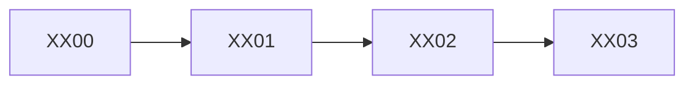

================================================================================
<REIHE> – <TITEL> – HOW2 (DEV)
================================================================================
Projekt         : R+MUNI Blueprint
Dokument        : <REIHE>_How2_DEV_S105
Tag             : #dev #how2 #<reihe> #s105
Datum           : <YYYY-MM-DD>
Stage           : S105 — AKTIV
<!-- HINWEIS FÜR DEV
     Stage = der Stage in dem dieses Dokument erstellt wird.
     Nicht der Stage des Templates — der Stage des befüllten Dokuments. -->
Status          : <ENTWURF / AKTIV / ARCHIV>
Verantwortlich  : EUMAXL
Review          : —
Jira-Sync       : NEIN
Ablageort       : R+MUNI Doku-public\02-how2\<REIHE>_How2_DEV_S105.md
Letzte Änderung : <YYYY-MM-DD>
================================================================================

---
title: "<REIHE> — How2 DEV"
stage: S105
status: "<ENTWURF / AKTIV / ARCHIV>"
typ: "How2"
datum: "<YYYY-MM-DD>"
autor: EUMAXL
tags: [rmuni, blueprint, s105, <reihe>]
---

<!-- HINWEIS FÜR DEV
     Dieses Template ist die verbindliche Vorlage für alle How2-DEV-Dokumente.
     Platzhalter in <GROSSBUCHSTABEN> sind zu ersetzen.
     Kommentarblöcke (wie dieser) werden im fertigen Dokument entfernt.

     Ausprägung: TECHNISCH — kompakte Referenz für DEV und Poweruser.
     Stil: präzise, direkt, ohne Erklärungsaufwand.
     Setzt Kenntnis der zugehörigen Principles voraus.

     Diagramme (Mermaid) sind erlaubt und erwünscht für Flows und Abhängigkeiten.
     Script-Inhalte und Auszüge können direkt eingebettet werden.
     Obsidian-Links sind optional — dort einsetzen wo Bezüge bestehen.
     Formstabilität hat Vorrang vor sprachlicher Variation.

     Pflichtkapitel: VORAUSSETZUNGEN, KURZREFERENZ, FEHLERBILDER, ENTSCHEIDUNGSHILFE
     Optionale Kapitel: MODI, FLOWS, LOG-AUSGABE — nur wenn für die Reihe relevant.
-->

VORAUSSETZUNGEN
--------------------------------------------------------------------------------
<!-- Alles was vor dem ersten Script-Aufruf erfüllt sein muss.
     Konkret und prüfbar — keine weichen Formulierungen. -->
- [[<REIHE>_principles_S105]] gelesen und verstanden
- <Technische Voraussetzung 1>       Beispiel: Python 3.10+
- <Technische Voraussetzung 2>       Beispiel: root.cfg vorhanden
- <Technische Voraussetzung 3>       Beispiel: Scripts in 01-artifacts\01-scripts\

<!-- OPTIONAL: Wenn die Reihe mehrere klar unterscheidbare Modi kennt -->
<MODI — KURZ ERKLÄRT>
--------------------------------------------------------------------------------
<Modus A>  (<Script-Bereich>)  →  <Was dieser Modus tut>
<Modus B>  (<Script-Bereich>)  →  <Was dieser Modus tut>

================================================================================
KURZREFERENZ — ALLE SCRIPTS
================================================================================
<!-- Jedes Script der Reihe mit Aufruf, Ziel und Ausgabe.
     Gruppen mit visueller Trennung kennzeichnen.
     Sonderfall / Spezialscript mit ★ markieren.
     Format je Script:
       <SCRIPTNAME> – <Kurzbeschreibung>
         py .\<SCRIPTNAME>.py
         → <Was das Script tut>
         → Ziel: <Ausgabepfad>
         → <Weitere relevante Info>
-->

── <GRUPPE 1 — BEZEICHNUNG> ────────────────────────────────────────────────────

<XX00> – <Beschreibung>
  py .\<XX00-scriptname>.py
  → <Was es tut>
  → Ziel: <Pfad>

<XX01> – <Beschreibung>
  py .\<XX01-scriptname>.py
  → <Was es tut>
  → Ziel: <Pfad>

── <GRUPPE 2 — BEZEICHNUNG> ────────────────────────────────────────────────────

<XX10> – <Beschreibung>
  py .\<XX10-scriptname>.py
  → <Was es tut>
  → Ziel: <Pfad>

<XX11> – <Beschreibung>  ★ SPEZIALFALL
  py .\<XX11-scriptname>.py
  → <Was es tut — inkl. Begründung warum Spezialfall>
  → Ziel: <Pfad>
  → Anwendungsfall: <Wann genau dieses Script und nicht das Standard-Script>

<!-- OPTIONAL: Häufige Kombinationen als Schnellreferenz -->
================================================================================
HÄUFIGE KOMBINATIONEN
================================================================================
<!-- Welche Scripts werden typischerweise zusammen aufgerufen?
     Format: Zweck → Script 1 + Script 2 + Script 3 -->

<Zweck 1>:
  py .\<Script1>.py
  py .\<Script2>.py

<Zweck 2>:
  py .\<Script1>.py
  py .\<Script3>.py

<!-- OPTIONAL: Nur wenn die Reihe einen definierten Flow hat -->
================================================================================
FLOW — REFERENZ
================================================================================
<!-- Reihenfolge der Scripts im Standardfall.
     Mermaid-Diagramm ist hier besonders wertvoll. -->

Standardflow:
  <XX00> → <XX01> → <XX02> → <XX03>

Abweichungen:
  <Wann wird vom Standardflow abgewichen und wie>

<!-- OPTIONAL: Nur wenn Log-Ausgaben für die Reihe relevant und nicht selbsterklärend -->
================================================================================
LOG-AUSGABE VERSTEHEN
================================================================================
<!-- Reale Log-Beispiele einbetten — kein Fantasie-Output. -->

Standardfall:
  [<XX>] <YYYY-MM-DD> HH:MM:SS | =====  Start <XX>
  [<XX>] <YYYY-MM-DD> HH:MM:SS | Ziel: <Pfad>
  [<XX>] <YYYY-MM-DD> HH:MM:SS | [OK]  <Ergebnis>
  [<XX>] <YYYY-MM-DD> HH:MM:SS | =====  Ende <XX>

[SKIP] — Ziel nicht vorhanden:
  [<XX>] ... | [SKIP]  <Pfad> nicht gefunden
  → <Was das bedeutet — kein Fehler wenn erwartet>

[FEHLER] — Datei gesperrt oder Pfad falsch:
  [<XX>] ... | [FEHLER]  <Pfad> — <Fehlermeldung>
  → <Ursache>
  → <Lösung>

================================================================================
FEHLERBILDER
================================================================================
<!-- Die häufigsten Fehler mit Ursache und direkter Lösung.
     Kein Fließtext — direkt und handlungsorientiert. -->

Fehler: <Fehlerbild 1>
  Ursache: <Was ist schiefgelaufen>
  Lösung:  <Was zu tun ist>

Fehler: <Fehlerbild 2>
  Ursache: <Was ist schiefgelaufen>
  Lösung:  <Was zu tun ist>

Fehler: root.cfg nicht gefunden
  Ursache: Script wird nicht aus dem Scripts-Ordner aufgerufen
           oder root.cfg liegt nicht zwei Ebenen über dem Script
  Lösung:  Arbeitsverzeichnis prüfen — PowerShell in
           <rootfolder>\01-artifacts\01-scripts\ starten

================================================================================
ENTSCHEIDUNGSHILFE
================================================================================
<!-- Tabelle: Ich will... → Richtiges Script -->

Ich will...                                      Richtiges Script
------------------------------------------------ -------------------------------
<Anwendungsfall 1>                               <Scriptname>
<Anwendungsfall 2>                               <Scriptname>
<Anwendungsfall 3 — Spezialfall>                 <Scriptname>  ← nicht <Alternative>!
<Diagnose wenn nichts funktioniert>              <Diagnose-Script>

================================================================================
BEZÜGE
================================================================================

[[<REIHE>_principles_S105]]     Designentscheidungen und Hintergrund
[[Global_GOV_DEV_S105]]         Normative Grundlage
[[TMP_How2_DEV_S105]]           Template-Nutzung und Dokumenttypen

================================================================================
<REIHE>_How2_DEV | S105 | <YYYY-MM-DD> | R+MUNI Blueprint
================================================================================
